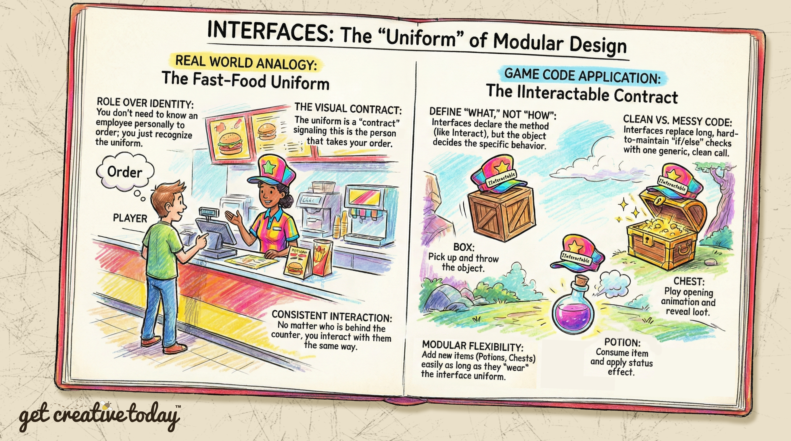
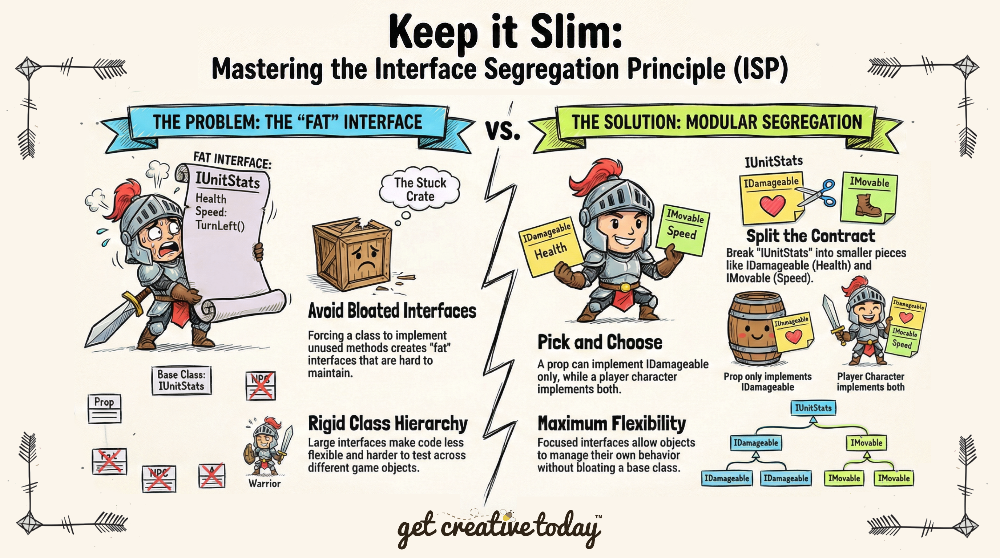

# 📜 Interfaces
> By: Akram Taghavi-Burris | © 2026

Imagine you walk into a fast-food joint and need to place an order. You **don’t need to know each employee personally**—you can spot them by their uniform. All employees wear the **same uniform**, so you instantly know who can take your order.

Just like the employee is **contracted to wear the uniform**, an **interface** ensures that a class **adheres to a specific contract**. Any class that implements the interface can be recognized and interacted with consistently, without needing to know the details of how it works.

## Understanding Interfaces

An **interface** is more than just a checklist—it’s a **guarantee** that a class will provide certain capabilities. Any system or object interacting with that class can **rely on the interface**, knowing exactly which methods and properties are available.

In C#, all interface methods are **always public**. This makes sense because the purpose of an interface is to allow other objects or systems to interact with your class **without needing to know the internal details**. Think of it like the uniform from the fast-food example: it signals what the employee can do, but not how they take your order behind the counter.

Some key points about interfaces:

-   **No implementation:** Interfaces define **what** must be done, not **how** it is done. That’s up to the implementing class.
-   **Multiple implementations:** Different classes can implement the same interface in completely different ways. For example, a `Box`, `Chest`, and `Door` might all implement `IInteractable`, but each behaves differently when interacted with.
-   **Decoupling:** Systems can interact with objects via their interface, rather than depending on specific class types. This makes your code more **modular**, **flexible**, and **testable**.


---

## 🌟 Game Design Challenge: Interacting with Game Objects

Imagine a player exploring a game world full of interactive objects. Some objects can be picked up, others opened, and some consumed. For example:

- A **Box** that can be picked up and thrown.
- A **Chest** that can be opened to reveal treasure.
- A **Door** that can be opened or locked.
- A **Magic Potion** that can be picked up and consumed.

To implement these interactions, the beginner approach would be to have the `Player` class, for example, check what it is interacting with and then run the appropriate method. For example: 

```csharp
void OnTriggerEnter(Collider other)
{
    swithc(other){
        case Box : 
            other.PickUp();
        case Chest: 
            other.Open();
        case Door: 
            other.Toggle();
        case Potion: 
            other.Consume();
        case Default:
            break;
    }
```

While this approach works, it requires that we know the **class** types of objects we could potentially interact with and the **specific method** that they need to call. Furthermore, as the number of interactable objects grows, we are faced with the following challenges: 

-   The code is **long and hard to maintain**.
    
-   Adding a new object requires **modifying the player code**.
    
-   Each object’s behavior is **scattered across multiple places**.

#

### Implementing an Interface

A more modular solution is implementing an **IInteractable** interface. 

We can define a contract for all interactable objects:

```csharp
public interface IInteractable
{
    void Interact();
}
```
Here, the interface declares the Interact method, but does not define its behavior.

Each object implements the interface in its own way of interacting:

```csharp
public class Box: MonoBehaviour, IInteractable
{
    public void Interact()
    {
        // Pick up and throw the box
    }
}

public class Chest: MonoBehaviour, IInteractable
{
    public void Interact()
    {
        // Play chest opening animation and reveal treasure
    }
}
```

The player code becomes clean and generic:

```csharp
void OnTriggerEnter(Collider other)
{
    IInteractable interactable = other.GetComponent<IInteractable>();
    if(interactable != null)
    {
        interactable.Interact();
    }
}
```
No matter what object the player encounters, as long as it implements `IInteractable`, the player can interact with it **without knowing its type or specific methods**.

### Multiple Interfaces

One of the powerful features of interfaces is that a **class can implement multiple interfaces**, even though it can only inherit from a single class. This allows you to mix and match behaviors without being constrained by a rigid class hierarchy.

For example, a player character might implement both:

```csharp
public class Player : MonoBehaviour, IInteractable, IDamageable
{
    public void Interact()
    {
        // Player interacts with objects
    }

    public void TakeDamage()
    {
        // Player takes damage
    }
}

```

Here, `Player` can be **interactable** and **damageable**, while still inheriting from `MonoBehaviour`.

This flexibility is another reason why interfaces are so useful in game development: you can combine multiple capabilities into a single class **without bloating a base class or breaking the class hierarchy**.

---
## Interface Segregation Principle (ISP)
While using an interface can be extremely useful, it’s important to **implement an interface only when all of its requirements make sense for the class**. In other words, don’t force a class to implement methods it doesn’t actually use. This is exactly what the **Interface Segregation Principle (ISP)** is about:

> **No client should be forced to depend on methods it does not use.**

Put simply: **avoid bloated interfaces**. This follows the same idea as the **Single-Responsibility Principle**, which encourages short, focused classes and methods.

Keeping interfaces small and focused gives you **maximum flexibility**, allowing objects to implement **only what they truly need**.

**Example:** Strategy game units

```csharp
public interface IUnitStats
{
    public float Health { get; set; }
    public int Defense { get; set; }
    public void Die();
    public void TakeDamage();
    public void RestoreHealth();
    public float MoveSpeed { get; set; }
    public float Acceleration { get; set; }
    public void GoForward();
    public void Reverse();
    public void TurnLeft();
    public void TurnRight();
}

```

This works for player units, but what if you want a **breakable crate or barrel**?

-   The prop needs **health**, but it doesn’t move or attack.
-   It doesn’t need `GoForward()`or `TurnLeft()`.
    

**Solution:** Split the interface into smaller, focused pieces:

```csharp
public interface IDamageable
{
    float Health { get; set; }
    void TakeDamage();
    void Die();
}

public interface IMovable
{
    float MoveSpeed { get; set; }
    void GoForward();
    void Reverse();
    void TurnLeft();
    void TurnRight();
}

```



Now, a **breakable crate** can implement `IDamageable` only, without being forced to implement irrelevant methods.

> [!TIP]
> **ISP** keeps your code **flexible, modular, and easier to maintain**.
> 

---

## 🚩 **Checkpoint**

After exploring interfaces, here’s what to remember:

-   **Contract, not implementation:** Interfaces define **what must be done**, not **how**.
-   **Consistency:** Other systems can interact with your object **without knowing details**.
-   **Flexibility:** Adding new behaviors doesn’t require changes to the player or other systems.
-   **Decoupling:** Objects manage their own behavior, keeping code modular and testable.

Using interfaces effectively allows your game architecture to grow without turning your player code into a tangled mess of type checks.


