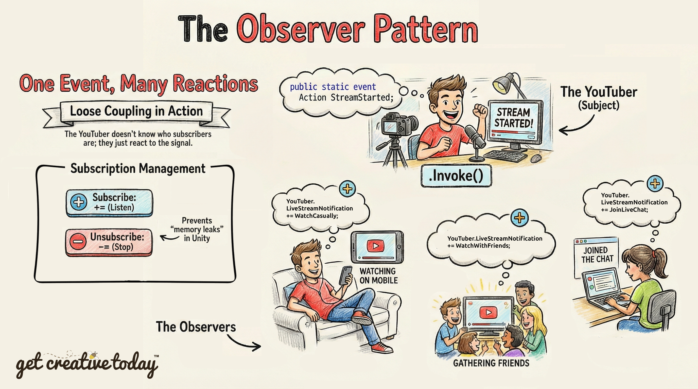

# 📜 The Observer Pattern

The **Observer pattern** solves this by establishing a **one-to-many relationship** between objects:
- A **Subject (Publisher)** broadcasts a notification when something happens.
- **Observers** subscribe to the Subject and automatically react when the notification occurs.
The Subject **doesn’t need to know who is listening** or what they will do — each Observer decides how to respond.

## C# Events
In C# and Unity, **events** are the tool that implements this pattern. They allow a class to **announce that something happened**, without worrying about which other objects care.
- **Subject:** Declares and triggers the event.
- **Observers:** Subscribe to the event and run their own logic when it is invoked.

---

## YouTube LiveStream Analogy

To illustrate how events work in programming, imagine your favorite YouTuber is hosting a **special livestream**, and **only subscribers get notified** when it starts. Each subscriber reacts differently when they receive the notification, just like different parts of a game can respond in their own way to the same event.


When the stream goes live, each subscriber, **Gregory**, **Samantha**, and **Valerie**, gets a notification. However, they don’t all react the same way; instead, each subscriber takes a **different action**.
- **Gregory** gets the notification while on his lunch break. He pops in his earbuds and casually watches on his phone.
- **Samantha** sees the alert and rounds up a group of friends so they can watch and discuss the stream together.
- **Valerie** gets the notification on her laptop and immediately joins the live chat to interact with other viewers.
  
Even though they all received the same notification, their responses are completely different.



The YouTuber has no idea **who their subscribers are** or **what they’ll do when notified**. They simply send out the alert, and each subscriber reacts in their own way.

This is exactly how events in programming work! When an event is triggered, any method listening for that event will execute its own unique action, just like each subscriber reacting differently to the livestream notification.

---

## Events In Action
Let's turn our YouTube analogy into a tangible programming example. Let's say that our `YouTuber` is a class that will declare (announce) the event `LiveStreamNotification` and on the Start will call the `StartLiveStream()` method, which will broadcast (invoke) the `LiveStreamNotification` to all subscribers.

#### 1. YouTuber Class 

```csharp
using System;
using UnityEngine;

public class YouTuber: MonoBehaviour
{
    // Define an event that subscribers can listen to
    public static event Action LiveStreamNotification;

    void Start()
    {
        // Simulating a livestream starting after 3 seconds
        Invoke("StartLiveStream", 3f);

    }//end Start()

    void StartLiveStream()
    {
        Debug.Log("The YouTuber has started a livestream!");
        
        // Trigger the event (notify all subscribers)
        LiveStreamNotification?.Invoke();

    }//end StartLiveStream()

}//end YouTuber
```

### How it works
- `public static event Action LiveStreamNotification`;
   - This line declares an event called `LiveStreamNotification`.
   - `Action` is a built-in C# delegate type that represents a method with no parameters and no return value.
   - `static` makes the event accessible without needing to reference a specific YouTuber instance. This way, all subscribers can listen to the same event.
   - Essentially, this event is the notification system: it lets the YouTuber announce _“I’m live!”_ without knowing who will respond.
 
- `Invoke("StartLiveStream", 3f);`
   - This Unity method calls another method (`StartLiveStream`) after a **delay of 3 seconds**.
   - Here, it simulates the YouTuber going live after a short delay.
   - At this point, no subscribers have been notified yet; we are just scheduling the livestream start.
 
- `LiveStreamNotification?.Invoke();`
   - This is the **key event call** : it **broadcasts the notification** to all subscribers.
   - The `?.` **(null-conditional operator)** ensures that **if no one is subscribed** to the event, it **won’t throw an error**.
   - Each subscriber that has registered a method to this event will have its method **called automatically**, reacting however it needs to.
 
#

#### 2. Gregory Class 

The **Gregory** class is an **observer** in the Observer pattern. Its job is to **react when the YouTuber broadcasts the livestream event**, by performing a unique action (`WatchCasually()`).

```csharp
using System;
using UnityEngine;

public class Gregory: MonoBehaviour
{
    void OnEnable()
    {
        // Subscribe to the livestream event
        YouTuber.LiveStreamNotification += WatchCasually;

    }//end OnEnable()

    void OnDisable()
    {
        // Unsubscribe to prevent memory leaks
        YouTuber.LiveStreamNotification -= WatchCasually;

    }//end OnDdisable()

    void WatchCasually()
    {
        Debug.Log("📱 Gregory gets the notification and watches casually on his phone.");

    } //end WatchCasually()

}//end Gregory

```
### How It Works
- `OnEnable()` is a Unity callback that runs when the GameObject becomes active.
  
- `YouTuber.LiveStreamNotification += WatchCasually;`
   - This **subscribes** Gregory to the event.
   - `+=` means “add this method to the list of methods to call when the event fires.”
   - When `YouTuber.LiveStreamNotification.Invoke()` happens, Unity will automatically call `WatchCasually()` for Gregory.
     
- `OnDisable()` runs when the GameObject is disabled or destroyed.
   - `-=` removes the method from the event subscription.
   - This **prevents memory leaks** or unwanted behavior, especially if the object is destroyed but the event could still fire.
   - It’s best practice in C# and Unity to always unsubscribe from events when the listener is no longer active.
     
- `WatchCasually()` is the method that runs only when the event is triggered.
  - It prints a message to the console, simulating Gregory’s reaction to the livestream.
  - In a real game, this could be any behavior: moving the character, triggering animations, updating UI, etc.
 
#

Just like **Gregory**, the **Samantha** and **Valerie** classes also subscribe to the `YouTuber.LiveStreamNotification` event, but each calls a different method to define its unique reaction.

#### 3. Samantha Class 
```csharp
using System;
using UnityEngine;

public class Samantha: MonoBehaviour
{
    void OnEnable()
    {
        // Subscribe to the livestream event
        YouTuber.LiveStreamNotification += WatchWithFriends;

    }//end OnEnable()

    void OnDisable()
    {
        // Unsubscribe to prevent memory leaks
        YouTuber.LiveStreamNotification -= WatchWithFriends;

    }//end OnDdisable()

    void WatchWithFriends()
    {
        Debug.Log("Samantha gets the notification and gathers friends to watch together.");

    }//end WatchWithFriends()

}//end Samantha
```
#
#### 4. Valerie Class 
```csharp
using System;
using UnityEngine;

public class Valerie: MonoBehaviour
{
    void OnEnable()
    {
        // Subscribe to the livestream event
        YouTuber.LiveStreamNotification += JoinLiveChat;

    }//end OnEnable()

    void OnDisable()
    {
        // Unsubscribe to prevent memory leaks
        YouTuber.LiveStreamNotification -= JoinLiveChat;

    }//end OnDdisable()

    void JoinLiveChat()
    {
        Debug.Log("Valerie gets the notification and joins the live chat on her laptop.");

    }//end JoinLiveChat()

}//end Valerie
```
---

## 🚩 Checkpoint

Key takeaways about the **Observer Pattern** in game development:
-   The **Observer pattern** creates a **one-to-many relationship**, where one object broadcasts an event and multiple listeners can react independently.
-   Observers do **not need direct references** to the object raising the event — this keeps systems loosely coupled.
-   In Unity’s **new Input System**, input actions act as **event broadcasters**.
-   Multiple systems can respond to the same event without interfering with each other.
-   This design improves **modularity, maintainability, and scalability**.
-   Decoupled systems are easier to test, refactor, and extend as the project grows.
