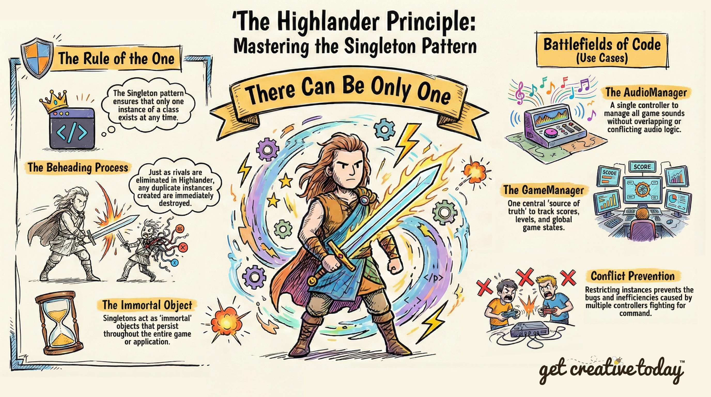

# 📜 Singleton Pattern
> By: Akram Taghavi-Burris | © 2026

When discussing the **singleton** design pattern, I can’t help but think of the 1980’s cult classic film and lesser-known TV series, _Highlander_. I know that I am dating myself here, but it’s the best analogy I have.

The story of Highlander is one of immortal beings who exist among humans, each with their own unique powers and abilities. Central to the narrative is the belief that **“There can be only one.”** This implies that these immortals must engage in fierce battles, culminating in the beheading of their rivals until only one remains standing. The last immortal standing is said to receive **The Prize**, a mysterious reward that grants them ultimate power.

In a similar vein, **Singletons** represent the “immortal” objects in your game. Just as the Highlanders cannot coexist peacefully, your Singleton class ensures that only one instance of the class survives throughout the entire game. Any additional instances created are destroyed, just as an immortal would face beheading if they crossed paths with another.



## Implementing a Singleton Pattern

In game development, a common use case for a singleton is in the creation of a single instance of a manager or controller class (e.g., AudioManager, GameManager, or PlayerController) where creating multiple instances could lead to conflicts or inefficiencies. By implementing the Singleton pattern, you can ensure that no matter how many times the object is requested or instantiated, only one instance will exist. Use of Singleton Pattern in Unity

Example of how the Singleton pattern can be used inside a class:
```csharp
public class GameManager: MonoBehaviour
{
    //Creates the global access to the instance
    public static GameManager Instance { get; private set; }

    void Awake()
    {
        // If no GameManager exists, assign this instance and mark it as persistent across scenes
        if (Instance == null)
        {
            //make this the game manager
            Instance = this; 

            // Prevents the instance from being destroyed when changing scenes
            DontDestroyOnLoad(gameObject); 
        }

        // Else if a GameManager already exists and it's not this one, destroy this instance to maintain the Singleton
        else
        {
            //if there is a game manager, destroy this object
            Destroy(gameObject);

        }//end if (Instance == null)

    }//end Awake()

   //other game manager behaviors go here
}
```

---

## Using Singletons

As a beginner, you will often hear conflicting opinions about **Singletons**. Some developers avoid them entirely, while others use them frequently.

In Unity, Singletons are popular because they are convenient: you can access them from anywhere using a single line of code:

`GameManager.Instance`

But that convenience comes with tradeoffs.

### Pitfalls of Singletons

If your project contains too many Singletons, your codebase can start to feel like a game where **every object has a megaphone**. Every system can talk to every other system at any time, which leads to:

-   **Hidden dependencies**  
    A script might look independent, but it secretly relies on several Singletons.
    
-   **Tightly coupled systems**  
    When everything talks directly to everything else, changes become risky.
    
-   **Harder debugging**  
    Bugs often become “who changed the global state?” mysteries.
    
-   **Harder testing and reuse**  
    Scripts that depend on Singletons are difficult to reuse in other projects or test in isolation.
    

> [!WARNING]  
> **Singletons** can be helpful, but they can also turn your architecture into **spaghetti** 🍝 very quickly.
> 

### When Singletons Make Sense

Even with these downsides, Singletons still have a place in game development when applied to the right type of object.

Singletons are best used for systems that are naturally **global** and **unique**, such as:

-   `GameManager`
-   `AudioManager`
-   `SceneLoader`
-   `SaveSystem`
-   `SettingsManager`
-   `InputManager` (sometimes)
    
These are often called **manager classes**, because they coordinate or control systems rather than representing gameplay entities.

> [!NOTE]
> ### Singleton Checklist 📝
> 
> Before applying the Singleton pattern, ask yourself:
>  - [ ]  **Uniqueness:** Does this system or object truly need to exist only once?
>  - [ ]  **Global access:** Do multiple systems need to access it without passing references everywhere?
>  - [ ]  **Conflict prevention:** Would creating multiple instances cause bugs, overlapping behavior, or inconsistent state?
>  - [ ]  **Managerial role:** Does the object coordinate or control other systems rather than represent a gameplay entity?
>  - [ ]  **Persistence:** Should it survive across scenes or sessions?
>  - [ ]  **Future flexibility:** Could making this a Singleton block future design changes, like multiplayer or temporary clones?
>
> If most of the items get **checked, yes**; the class is likely a strong candidate for a Singleton.
> If not, consider alternatives such as **events, dependency injection, or scoped references** to maintain flexibility and decoupling.
> 

---
## 🌟Game Design Challenge: Action Fighting Game Singleton Implementation

Imagine you are building a brand-new action-fighting game called **Arena of Champions**. Before we implement any code, we outline some core gameplay features:

-   Players fight waves of enemies in dynamic arenas.
    
-   Each player has stats like health, energy, and score.
    
-   The UI displays health, score, energy, and cooldowns in real time.
    
-   Enemies react dynamically to the player’s position, health, and abilities.
    
-   The arenas have evolving visual and audio feedback that responds to the intensity of the fight (e.g., music, sound effects, and environmental cues).

#### Player as a Singleton

At first, it’s tempting to think the **Player** class could be a Singleton because many systems need to access it:

-   Updating the UI when the score or health changes
-   Having enemies react to the player’s position
-   Resetting or respawning the player after death
    

You might imagine something like:

`Player.Instance`

It seems convenient. Any system can access the player without passing references around.

But analyzing the design carefully shows problems:

-   **Future-proofing:** If multiplayer or co-op is added later, suddenly you need `Player1` and `Player2`, separate input sources, separate UI elements, and AI targeting multiple players.
-   **Hidden dependencies:** Scripts that rely on `Player.Instance` are tightly coupled to a single instance.
-   **Limited flexibility:** Temporary clones, shadow players, or AI-controlled proxies would break the Singleton assumption.

> [!TIP]
> Instead of making the player a Singleton, you can decouple player data from the systems that use it. For example:
> -   Expose player stats through events (`OnHealthChanged`, `OnScoreChanged`)
> -   Use dependency injection to pass references to objects that need the player
> -   Keep gameplay entities flexible and modular
>
> This keeps your architecture flexible and testable, while still allowing systems to react to the player as needed.   


#### When a Singleton Makes Sense

Now let’s consider another aspect of the same game: **dynamic arena feedback**. As the designer, you notice that the arena needs to:

-   Monitor the state of the fight and intensity of player actions
-   Adjust background music, battle sound effects, and ambient cues in real time
-   Ensure consistency across all systems that trigger sounds or visual effects
    
You might start by thinking: _“We could just have each system trigger its own sounds and effects.”_

But stepping back, that approach creates problems:

-   Multiple systems could play overlapping tracks or conflicting effects
-   Timing and coordination between effects would be difficult to maintain
-   Changes to behavior would require updates in multiple places
    

By analyzing the **requirements and constraints**, a solution emerges naturally: there should be **one centralized controller** that manages audio and visual feedback for the arena. This controller:

-   Needs global access so any system can trigger effects
-   Must exist only once to avoid conflicts
-   Coordinates multiple systems without representing a specific gameplay entity
    
These properties make it a perfect candidate for a **Singleton**.

# 

Thinking critically about what truly needs to be unique in your game helps ensure that using a Singleton improves your architecture rather than creating long-term problems. By carefully outlining your game requirements and identifying which entities need global access, and which should remain flexible, you can determine whether a Singleton is the right pattern to implement.

By implementing a Singleton, you create a system that guarantees a single instance and global access. This can make certain global controllers or manager-type systems easier to implement and coordinate. However, Singletons also introduce hidden dependencies and reduce flexibility if applied to the wrong objects.

---

## 🛡️ **Checkpoint**  
Having explored Singletons, here are some things to keep in mind:

-   **Systems vs. entities:** Singletons are ideal for global, coordinating systems—not individual gameplay entities like the Player.
    
-   **Design by constraints:** Ask whether the object must exist only once and whether duplicates would create conflicts.
    
-   **Decouple where possible:** For objects that many systems need to observe (like Player stats), use events or references instead of a Singleton.
    
-   **Plan for future growth:** Avoid convenience-driven Singletons that could block changes like multiplayer, cloning, or AI-controlled proxies.
