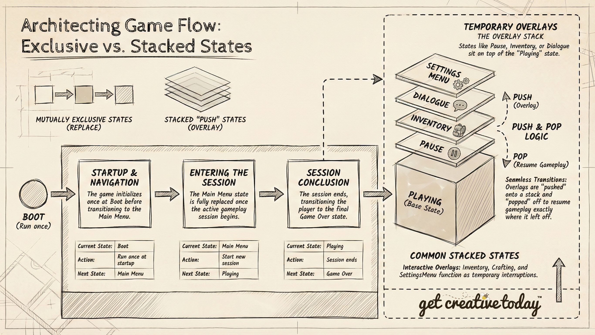

# 📜 Designing Game States
> By: Akram Taghavi-Burris | © 2026

You’ve just loaded your current game of choice. The loading screen appears, followed by the main menu, with the main score playing softly in the background. Once you start a new game or load a save, the menu disappears, the music shifts to the ambient sounds of the level, and you take control of the player, exploring a vast world. Later, you might pause to check your inventory. Each of these moments requires the game to behave differently, even if the same world or elements are still visible.

Before writing any code, it’s important to **plan out the different modes of your game**, from menus to gameplay to temporary interruptions. Designing these **game states** first provides a clear blueprint for creating a **predictable, engaging, and maintainable game experience**.

## What Are Game States?
We've discussed how **[states](../DesignPatterns/StatePattern.md)** help control behaviors like **Walk**, **Run**, **Patrol**, or **Attack** on an NPC or player character. Any object in the game can have different states, which trigger different behaviors at the right time.

Similarly, games can also have **game states**. These can be thought of as **global states**, not tied to any single object, but other objects in the game may need to respond when a specific game state is active.

For example, when the player is actively **playing the game**, the world is fully alive: the player can move, interact with objects, fight enemies, and explore the environment. Every character and object in the world behaves independently, enemies patrol, NPCs walk around, and items respond to interactions. In contrast, when the player is navigating the **main menu**, the game world is effectively paused. Nothing in the environment moves, enemies are inactive, and the player cannot interact with the world; instead, the focus is entirely on navigating menu options.

**Game states** allow us to better manage the **overall flow of the game**. They determine:

-   **What the player can do**
    
-   **How the game world behaves**
    
-   **Which rules are active**
    
-   **Which UI elements are shown**
    

Furthermore, **game states** are **more than just a scene change**. While a state might load a different **scene**, such as the **Main Menu** scene during the **Main Menu** state, the purpose of the state is not simply to show a new scene, but to **control everything happening in that part of the game**. For instance, when the game transitions to a **Pause** state, the same **Playing** scene may remain loaded, but the state **stops player movement**, **disables interactions**, and **displays the pause menu**. In this way, the scene is just the visual backdrop, while the **game state manages how the game behaves** while it is active.

#

### Core Game States – What a Game Needs

Once we understand what game states are, the next question is: **which states should a game have?** Core states are those essential modes that every player expects, because they define the basic flow of the game. These states form the backbone of the experience, guiding the player from starting the game to reaching the end.

A typical set of core game states might include:

1.  **Boot** – The game starts up.
2.  **Main Menu** – The player chooses options like “New Game” or “Load Game.”
3.  **Playing** – The player explores the game world.
4.  **Game Over** – The game ends and shows the final screen.
    
Here, **only one state exists at a time**, and each state fully replaces the previous one. These are **core, mutually exclusive states**, forming the foundation of the game’s flow. Every other state, whether temporary overlays or special modes, builds on top of this core structure.

# 

### 🌟 Game Design Challenge: Adventure Crafting Game States

Let’s imagine our adventure crafting game. In this game, the player needs to **explore the world, collect resources, craft items, and interact with NPCs**, all while navigating menus and handling game progression. To manage this, the game is divided into **different types of game states**, each responsible for controlling **what the player can do and how the game behaves** at that moment.

Some states are **core and mutually exclusive**, forming the backbone of the game, while others are **temporary or overlay states** that **temporarily take control of certain game systems**, pausing or modifying behaviors as needed. For example, when the player enters a **Crafting** mode, gameplay systems like movement, enemy AI, or resource collection may be paused, while specific animations, logic, or interactions run. Once crafting is complete, the underlying gameplay **resumes exactly where it left off**, maintaining the flow of the game, whether or not any new visuals are shown.

#### Mutually Exclusive States

These states **replace each other completely**. Only one of these can be active at a time. For example:
| State    | Replaces | Reason                                |
| -------- | -------- | ------------------------------------- |
| Boot     | None     | Runs once at startup                  |
| MainMenu | Boot     | Player chooses to start a new session |
| Playing  | MainMenu | The game session begins               |
| GameOver | Playing  | Session ends                          |
| MainMenu | GameOver | Player can start fresh                |

In this flow, the game **cannot be in MainMenu and Playing at the same time**. Each transition is like **closing one chapter and opening another**.

#### Stacked or Overlay States

Other states are **temporary overlays**. These states **do not replace the underlying core state**. Instead, they **take control of specific gameplay systems**, modify behaviors, and then **return control to the previous state** once finished. For example:

| State        | Reason                                                           |
| ------------ | ---------------------------------------------------------------- |
| Paused       | Player wants to pause gameplay                                   |
| Inventory    | Player opens inventory without leaving the game                  |
| Crafting     | Player interacts with crafting without leaving the current scene |
| Dialogue     | Handles temporary interactions with NPCs                         |
| SettingsMenu | Adjust options while the game continues underneath               |

Overlay states are often **pushed onto a stack**, allowing multiple temporary states to coexist in order. When an overlay state is done, it is **popped off**, and the underlying game resumes exactly where it left off. This system allows the game to temporarily pause or modify gameplay without losing context or progress, and it works whether or not the overlay introduces new visuals.




---

## Managing Game States

Now that we’ve seen how core and overlay states work in practice, we can explore **how the game actually manages them**. In most games, **game states are controlled by a global Game Manager**, a central system responsible for keeping track of which state is active and coordinating transitions between them. This ensures that only the appropriate behaviors, rules, and interactions are active at any given time.

The way we implement game states depends on their **complexity**. If a state has **minimal behaviors**, such as a simple Main Menu or Game Over screen, it can often be handled using a **finite state machine (FSM)**, which is easy to manage. However, if states have **many behaviors** or require **specific transitions** when entering, executing, or exiting a state, a **State Pattern** is usually a better choice. This pattern provides more flexibility and helps organize complex logic.

As games become more feature-rich, we must also consider **how the Game Manager handles additional behaviors**. Some states are **exclusive**, meaning only one can be active at a time, while others are **temporary overlays** that can **stack on top of existing states**, like a Pause menu appearing over the Playing state. The Game Manager is responsible for managing these relationships, ensuring the game behaves consistently regardless of how many states are active or stacked.

>[!TIP]
> Just as our example describes stacking states, a **Stack** in C# is ideal for implementing this game flow. A stack is a **Last In, First Out (LIFO)** collection, so the most recently added state is the first one removed. When an overlay like **Inventory** or **Pause** is pushed onto the stack, it temporarily takes control. When it’s done, it’s popped off, and the previous state **resumes exactly where it left off**.

---

## Game State Behaviors
In addition to determining the flow of the states, we also need to define **what each state actually does**. If a **State Pattern** is being implemented, it’s important to clearly identify the behaviors and responsibilities of each game state (i.e., what happens when it becomes active, what it does while active, and what happens when it ends).

A common approach is to define a **consistent [interface](../DesignPatterns/Interface.md)** for all game states, such as:

```csharp
public interface IGameState
{
    void Enter();   // Called when the state becomes active
    void Execute(); // Called each frame while the state is active
    void Exit();    // Called when the state ends or is replaced
}
```
By implementing this interface, each state is forced to explicitly declare its lifecycle behaviors, making transitions predictable, overlay states safer to stack, and the overall system easier to extend or modify without breaking unrelated code.  

Designing states this way forces us to **clearly identify the responsibilities of each state**, and whether it **replaces another state** or **temporarily overlays it**. This results in **cleaner transitions, safer stacking of overlay states**, and a system that can be **extended or modified** without accidentally breaking unrelated parts of the game.

By separating the **management of states** (handled by the Game Manager) from the **behavior of each state**, we achieve both **predictable flow** and **flexible, maintainable logic**.

---

## 🛡️ Checkpoint

Having explored the different **states** of the game world, here are some things to **keep in mind**:

-   **Game states vs object states:** Game states control the **overall flow of the game**, whereas object states (like Walk, Run, Attack) control the **behavior of individual entities**. A clear distinction helps prevent confusion when designing interactions.
    
-   **More than scene changes:** While states may load different scenes, their purpose is to **control what happens in the game**, not just change visuals. For example, a Pause state may keep the Playing scene loaded but temporarily stops gameplay systems.
    
-   **Core and overlay states:** Core states (Boot, Main Menu, Playing, Game Over) are **mutually exclusive** and form the backbone of the game’s flow. Overlay or stacked states (Pause, Inventory, Dialogue) **temporarily take control** of certain systems without replacing the underlying state.
    
-   **Game Manager responsibilities:** The **Game Manager** coordinates which states are active, manages transitions, and ensures that both exclusive and overlay states behave consistently.
    
-   **Implementation approach:**
    
    -   **Finite State Machine (FSM):** Good for simple states with minimal behaviors, like Main Menu or Game Over screens.
        
    -   **State Pattern:** Better for complex states with multiple behaviors, requiring specific logic when entering, executing, or exiting a state.
        
-   **Overlay management with stacks:** Temporary overlay states can be **pushed onto a stack**. When finished, they are **popped off**, and the underlying state resumes exactly where it left off. This ensures predictable, modular control of gameplay systems.
    
-   **State behaviors:** Defining consistent lifecycle methods (Enter, Execute, Exit) for each state, often via an **interface**, forces clear responsibilities, safer stacking, and maintainable logic.
