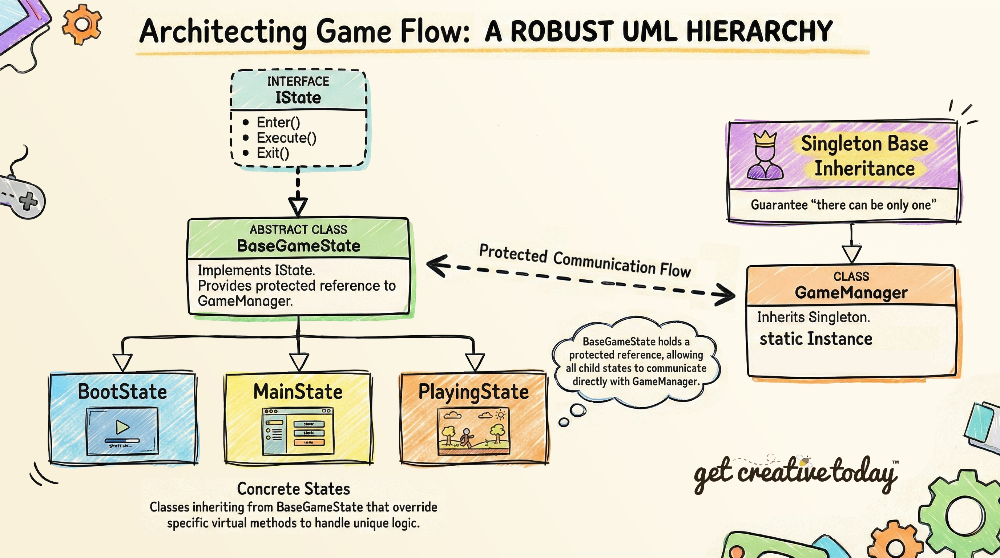

# 📜 Designing Game States
> By: Akram Taghavi-Burris | © 2026

You’ve just loaded your current game of choice. The loading screen appears, followed by the main menu, with the main score playing softly in the background. Once you start a new game or load a save, the menu disappears, the music shifts to the ambient sounds of the level, and you take control of the player, exploring a vast world. Later, you might pause to check your inventory. Each of these moments requires the game to behave differently, even if the same world or elements are still visible.

Before writing any code, it’s important to **plan out the different modes of your game**, from menus to gameplay to temporary interruptions. Designing these **game states** first provides a clear blueprint for creating a **predictable, engaging, and maintainable game experience**.

## What Are Game States?
We've discussed how **[States](../DesignPatterns/StatePattern.md)** help control behaviors like **Walk**, **Run**, **Patrol**, or **Attack** on an NPC or player character. Any object in the game can have different states, which trigger different behaviors at the right time.

Similarly, games can also have **game states**. These can be thought of as **global states**, not tied to any single object, but other objects in the game may need to respond when a specific game state is active.

For example, when the player is actively **playing the game**, the world is fully alive: the player can move, interact with objects, fight enemies, and explore the environment. Every character and object in the world behaves independently, enemies patrol, NPCs walk around, and items respond to interactions. In contrast, when the player is navigating the **main menu**, the game world is effectively paused. Nothing in the environment moves; enemies are inactive, and the player cannot interact with the world; instead, the focus is entirely on navigating menu options.

**Game states** allow us to better manage the **overall flow of the game**. They determine:

-   **What the player can do**
-   **How the game world behaves**
-   **Which rules are active**
-   **Which UI elements are shown**
    

Furthermore, **game states** are **more than just a scene change**. While a state might load a different **scene**, such as the **Main Menu** scene during the **Main Menu** state, the purpose of the state is not simply to show a new scene, but to **control everything happening in that part of the game**. For instance, when the game transitions to a **Pause** state, the same **Playing** scene may remain loaded, but the state **stops player movement**, **disables interactions**, and **displays the pause menu**. In this way, the scene is just the visual backdrop, while the **game state manages how the game behaves** while it is active.

#

### Core Game States – What a Game Needs
Once we understand what game states are, the next question is: **which states should a game have?** 
**Core states** are the essential modes that most players expect, because they define the basic flow of the experience, from starting the game to ending a session.

A typical set of **core game states** might include:

1.  **Boot** – The game starts up.
2.  **Main Menu** – The player chooses options like “New Game” or “Load Game.”
3.  **Playing** – The player explores the game world.
4.  **Paused** – The player temporarily freezes gameplay.
5.  **Game Over** – The session ends, and the game shows a final screen.
    
While these are common baseline states, most games include **many additional states** depending on genre and features. For example:

-   **Inventory**
-   **Crafting**
-   **Dialogue**
-   **Cutscenes**
-   **Shop / Trading**
-   **Tutorial**

#

### Exclusive vs Stacked States
Once we start mapping out the game’s **overall flow**, we quickly notice that not all states play the same role in the experience.
Some states represent a **major step in the game loop**, where the player transitions into a new mode of play. For example, moving from **Main Menu → Playing** means the menu is no longer relevant, and gameplay takes over completely.

Other states are **stacked**, meaning they do not replace the current state. Instead, they become active **at the same time**, while preserving the underlying state. When the stacked state ends, the previous state continues exactly where it left off.

With that in mind, we can break game states into two categories:

#### **Exclusive States (Replace)**
These states **replace each other completely**. Only one exclusive state should be active at a time.
| State    | Replaces | Reason                                |
| -------- | -------- | ------------------------------------- |
| Boot     | None     | Runs once at startup                  |
| MainMenu | Boot     | Player chooses to start a new session |
| Playing  | MainMenu | The game session begins               |
| GameOver | Playing  | Session ends                          |
| MainMenu | GameOver | Player can start fresh                |

#### **Stacked States (Layered)**
These states do not replace the current state. Instead, they are **stacked on top of it**, allowing the game to return to the previous state afterward.
| State          | Reason                                                           |
| -------------- | ---------------------------------------------------------------- |
| Paused         | Player wants to pause gameplay                                   |
| Inventory      | Player manages items without leaving the current state           |
| Crafting       | Player interacts with crafting without leaving the current state |
| Dialogue       | Handles temporary interactions with NPCs                         |
| Cutscenes      | Plays cinematic sequences while preserving the underlying state      |
| Shop / Trading | Player buys or sells items without leaving the current state     |
| Tutorial       | Guides the player through instructions while gameplay continues  |


---

## Managing Game States

Now that we’ve seen how states work in practice, we can explore **how the game actually manages them**. In most games, **game states are controlled by a global Game Manager**, a central system responsible for keeping track of which state is active and coordinating transitions between them. This ensures that only the appropriate behaviors, rules, and interactions are active at any given time.

The way we implement game states depends on their **complexity**. If a state has **minimal behaviors**, such as a simple Main Menu or Game Over screen, it can often be handled using a **finite state machine (FSM)**, which is easy to manage. However, if states have **many behaviors** or require **specific transitions** when entering, executing, or exiting a state, a **State Pattern** is usually a better choice. This pattern provides more flexibility and helps organize complex logic.

As games become more feature-rich, we must also consider **how the Game Manager handles additional behaviors**. Some states are **exclusive**, meaning only one can be active at a time, while others are **temporary overlays** that can **stack on top of existing states**, like a Pause menu appearing over the Playing state. The Game Manager is responsible for managing these relationships, ensuring the game behaves consistently regardless of how many states are active or stacked.

>[!TIP]
> Just as our example describes stacking states, a **Stack** in C# is ideal for implementing this game flow. A stack is a **Last In, First Out (LIFO)** collection, so the most recently added state is the first one removed. When an overlay like **Inventory** or **Pause** is pushed onto the stack, it temporarily takes control. When it’s done, it’s popped off, and the previous state **resumes exactly where it left off**.

---

## Game State Behaviors
In addition to determining the flow of the states, we also need to define **what each state actually does**. If a **State Pattern** is being implemented, it’s important to clearly identify the behaviors and responsibilities of each game state (i.e., what happens when it becomes active, what it does while active, and what happens when it ends).

A common approach is to define a **consistent [interface](../DesignPatterns/Interface.md)** for all game states, such as:

```csharp
public interface IState
{
    void Enter();   // Called when the state becomes active
    void Execute(); // Called each frame while the state is active
    void Exit();    // Called when the state ends or is replaced
}
```
By implementing this interface, each state is forced to declare its lifecycle behaviors explicitly. This makes transitions predictable, overlay states safer to stack, and the overall system easier to extend or modify without breaking unrelated code.

By separating the **management of states** (handled by the Game Manager) from the **behavior of each state**, we achieve both **predictable flow** and **flexible, maintainable logic**.

---

## ⚙️Refining Our State Architecture: Why an Interface Isn’t Enough

The game state architecture we’ve laid out so far is a clean and common starting point. It gives every state a predictable lifecycle and makes transitions easier to manage.

However, once we begin implementing real game states, we quickly run into two design issues.

#

### Issue 1: Every State Needs a GameManager Reference

Each game state will need to communicate with the Game Manager. Since the Game Manager is a Singleton, we can always access it directly:

`GameManager.Instance;`

However, if we need the singleton multiple times, we typically create a shorthand reference:

```csharp
private GameManager _gm;

private void Start()
{
    _gm = GameManager.Instance;
}
```

The reference doesn’t have to be assigned in `Start()` specifically; it just needs to be assigned early in the state’s lifecycle. This allows us to use `_gm` instead of repeatedly typing `GameManager.Instance`.

While it’s only a few lines of code, it breaks the **DRY principle**, because the same setup code gets repeated in every state.

#

### Issue 2: Forcing an Execute() Method

A bigger issue is that our interface forces every state to implement an `Execute()` method.

Switching between states will always require `Enter()` and `Exit()`, but not all states need to run logic every frame.

The `Execute()` method makes sense for states like:

-   **Boot**, which might check loading progress
-   **Playing**, which needs per-frame gameplay logic
-   **Dialogue**, which might wait for player input

However, the **Pause** state often doesn’t need to execute anything once it has entered. It simply displays UI and waits until the player unpauses.

That means we end up writing an empty method just to satisfy the interface:

```csharp
public void Execute()
{
    // Nothing to do here
}
```

This isn’t a major problem, but it does make us think about the **Interface Segregation Principle**, which encourages smaller, more specific interfaces and avoids forcing classes to implement rules they don’t actually use.

We _could_ solve this by splitting the interface into multiple smaller interfaces (for example, one for states that execute and one for states that do not). However, in our case, that solution would introduce more complexity than it removes. For a small-to-medium game state system, the overhead of managing multiple interfaces often outweighs the benefits.

Instead, we’ll use a simpler and more practical solution.

#

### A Practical Fix: BaseGameState

While these issues are minor, we can create a more robust setup.

Our interface was intentionally named `IState` instead of `IGameState`, because many systems can use the **State Pattern**, not just game flow. NPCs, players, UI systems, and gameplay systems can all use state-based logic.

However, **game states have an additional requirement**: they need communication with the **Game Manager**.

To solve this, we can create an abstract `BaseGameState` class that implements the `IState` interface.

This base class will:

-   automatically set up a `protected` reference to the Game Manager that child states can access
    
-   provide safe “boilerplate” implementations of lifecycle methods
    
-   allow child states to `override` only what they need
    

The lifecycle methods will be `virtual`, so a child state can override them as needed. In the case of Pause, the state can override only `Enter()` and `Exit()` and simply ignore `Execute()`.

This way:
-   The interface is still implemented
-   The system stays consistent
-   We can visually see in each state class which lifecycle methods are actually being used
    



This approach gives us the benefits of an interface-based design (consistency and predictability), while also addressing the two practical issues we discovered during implementation.

Most importantly, it keeps our architecture:

-   clean and readable
-   flexible enough for both exclusive and overlay states
-   simple enough to maintain
-   easy to extend without rewriting existing states
    
In the grand scheme of things, there are many ways to design game states and game manager architectures. This is one practical approach, and it fits the scope of our Adventure Crafting Game well.


> [!IMPORTANT]
> These issues usually don’t always appear during the initial design. As we begin to build real systems, we discover such design pitfalls and improve our architecture. That’s why **refactoring** is such a big part of game development. 
> 
> We are recognizing these issues and applying the refactored solutions now, so the rest of the lesson stays clean and consistent.
> 

---

## 🚩 Checkpoint

Having explored the different **states** of the game world, here are some key points to **keep in mind**:

-   **Game states vs object states:** Game states control the **overall flow of the game**, while object states (like Walk, Run, Attack) control the **behavior of individual entities**. Keeping this distinction clear prevents confusion when designing interactions.
    
-   **More than scene changes:** States may load different scenes, but their purpose is to **control what happens in the game**, not just visuals. For example, a Pause state may keep the Playing scene loaded but temporarily stop gameplay systems.
    
-   **Core and overlay states:** Core states (Boot, Main Menu, Playing, Game Over) are **mutually exclusive** and form the backbone of game flow. Overlay or stacked states (Pause, Inventory, Dialogue) **temporarily take control** of specific systems without replacing the underlying state.
    
-   **Game Manager responsibilities:** The **Game Manager** coordinates active states, manages transitions, and ensures both exclusive and overlay states behave consistently.
    
-   **Implementation approach:**
    
    -   **Finite State Machine (FSM):** Good for simple states with minimal behaviors, like Main Menu or Game Over.
        
    -   **State Pattern:** Better for complex states requiring logic when entering, executing, or exiting.
        
-   **Overlay management with stacks:** Temporary overlay states can be **pushed onto a stack**. When finished, they are **popped off**, and the underlying state resumes exactly where it left off, ensuring predictable, modular control.
    
-   **State behaviors:** Defining consistent lifecycle methods (**Enter, Execute, Exit**), often via an **interface**, enforces clear responsibilities, safer stacking, and maintainable logic.
    
-   **BaseGameState helps reduce repetition:** Child states inherit common setup and only override what they need, keeping code cleaner and simpler.
    
-   **Design evolves during implementation:** Many issues don’t appear on paper—they emerge once we start writing real code, like repeated setup logic or states being forced to implement methods they don’t use. This is a natural **refactoring moment** in game development.
