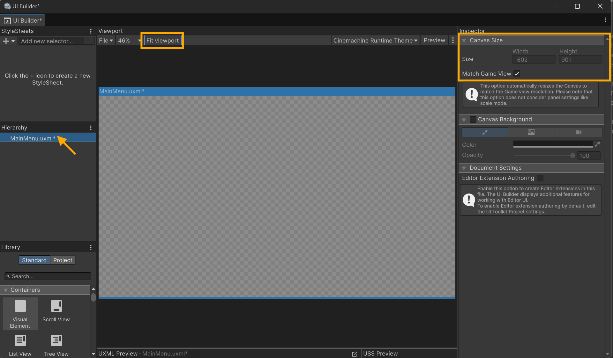
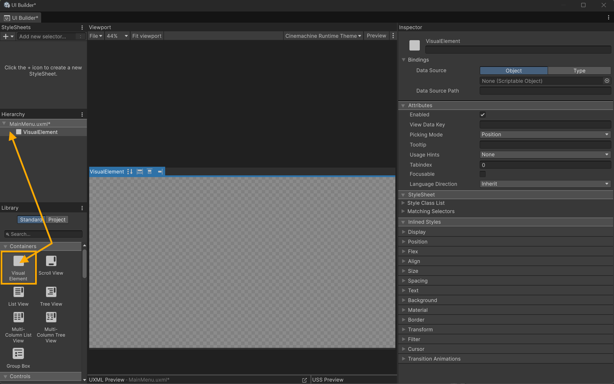
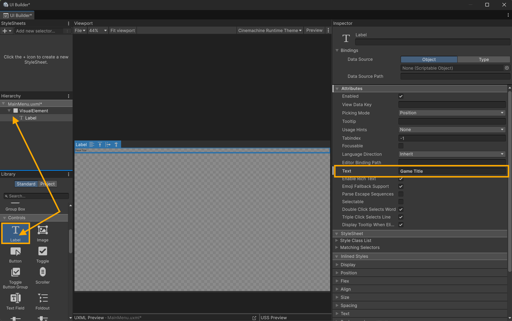
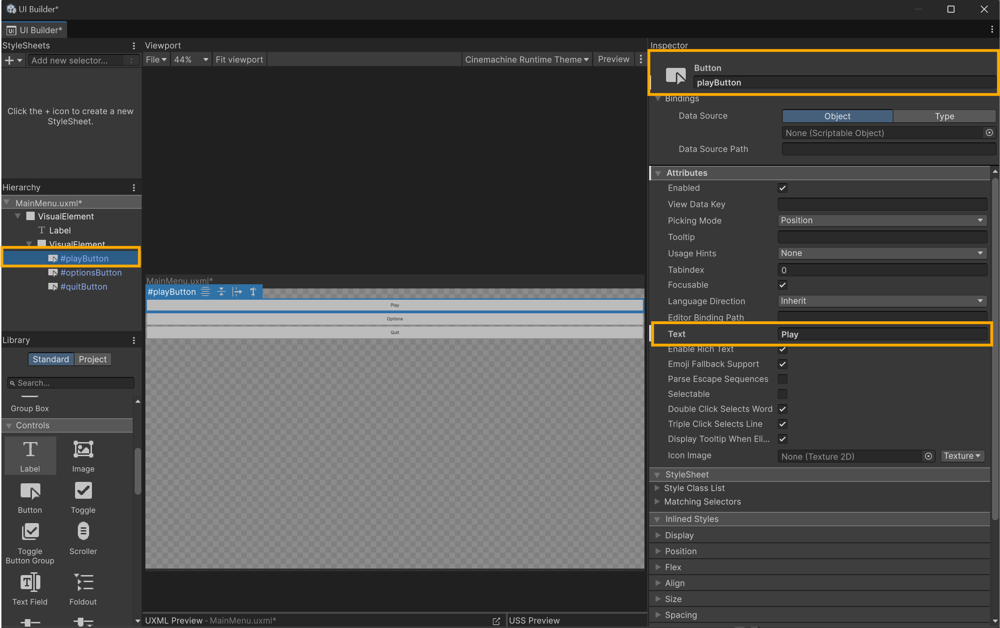

# 📜UI Document - UXML
When creating UI with Unity’s **UI Toolkit**, everything begins with a **UI Document**. You can think of a UI Document as the UI Toolkit equivalent of a **Canvas** in Unity’s older Canvas-based UI system (uGUI). It acts as the “container” that defines what UI exists, and it gets attached to a **GameObject in the scene** so Unity can render it at runtime.

## UI Document vs Canvas (uGUI)
In the Canvas-based system, the **Canvas and all UI elements are GameObjects** in the scene hierarchy. Buttons, text, images, panels; they all exist as objects with components like `RectTransform`, `Button`, and `TextMeshProUGUI`.

UI Toolkit works differently. Instead of building UI out of GameObjects, UI Toolkit UI is built using:
-   **UXML** → defines the UI structure
-   **USS** → defines the styling
-   **C#** → controls behavior
  
The **UI Document component** is responsible for displaying the **UXML** layout when the game runs.

# 

### What is UXML?

UXML is Unity’s version of XML, designed specifically forthe  UI Toolkit, drawing inspiration from modern web UI, which is built using **HTML + CSS**. In many ways:
-   **UXML is similar to HTML**
-   **USS is similar to CSS**
    
The key difference is that **HTML has predefined tags** (`<div>`, `<button>`, `<h1>`, etc.), while **standard XML does not**; XML tags can be anything, as long as the structure is valid and the program reading the file understands what those tags mean.

UXML sits somewhere in the middle: it is **XML**, but Unity provides a set of **predefined tags** like:
-   `<VisualElement>`
-   `<Label>`
-   `<Button>`
    
These tags represent UI Toolkit elements and are recognized directly by Unity.

---

## UI Builder vs Writing UXML
Unity provides the **UI Builder**, which allows you to build UI visually through drag-and-drop.

This can be useful for:
-   Quickly experimenting with layout
-   Previewing element structure
-   Learning how UI Toolkit works
    
However, UI Builder can also be cumbersome because:
-   It relies heavily on inspector-style workflows
-   It may generate **inline styles**, which can clutter your UI setup
-   It often encourages styling too early
    

For this course, we’ll use the UI Builder only briefly, and we’ll focus primarily on writing UXML directly. This makes the UI:
-   Cleaner to read
-   Easier to version control
-   Faster to build once you understand the structure
    
> [!NOTE]
> A good starting point for learning UI Toolkit structure and concepts is Unity’s documentation:
> [https://docs.unity3d.com/2022.3/Documentation/Manual/UIElements.html](https://docs.unity3d.com/2022.3/Documentation/Manual/UIElements.html)
>

---


## Basic Main Menu
Before creating our first UI Document, we need a clear target. We’ll start with a **basic main menu**, containing:

-   A **game title**
-   Three buttons:
    -   **Play**
    -   **Options**
    -   **Quit**
        

This menu will be:
-   Centered on screen
-   Vertically stacked
-   Evenly spaced
    
This is a simple and reusable layout that can serve as a **starting template** for future projects and menus.

---

# ⚒️ Tutorial: Creating A New UI Document - Main Menu
> By: Akram Taghavi-Burris | © 2026

<details>
<summary><strong><em>Tutorial Details</em></strong></summary>

|📝 Topic          | 🕑 Estimated Time | 🧰 Requirements   |
| :---------------: | :---------------: | :---------------: |
| UI Toolkit        | 10 minutes        | Unity, IDE |

</details>

> [!NOTE]
> Before starting this tutorial:
> - Ensure you are on the **UIManager** branch
>   

---

### Step 1: Create A UI Document
1. Open your project in the Unity Editor
2. In the **Project** window create a new folder named **UI**
3. Inside **UI** folder right-click and choose **Create > UI Toolkit > UI Document** 
   - Name it: **MainMenu**
4. Double-click on the **MainMenu** UI Document from the **Project** window
   - This will open the document in the **UI Builder**

# 

### Step 2: UI Document Canvas Setup
1. With the UI Document Selected in the UI Builder Hierarchy, set the **Canvas Size** to **Match the Game View**



> [!NOTE]
> For the **Match the Game View** to render at the appropriate resolution, the **Game View** window must have the correct **Aspect Ratio** set.
>

2. To see the full UI Document in the UI Builder, set the **Viewport** to **Fit Viewport**

# 

### Step 3: Adding a Visual Element
All UI elements exist inside a **Visual Element**, which can be thought of as the _root container_ as it is the base for all ui elements.

1. From the **Library** panel in the **UI Builder** find the **Visual Element**
   - Drag and drop the element into the **Hierarchy**




  
# 

### Step 4: Adding a Game Title
The game title will be displayed as text for this example. The visual element for displaying text is a **Label**

1. From the **Library** panel in the **UI Builder** find the **Label**
   - Drag and drop the element into the **Hierarchy** nested in the **Visual Element**
2. With the **Label** selected in the **Inspector** window
   - Set the **Attributes → Text** property to **Game Title**


  
# 

### Step 5: Create a Button Container
Since we want to ensure the buttons are aligned with each other, we can group these in their own container (i.e., Visual Element). This _button container_ will be inside the _root container_. 

1. From the **Library** panel in the **UI Builder** find the **Visual Element**
   - Drag and drop the element into the **Hierarchy** under the pervious **Label** elment

2. Inside the **Visual Element** which acts as our _button container_ **add 3 buttons**

We will assign a unique identifier (**ID**) to the buttons to ensure there is only one instance of that button in a given document. 

3. With the first (top) button selected in the **Hierarchy** in the **Inspector** window
   - Set the ID to **playButton**
   - Set the **Attributes → Text** to **Play**

4. Repeat step 3 on the other two buttons:
   - Set the ID to **optionsButton** and text value to **Options**
   - Set the ID to **quitButton** and the text value to **Quit**
  


#

### Step 6: View the UXML File
1. Open the **MainMenu** UXML file your IDE
2. The UXML document should look similar to the following:

```xml
<ui:UXML xmlns:xsi="http://www.w3.org/2001/XMLSchema-instance" xmlns:ui="UnityEngine.UIElements" xmlns:uie="UnityEditor.UIElements" noNamespaceSchemaLocation="../../UIElementsSchema/UIElements.xsd" editor-extension-mode="False">
    <ui:VisualElement style="flex-grow: 1;">
        <ui:Label text="Game Title"/>
        <ui:VisualElement style="flex-grow: 1;">
            <ui:Button text="Options" name="optionsButton"/>
            <ui:Button text="Quit" name="quitButton"/>
            <ui:Button text="Play" name="playButton"/>
        </ui:VisualElement>
    </ui:VisualElement>
</ui:UXML>
```
The first line declares Unity’s UI Toolkit namespaces, links the schema for validation/autocomplete, and specifies that this document is meant for **runtime UI**.

The remaining lines define the UI elements and set basic properties such as:

-   `text` (what the element displays)
-   `name` (how we reference the element later in C#)
    
You’ll also notice that the `VisualElement` tags include a `style` attribute, such as:

`style="flex-grow: 1;"`

These are **inline styles** generated by Unity. The issue is that inline styles take priority over any styling we apply later through a USS stylesheet. Since we want our layout and design controlled entirely through USS, we should remove these `style` attributes.

After removing inline styles, your UXML should look like this: 

```xml
<ui:UXML xmlns:xsi="http://www.w3.org/2001/XMLSchema-instance" xmlns:ui="UnityEngine.UIElements" xmlns:uie="UnityEditor.UIElements" noNamespaceSchemaLocation="../../UIElementsSchema/UIElements.xsd" editor-extension-mode="False">
    <ui:VisualElement>
        <ui:Label text="Game Title"/>
        <ui:VisualElement>
            <ui:Button text="Options" name="optionsButton"/>
            <ui:Button text="Quit" name="quitButton"/>
            <ui:Button text="Play" name="playButton"/>
        </ui:VisualElement>
    </ui:VisualElement>
</ui:UXML>
```

# 
### Defining Classes in UXML
 Before we write any USS, we need to **define classes** for the elements we want to style. A **class** in UXML works the same way it does in HTML/CSS:
-   It’s an identifier that groups one or more elements together
-   You can then target that class in your USS to apply consistent styles
-   Multiple elements can share the same class

Think of a class as a **tag that labels an element**, telling the stylesheet: “Style anything with this label this way.”

> [!NOTE]
> While it is possible to style UI elements directly in the UI Builder, the panels can quickly become cumbersome and messy to manage, especially as your UI grows.
> Instead, we will assign classes to the UI elements through code, giving us cleaner, reusable, and more maintainable styling.
> 

### Step 1 — Assign Classes in Your UXML
We’ll create three main classes for our main menu:
1.  **`root-container`** → Assigned to the top-level `VisualElement`.
    -   Acts as the **root container** for the menu layout.
        
2.  **`game-title`** → Assigned to the `Label` that displays the game title.
    -   Allows us to style the title text differently from other Label (text) elements.
      
3.  **`button-container`** → Assigned to the `VisualElement` that contains the buttons.
    -   Allows us to control spacing, alignment, and layout of the buttons.

Here’s how the updated UXML looks with these classes added:

```xml
<ui:UXML xmlns:xsi="http://www.w3.org/2001/XMLSchema-instance" 
         xmlns:ui="UnityEngine.UIElements" 
         xmlns:uie="UnityEditor.UIElements" 
         noNamespaceSchemaLocation="../../UIElementsSchema/UIElements.xsd" 
         editor-extension-mode="False">
         
    <ui:VisualElement class="root-container">
        <ui:Label text="Game Title" class="game-title"/>
        <ui:VisualElement class="button-container">
            <ui:Button text="Options" name="optionsButton"/>
            <ui:Button text="Quit" name="quitButton"/>
            <ui:Button text="Play" name="playButton"/>
        </ui:VisualElement>
    </ui:VisualElement>
</ui:UXML>
```

>[!TIP]
> Notice how we use the class attribute for styling instead of inline style properties.
> This allows us to centralize all visual design in a USS file, making it easier to tweak the look of our UI later.
>

--- 
# 🎉 New Achievement: Main Menu UXML Scaffold Created!

You now have a fully structured **UXML main menu scaffold** with **class-based styling hooks** ready for USS. This scaffold includes:
-   A **root container** (`root-container`) that acts as the menu’s base
-   A **game title label** (`game-title`) for customizing text styling
-   A **button container** (`button-container`) housing three buttons with unique IDs (`playButton`, `optionsButton`, `quitButton`)

```xml
<ui:UXML xmlns:xsi="http://www.w3.org/2001/XMLSchema-instance" 
         xmlns:ui="UnityEngine.UIElements" 
         xmlns:uie="UnityEditor.UIElements" 
         noNamespaceSchemaLocation="../../UIElementsSchema/UIElements.xsd" 
         editor-extension-mode="False">
         
    <ui:VisualElement class="root-container">
        <ui:Label text="Game Title" class="game-title"/>
        <ui:VisualElement class="button-container">
            <ui:Button text="Options" name="optionsButton"/>
            <ui:Button text="Quit" name="quitButton"/>
            <ui:Button text="Play" name="playButton"/>
        </ui:VisualElement>
    </ui:VisualElement>
</ui:UXML>
```

This scaffold serves as a **starting template** for all future main menus and provides a **clean foundation** for styling via USS and behavior via C#.

## 🚩 Checkpoint

Key takeaways from this lesson:
-   The **UI Document** is the UI Toolkit equivalent of a **Canvas** in uGUI.
-   UI elements are defined in **UXML**, styled with **USS**, and controlled via **C#**.
-   A **VisualElement** acts as a **container** for all child elements.
-   Inline styles generated by UI Builder can **override USS**; removing them gives you full control via USS.
-   Using **classes** (`root-container`, `game-title`, `button-container`) allows **centralized, reusable styling**.
-   Each button has a **unique ID** (`playButton`, `optionsButton`, `quitButton`) for **C# references** and interaction logic.
-   This scaffold is **modular and reusable**, making it easier to expand or adapt menus across different projects.


