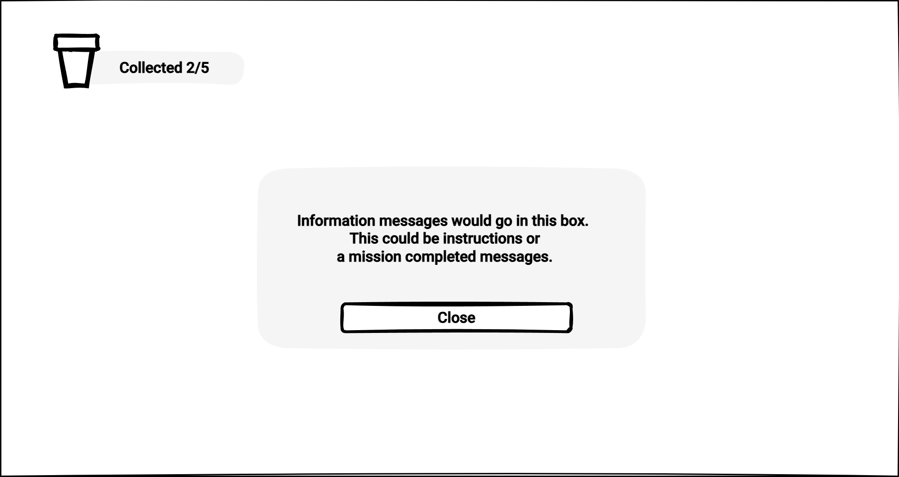
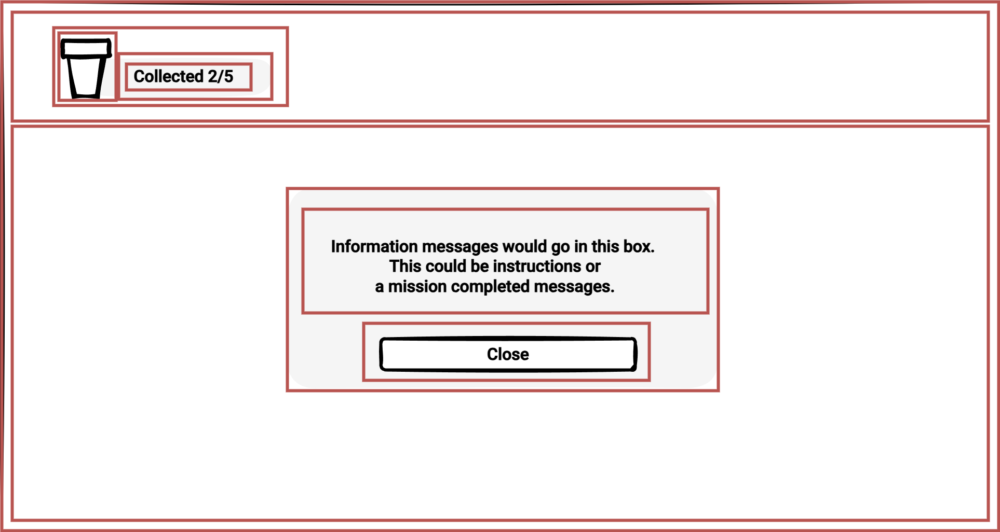

# 📜 User Interface Development

> By: Akram Taghavi-Burris | © 2026

UI development focuses on creating the interactive elements that users (players) will engage with and gather information from, throughout the experience. In this chapter, we will explore the process of building a UI from planning to implementation.

## UI Planning

Before diving into the visual design of your User Interface (UI), it’s essential to first plan how it will function and what elements need to be included. This is where **wireframing** comes in. Wireframing is the process of creating a basic layout or blueprint for your UI, focusing on structure, content placement, and functionality, without worrying about color schemes, fonts, or images.

Wireframes serve as the foundation for your UI design, providing a clear, simplified view of how the interface will look and operate. They allow you to visualize the relationship between various components—such as buttons, menus, and icons—before you commit to detailed design work. Think of wireframes as a rough draft, helping you establish a clear vision for the layout and flow of the interface, and making it easier to iterate and adjust before finalizing any visual details.

#

#### The Importance of Planning the Layout and Functionality

Planning the layout and functionality through wireframing is crucial for several reasons:

1.  **Clarifying Functionality**: Wireframes allow you to focus on how the interface will work. You can experiment with different placements of elements, ensuring that buttons, menus, and other interactive components are logically arranged and easy to use. It’s a time-efficient way to visualize user flows and identify potential usability issues early in the design process.
    
2.  **Ensuring Consistency**: By planning the layout in advance, you ensure that all UI elements are consistent in their positioning and interaction. This consistency is key to creating a user-friendly experience, as it minimizes confusion and helps players navigate through the game intuitively.
    
3.  **Fostering Collaboration**: Wireframes are excellent communication tools. When working with a team, wireframes act as a universal reference point for discussing and refining the interface design. Designers, developers, and stakeholders can all review the wireframe to provide feedback and align on the layout and functionality before proceeding to more complex visual designs.
    
4.  **Saving Time and Resources**: Creating detailed visual designs too early in the process can lead to wasted time and effort if the layout or functionality changes later on. Wireframes allow you to quickly iterate and test different ideas without committing to high-fidelity design elements. They help pinpoint layout problems early, reducing the risk of costly redesigns down the line.
    
5.  **Focusing on User Experience**: At this stage, the priority is to design with the user in mind. Wireframing forces you to think critically about how players will interact with the interface, helping you prioritize functionality and ease of use over aesthetics. You can focus on the flow of interactions, ensuring that the UI supports the player’s goals efficiently.
    
#

#### Getting Started with Wireframing

When creating a wireframe, start with the basic elements you know are essential for the interface. Consider the following:

-   **Core Elements**: What are the key components that will appear in the UI (e.g., navigation menus, buttons, HUD elements, etc.)? These should be clearly outlined in your wireframe.
    
-   **Layout Structure**: Where will each element be placed on the screen? Consider visual hierarchy, grouping similar items together, and ensuring there is enough space between elements for clarity.
    
-   **User Flow**: How will the user navigate through the interface? Wireframing allows you to map out this flow, showing how players will move from one screen or action to another.
    
-   **Interactivity**: Even in the wireframe stage, it’s helpful to define interactive areas, such as buttons or sliders, so that their purpose and placement are clear.
    
#

### Example UI Wireframe

In our **Game Design Challenge:** _Park Clean-Up Game_ we will want our in game Heads-Up Display (HUD) to provide the player with information regarding the objectives of each level. For example, we will want to display the amount of Trash the player has collected. We might also want to share information on what the objective for each level is and when the mission for each level is completed.

Given these requirements, we can create a wireframe sketch to illustrate where all these elements will appear in the game. The following is an example of this wireframe sketch.



Once the wireframe is established, you can move on to refining the design, adding visual elements, and creating high-fidelity mockups. However, without a solid wireframe, the risk of ending up with a confusing or inefficient UI is much higher.

## **Style Sheets**

Modern UI design faces similar challenges when designing for the web and other digital interfaces, such as games. These challenges include the need to present information clearly, adapt to different screen sizes, and provide an intuitive experience.

**CSS (Cascading Style Sheets)**, a **style sheet language**, was developed primarily for the web to define a set of rules for how elements appear on screen, defining layout, colors, spacing, and responsiveness.

The sample below shows the CSS set of rules for a button.

```css
    button {
        background-color: #4CAF50; /* Green background */
        color: white; /* White text */
        padding: 15px 32px; /* Padding around the text */
        text-align: center; /* Center the text inside the button */
        text-decoration: none; /* Remove underline */
        display: inline-block; /* Make the button inline */
        font-size: 16px; /* Set text size */
        margin: 4px 2px; /* Add space around the button */
        cursor: pointer; /* Change cursor to pointer on hover */
        border-radius: 4px; /* Rounded corners */
    }
```

### Unity USS

The Unity UI Toolkit uses a variation of CSS known as **USS (Unity Style Sheet)**, which works and is written exactly like CSS, only with a few Unity-specific elements and rules.

---

## **The Box Model**

One of the core concepts of CSS is the **Box Model**. Whether we are designing a website or interface, everything on screen lives inside a box. Each box has the following four properties:

1.  **Content** – The actual text, image, or UI element.
2.  **Border** – The outline surrounding the element. The border is typically invisible by default.
3.  **Padding** – Space on the inside of the border. Adding padding will push the content away from the edge of the border.
4.  **Margin** – Space outside the border. Adding a margin will push the element away from other elements.

#

### Applying the Box Model to the Wireframe

To get a better understanding of how the elements in our UI will be structured, we can apply the Box Model directly to our UI wireframe sketch. By visualizing the layout in terms of "containers" and their relationships, we can more effectively plan how to group, nest, and space UI components. This process helps ensure that the UI is clean, organized, and easy to navigate before we dive into detailed visual design.

Here’s how we can apply the Box Model to our wireframe:

1.  **Draw Borders Around Each Element**: Start by outlining each UI element (such as buttons, text, and images) with borders. These borders represent the "containers" or "content areas" for each element. Drawing these helps us clearly define the boundaries of each component and see how it will fit within the overall layout.
    
2.  **Group Related Elements with Borders**: Once individual elements are outlined, group related items together by drawing larger borders around them. For example, multiple buttons or text sections that are part of the same group can be enclosed in a single container. This step allows us to see which elements are related and should be positioned together in the UI.
    
3.  **Add Padding Around the Borders**: Now that we’ve grouped elements into containers, we add padding around the content inside each border. Padding creates space between the content (e.g., text or images) and the edge of the container, preventing the content from feeling too cramped and ensuring the UI elements are visually comfortable.
    
4.  **Define the Margin**: Lastly, define the margin around each container by drawing space between the outer borders. This margin ensures there’s adequate space between different groups of elements, preventing the layout from feeling too cluttered or congested.
    

The image below is a perfect example of applying the Box Model to the UI wireframe sketch.



By visualizing the wireframe with borders, padding, and margins, we can identify the necessary containers (boxes) and how they should be organized and nested within the UI. This approach provides a structured foundation for the layout, making it easier to move forward with building a functional, well-aligned user interface.

#

### **Unity's Box Model**

Unity’s UI Toolkit uses the **box model** in a way similar to CSS. Each UI element follows the same rules, allowing for structured, scalable layouts. Instead of manually adjusting pixel positions, you define margins, padding, and borders in **USS (Unity Style Sheets)** to create clean, maintainable UI designs.


Understanding these fundamentals makes working with UI Toolkit much easier. Next, we’ll explore how Unity applies these concepts and how you can build UI visually using the **UI Builder**.
