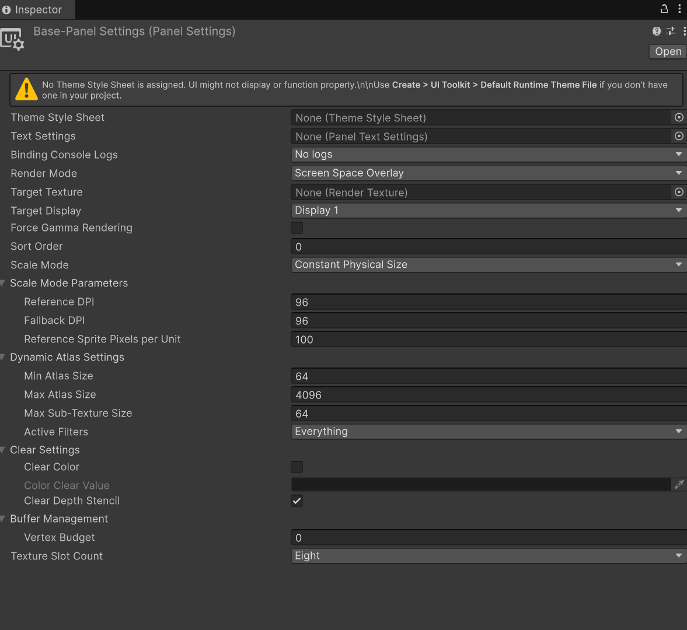

# 📜 UI Document – Game Object

We’ve already created a **UI Document asset** (the `.uxml` file), which you can think of as the **UI Toolkit equivalent of a Canvas layout** in the older uGUI system. However, unlike a Canvas, this UI Document **only exists in the Assets folder**; it is just a file and does **not appear in the scene** by itself.

To actually display this UI in the scene, we need a **UI Document GameObject**. Unity’s naming can be confusing here: the **GameObject is not the UXML file**. Instead, it is a scene object with a **UIDocument component**, which is responsible for rendering the assigned UXML at runtime.

Once the UI Document GameObject is created, we assign the **UXML file** to its **Source Asset** field. This tells Unity which UI Document asset to load and display in the Game View.

## UI Panel Settings

While the **UI Document GameObject** renders the UXML, it also needs rules for **how** to render it. This is handled by a **Panel Settings asset**, which defines:
-   UI scaling behavior
-   Rendering rules
-   Layering and sort order
-   Some performance and fallback behavior

> [!NOTE]  
> Most projects only need **one Panel Settings asset** for all menus.
>
> When you create a new UIDocument, Unity searches the project for an existing Panel Settings asset.
> If none exists, it automatically creates one. If one does exist, it will pick the one with the lowest **Internal Instance ID** (often the first one created or imported).
>

#

### Theme Style Sheet

The first key setting on a Panel Settings asset is the **Theme Style Sheet**.

> [!WARNING]
> The **Theme Style Sheet** is **not the same** as the USS style sheets you assign directly to a UIDocument in the UI Builder.
    
The Theme Style Sheet is a **.tss file**, which acts as a set of **global style defaults**. For example, Unity’s default button is grey with black text. If you want **all buttons across all UI Documents** to have white backgrounds and black text, you could define a global USS in a Theme TSS file.

**How it works in practice:**
-   Assign a Theme TSS to the Panel Settings asset.
-   That TSS can reference global USS files (via `@import`) or define styles directly.
-   UIDocuments using that Panel Settings will **use the theme styles**, unless the UIDocument itself has **specific USS assigned**.

> [!IMPORTANT]
> The **Theme only affects runtime**; UI Builder will **not automatically show theme styles** unless you select the theme in the UI Builder dropdown.
>
> Many developers find it simpler to **use Theme TSS only as a fallback** and assign USS directly to UIDocuments.
>     

**Creating a Theme Style Sheet:**
1.  Right-click in the Assets folder and choose **Create > UI Toolkit > TSS File (Theme File)** or choose **Default Runtime Theme**.
2.  Select the new TSS file and, in the Inspector, you can assign **default style sheets**.

> [!TIP]  
> For most small projects, it’s easier to create a **Default Runtime Theme** with no specific settings and define **all styles per UI Document** using USS and UXML.
>

#

### Text Settings
The **Panel Settings** asset also includes **Text Settings**, which are **fallback assets for text, sprites, and font rendering**.
-   If a font, sprite, or TextMeshPro asset fails to load, Unity uses the Text Settings asset to provide defaults.
-   These assets must reside in the **Resources folder** so they can be preloaded at runtime.
-   Adding Text Settings increases memory usage slightly, but ensures that UI elements **always have a fallback**.
    
**Creating a Text Settings asset:**
1.  Right-click in the Assets folder and choose **Create > UI Toolkit > Text Settings**.
2.  Assign it to your Panel Settings asset as needed.

> [!NOTE]  
> In most simple projects, the default Text Settings can be safely ignored.
>

# 

### **Target Texture**
The **Target Texture** setting allows the UI Toolkit panel to render into a **Render Texture** instead of directly to the screen.

This is mainly used when you want UI to appear:
-   on a 3D object (like a screen in the world)
-   inside a monitor display
-   inside VR as part of the world
    
If you are building normal menus/HUD, you can ignore this.

# 

### **Sort Order**
The **Sort Order** controls layering when you have **multiple UI Documents active**.

-   Higher Sort Order = draws on top
-   Lower Sort Order = draws behind
    
Example:
-   HUD → 0
-   Pause Menu → 10
-   Popup Dialog → 50

Sort Order is one of the most important settings once you have more than one UI Document.

### **Scale Mode and Parameters**
**Scale Mode** controls how UI scales when the screen size changes; basically, the UI Toolkit equivalent of the **Canvas Scaler** from uGUI. 
The UI scale can be set to : 

-   Constant Pixel Size (set size - best for fixed-resolution games)
-   Constant Physical Size ( real-world physical size based on the screen DPI.)
-   Scale With Screen Size ( scales with the resolution, most common option) 

#### Screen Match Mode
The **Screen Match Mode** controls how scaling behaves when the aspect ratio changes.
The behaviors include: 
 - Match Width or Height (most common option)
 - Shring (Shrinks the UI until it fits)
 - Expand (Expands the canvas area to keep the UI's size; could cause off screne overflow). 

# 

### Dynamic Atlas Settings
UI Toolkit uses something called a **Dynamic Atlas**, which is basically a texture “packing system.”  
Unity tries to combine lots of small UI textures into one larger texture behind the scenes so the UI can render faster.

This is mostly relevant if the UI uses:
-   lots of icons
-   many small images
-   lots of texture swapping
    
For most student projects, the default settings are fine.

#### **Active Filters**
The **Active Filters** tell Unity what textures to **exclude** from the atlas.

This is mostly for avoiding:
-   textures that can’t be packed safely
-   textures that cause quality loss
-   textures that don’t match the atlas settings

**Active Filters** can be set to: 
- Everything (enables all filtering rules)
- Nothing (disables all filtering rules)
- Readability (excludes textures marked as isReadable)
- Size (excludes textures larger than Max Sub Texture size)
- Format (excludes textures with formats that would lose precision)
- Color Space (avoids packing certain formats when your project is using Linear Color Space, because it can cause visual artifacts like banding.)
- Filter Mode (Prevents textures from being packed if their filter mode doesn’t match the atlas.)

---
## 🚩 Checkpoint
Having explored the UI Document GameObject and Panel Settings, here are the key points to keep in mind:

-   **UI Document vs UI Document GameObject:**  
    The UI Document (`.uxml`) defines the UI layout and lives in the Assets folder. The UI Document GameObject is a **scene object** with a UIDocument component that renders the UXML at runtime. Don’t confuse the two—they serve different purposes.
    
-   **Source Asset assignment:**  
    To display UI in the scene, the UI Document GameObject must reference a **Source Asset** (your UXML file). This is how Unity knows what to render.
    
-   **Panel Settings purpose:**  
    Panel Settings define **how** the UI is displayed, including scaling, layering, sort order, fallback behavior, and performance settings. Unity auto-creates one if none exist, and most projects only need **one Panel Settings asset**.
    
-   **Theme Style Sheet (.tss):**  
    Provides **global default styles** for UI elements at runtime, like default button colors or font styles. It is not the same as a USS assigned to a specific UI Document. Theme styles only apply if the UIDocument doesn’t have its own USS.
    
-   **Text Settings fallback:**  
    Ensure fonts, sprites, and text elements render correctly at runtime. Stored in the Resources folder, these act as a fallback if an asset fails to load.
    
-   **Sort Order & layering:**  
    When multiple UI Documents are active, **Sort Order** determines which renders on top. Higher values draw above lower values, allowing modular HUDs, menus, and popups.
    
-   **Scaling & Screen Match Mode:**  
    Use Scale Mode to control how UI adjusts to different screen sizes. Most commonly, **Scale With Screen Size** is used with a **Match Width or Height** parameter to handle different aspect ratios.
    
-   **Dynamic Atlas & Filters:**  
    UI Toolkit packs multiple small textures into a single atlas for performance. Filters let you exclude certain textures that could cause rendering issues or precision loss. Defaults are fine for most projects.
    
-   **Best practice:**  
    For student projects and small games, it’s usually simpler to:
    1.  Use a default Panel Settings asset.
    2.  Use the **Default Runtime Theme**
    3.  Define **styles via USS per UIDocument** rather than relying heavily on Theme TSS.
