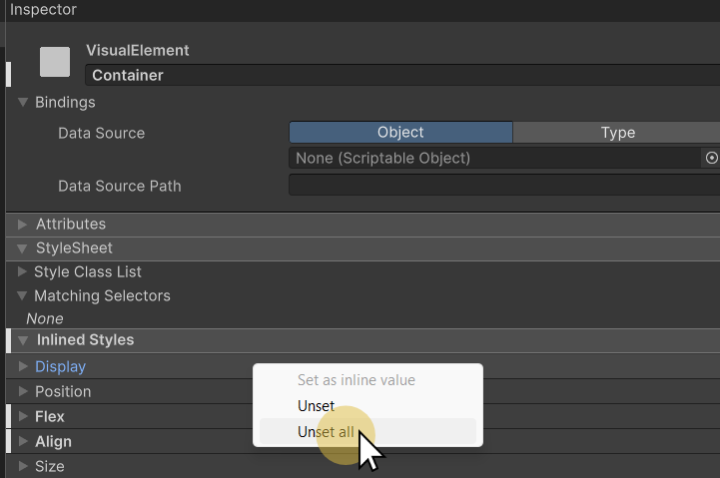

# 📜 Unity UI Toolkit
> By: Akram Taghavi-Burris | © 2026


**Unity UI Toolkit** is a modern UI framework for creating user interfaces in Unity. It provides a flexible and scalable approach to building UI, leveraging a workflow similar to web development with stylesheets, hierarchy-based elements, and responsive layouts. Whether you're designing in-game UI, editor extensions, or tools, UI Toolkit streamlines the process with a clean and structured approach.

## **UI Builder**

**UI Builder** is Unity’s dedicated visual editor for creating and managing UI Toolkit interfaces. This allows game designers the ability to create their UI without knowing anything about css or Unity's own uss (Unity Style Sheet). Elements can be placed in the viewport and rules are defined in the Inspector.

#

#### **Key Parts of the UI Builder**

UI Builder consists of several panels that help you construct and manage your UI efficiently:
1.  **StyleSheets Panel**: Manages USS (Unity Style Sheets) and allows you to define reusable styles for your UI.
2.  **Hierarchy Panel**: Displays the structure of your UI, showing parent-child relationships between elements (like a scene hierarchy for UI).
3.  **Library Panel**: Contains a collection of UI elements that you can drag into your UI, including standard controls, containers, and templates.
4.  **Canvas (Viewport)**: The main working area where you visually arrange and edit UI elements.
5.  **Code Previews**: Displays the associated UI Document (UXML) and the StyleSheets (USS) that is generated when building the UI.
6.  **Inspector Panel**: Allows you to modify properties of selected UI elements, including layout, styling, and behavior.
    
> [!IMPORTANT]
> While designers do not need to know **CSS** or **USS** to use the UI Builder, you do need to have a good grasp on the **Box Model**.
> You can not just place a button in the middle of the scene. Because the interface overlays on the game world and because the interface needs to be responsive, there are no actual vector position values for the UI object.
> Instead, everything is positioned based on a percentage from its parent box, using **margin**, **padding**, and **border**.
> 

# 

### **UXML & USS**

UI Toolkit uses a structured system inspired by web technologies:
-   **UXML (Unity XML)**: Defines the UI structure, similar to how HTML works on the web. It allows you to create reusable UI components.
-   **USS (Unity Style Sheets)**: Controls the appearance of UI elements, similar to CSS. With USS, you can apply styling, spacing, colors, and animations, keeping UI design clean and maintainable.

>[!TIP]
> UI Toolkit can be used for both **runtime UI** (in-game UI elements) and **editor UI** (custom Unity Editor tools).
>

# 

## UI ToolKit Styling
The Unity UI Toolkit styles UI elements similar to CSS for the web, and as such, the way an element is styled has a certain level of dominance over others.

There are 3 methods for styling UI elements:
-   **InLine**
-   **ID Selector**
-   **Class Selector**

 #
 
### **Inline Styling**
-   Applied directly to the element in the **Hierarchy** via the **Inspector**.
-   Takes the highest priority, overriding ID and Class styles.
-   Best used for elements with **minimal styling** (three or fewer properties) that mainly act as **containers**.

**Example:** A simple background container with just a color and padding may be easier to manage with inline styling.

#

### **ID Selector Styling**
-   Defined in your **USS (Unity Style Sheet)** using the `#` symbol followed by the element's name.
-   Best for styling repeating elements that have a lot of settings applied.
-   Ensures consistent styling for specific UI elements throughout your project.

**Example:**

```css 
#MainMenu {   background-color: #333;    padding: 10px;}
```

> [!NOTE]
> In web development, **ID selectors** must be unique within a page because they also function as anchor links, allowing navigation to specific elements.
> As a result, no two elements can share the same ID.
>
> In contrast, the **Unity UI Toolkit treats ID selectors strictly as styling hooks**, meaning the same ID can be applied to multiple elements within the same UI Document without issue.
>

#

### **Class Selector Styling**
-   Defined in your **USS** using the `.` symbol followed by the class name.
-   Best for **shared styles** applied across multiple elements.
-   Efficient for consistent styling of reusable UI components.

**Example:**
```css
.container {    border: 2px solid #aaa;    margin: 5px;}
```

### **Order of Precedence (Inheritance)**
The order in which styles are applied matters. Unity UI Toolkit follows this priority:
1.  **Inline Styles** (Highest Priority)
2.  **ID Selector Styles**
3.  **Class Selector Styles**

> [!CAUTION]
> **Inline styles will always override ID or Class styles**.
> If your updates to ID or Class selectors are not taking effect, check for inline settings that may be interfering.
>

#

### **Resetting Inline Styles**
If you've accidentally styled an element inline and your USS changes are not applying, you must:
1.  Select the element in the **Hierarchy**.
2.  In the **Inspector**, locate the inline styles.
3.  Use **Unset** or **Unset All** to remove the inline settings.



This will allow the ID or Class selectors to apply their intended styles.

### **Best Practices for Styling**
✅ **Use Inline Styles** for simple containers with minimal styling.  
✅ **Use ID Selectors** for unique elements with distinct styling.  
✅ **Use Class Selectors** for reusable, shared styles across multiple elements.

By following these guidelines, you'll create a cleaner, more maintainable UI structure in Unity.
