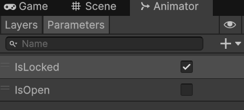
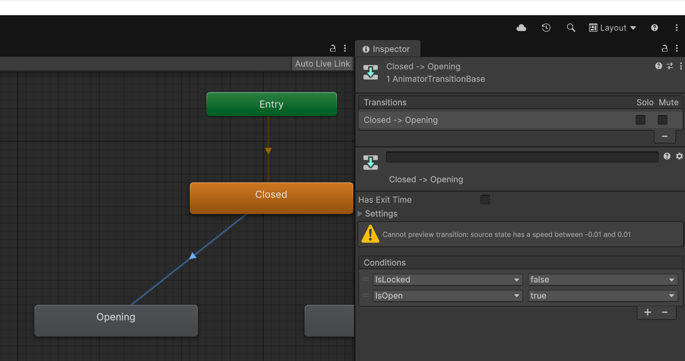
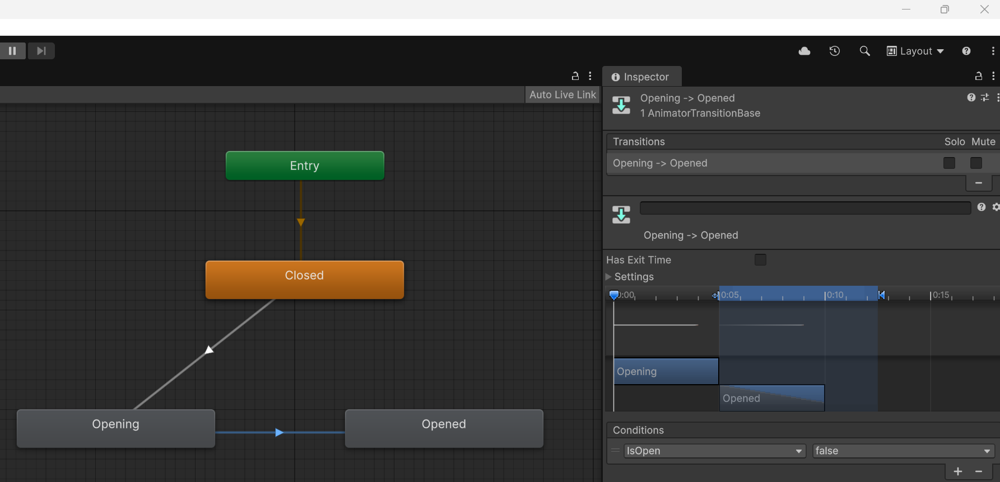

# 📜 Unity Animation

> By: Akram Taghavi-Burris | © 2026

In many games, **interactive objects** such as doors, gates, or levers often need animations to **open, close, or react to player actions**. Unity provides a robust **Animation** and **Animator** system to control object states with precision and flexibility.

In this tutorial, we will animate a **park gate** that separates two areas. We’ll create **open and close animations**, set up an **Animator state machine**, and configure **parameters** to control gate behavior. Finally, we’ll turn the gate into a **prefab variant** so it can be reused across the scene.

> [!TIP]  
> Think of the Animator as a **state machine** for your object—it controls what animation plays, when it plays, and under what conditions.
>

## Best Practices for Animation
-   **Name your objects clearly** (`Gate_Interactable`, `Gate-Left`, `Gate-Right`) for easy reference.
-   **Keep animation clips and prefabs organized** in dedicated folders (`Animation`, `Prefabs`).
-   **Use Boolean parameters in the Animator** for true/false conditions, which simplifies transitions.

---

# ⚒️ Tutorial: Animate the Gate

<strong><em>Tutorial Details</em></strong>

|📝 Topic          | 🕑 Estimated Time | 🧰 Requirements   |
| :---------------: | :---------------: | :---------------: |
| Animation     | 30 minutes       |   GitHub Desktop, Unity, Gate Prefab   |

> [!NOTE]
> Before starting this tutorial, ensure you have :
>  - Completed **[Probuilder Tutorial](ProBuilder.md)**
>  - That you are on the **Animation** branch in GitHub Desktop.
>

### Step 1 — Prepare the Gate GameObject
1.  Open the **ParkGame-Unity** project
2.  In the **Hierarchy**, locate the gate separating **Area One** from **Area Two**.
3.  Rename the GameObject to:
    -   **Gate_Interactable**
        
> [!TIP]  
> Clear and descriptive names help avoid confusion when adding animations or scripting behaviors.
> 

#

### Step 2 — Open the Animation Window
1.  In the top menu, go to:
    -   **Window > Animation > Animation**
        
2.  The **Animation window** will open.
3.  With **Gate_Interactable** selected, in the **Animation** window press **Create** to create a new animation.
4.  Save the animation in a new folder named:
    -   `Animation`
        
5.  Name the animation:
    -   **ANM_GateOpen**
        
#

### Step 3 — Add Properties for Rotation
1.  In the Animation window, click **Add Property**.
2.  Select **Gate-Left → Transform → Rotation**
3.  Repeat for **Gate-Right → Transform → Rotation**

> [!NOTE]
> Any property added to the animation track will have a first key frame auto-created based on its current settings.
> 
    
# 

### Step 4 — Record the Open Animation
1.  Press the **Record button** in the Animation window.
2.  Move the **playhead** to the **10** second marker.
3.  Select **Gate-Left** → in the **Inspector**, set **Y rotation = -90**.
4.  Select **Gate-Right** → in the **Inspector**, set **Y rotation = 270**.
5.  Turn **off** the Record button.

> [!TIP]  
> Recording automatically creates keyframes at the playhead position when the property values for that track are changed.
> 

# 

### Step 5 — Create the Close Animation
1.  In the **Project window**, duplicate **ANM_GateOpen** → rename it **ANM_GateClose**.
2.  In the Animation window:
    -   Draw a selection box around the **first frames** and drag them to frame **15**.
    -   Select the frames at **frame 10** → move them to **frame 0**.
    -   Move frames from frame 15 back to frame 10.
        
> [!NOTE]  
> This effectively **flips the animation**, making the close animation play in reverse.
>

# 

### Step 6 — Associating Animation Clips with the Animator
When we created **ANM_GateOpen**, Unity automatically linked it to the gate.

But since **ANM_GateClose** was duplicated, we need to manually link it.

1.  Select **Gate_Interactable** in the **Hierarchy**.
2.  In the **Inspector**, confirm the object has an **Animator** component.
3.  In the **Animation** window, click the clip drop-down.
    -   You should only see **ANM_GateOpen**
        
4.  In the **Project** window, drag **ANM_GateClose** onto **Gate_Interactable** in the **Hierarchy**.
5.  Return to the **Animation** window and open the clip drop-down again.
    -   You should now see both
        -   **ANM_GateOpen**
        -   **ANM_GateClose**
            

> [!TIP]  
> If a clip exists in the Project window but does not appear in the Animation window, it usually means it has not been added to the GameObject yet.
>

# 

### Step 7 - Adjusting Animation Loops
By default, all animation clips are set to loop. In many instances, we will want to turn off the loop property by: 
1. Select the **ANM_GateOpen** in the **Project** window
2. In the **Inspector** window uncheck **Loop Time**
3. Repeat the steps for **ANM_GateClose**

# 

### Step 8 — Create Closed State
The **Animator** controller allows us to control when animations play using **states**. 

**States** help us organize behavior. Instead of the player trying to walk, run, and idle all at once, the game chooses one mode and follows its rules.

1. Go to **Window > Animation > Animator**.
2.  The **Animator window** will open.
3. Select **Gate_Interactable** from the **Hierarchy**.
4. In the **Animator** window, draw a window around all states and press delete.
   - The Entry, Exit, and Any State should be the only states left
6.  In the **Animator** window right-click in an open area and choose **Create State → Empty** → rename: **Closed**
7.  Right-click on the **Entry** state and choose **Make Transition**
    -  Drag the transition arrow to the **Closed** state.
3.  With **Closed** selected, in the Inspector:
    -   Set **Motion** = `ANM_GateOpen`
    -   Set **Speed = 0**  (keeps the animation from playing automatically)

>[!WARNING]
> The **Closed** state uses **ANM_GateOpen** on purpose.
>
>Even though the name sounds wrong, the **first frame** of `ANM_GateOpen` shows the gate **fully closed**.
>
>Since the **Closed** state has its **Speed set to 0**, Unity will hold the animation on frame 1 and keep the gate closed.
>
>If we used `ANM_GateClose` instead, frame 1 would show the gate **already open**, which is not what we want for the Closed state.
>

        
#

### Step 9 — Create Animator Parameters
1.  In the Animator window, go to the **Parameters tab**.
2.  Click **+ → Bool** → name: `IsLocked`
    - Set the value to `True` (checked )
3.  Click **+ → Bool** → name: `IsOpen`
    - Set the value to `False` (unchecked)

> [!NOTE]  
> **Animator Parameters** are values that control when animations switch states.
> 
> Booleans are a simple type of parameter that checks for a **true/false** condition. These parameters should be phrased as questions (true/false) to make transitions easy to understand (e.g., 'IsLocked').
> 

# 

### Step 10 — Add Opening and Open States
1. In a blank area of the **Animator** window, create two more states (i.e., right-click **Create State → Empty**)
    - Name one **Opening**
    - Name the second one **Opened**
3.  Right-click **Closed** and choose  **Make Transition**
    - Drag the transition arrow to **Opening**
5.  Select **Opening** state and in the **Inspector**:
    -   Set **Motion** = `ANM_GateOpen`
    -   Set **Speed = 1**  (will auto-play the animation)
       
6.  Select the **transition arrow (Closed → Opening)**, in the **Inspector** window
    - Uncheck **Has Exit Time** 
    - In the **Conditions** Panel, press the **`+`** to add the following coniditions:
        -   `IsLocked = False`
        -   `IsOpen = True`

8.  Right-click **Opening** state and choose **Make Transition**
    - Drag the transition arrow to **Opened**
9.  Select **Opened** state and in the **Inspector**:
    -  Set **Motion** = `ANM_GateClose`
    -  Set **Speed = 1**  (will auto-play the animation)
        
10.  Select **transition arrow (Opening → Open)**:
    -   Uncheck **Has Exit Time**
    -   Condition: `IsOpen = False.`

> [!IMPORTANT]
> The logic behind our conditions comes from the interactions we plan to create later.
> When the Player triggers the gate, it will need to check if we have completed our mission. If this is true, we need to:
>  - Unlock the gate, setting `IsLocked` value to `False.`
>  - Start the open animation, but set the `IsOpen` to `true.`
>  Once we exit the trigger area, we will check if `IsOpen` is `true` and if so, set it back to `false`. This triggers the close animation.
>
        
11.  Right-click **Opened** state and choose **Make Transition**
     - Drag the transition arrow to **Closed**
13.    Select the **transition arrow (Opened → Closed)**, in the **Inspector** window
       - **Check Exit Time** = True
       -   Set **Exit Time** = 1 (ensures the animation finishes before returning to Closed)

#
### Step 11 — Test the Gate Animation
1.  Press **Play** in Unity.
2.  In the **Scene view**, locate **Gate_Interactable**.
3.  In the Animator window:
    -   Set **IsLocked = False** → gate opens automatically.
    -   Set **ShouldOpen = False** → gate closes automatically.
4.  Exit Play mode.
   
> [!NOTE]  
> This verifies that the **Animator state machine and conditions work correctly**.
> Later, we trigger these animations in the game through visual scripting.
>

#

### Step 12 — Create a Prefab Variant
1.  Drag **Gate_Interactable** from Hierarchy into the **Project** window **Prefabs folder**.
2.  When prompted:
    -   Select **Create Prefab Variant**
3.  Rename the variant back to **Gate_Interactable**
    
> [!TIP]  
> A **prefab variant** inherits the original prefab’s properties but allows **scene-specific adjustments**.
> This is why we create a variant: we can reuse it while keeping unique animations or parameters for each instance.
> 

#

### Step 13 — Add Additional Gates
1.  Drag another **Gate_Interactable** prefab into the scene.
2.  Place it as the **second gate** to interact with in your park.
    
> [!TIP]  
> Using prefabs and variants allows you to **reuse the same gate logic and animation** without duplicating setup work.
> 

#

### Step 14 — Save & Commit
1.  Save the scene: **File > Save** or **Ctrl + S**
2.  Close Unity.
3.  In **GitHub Desktop**: stage your changes
4.  Commit with message:
    -   `feat: added Gate Animator and open/close animations.`
5.  Push changes to the **Animation** branch

