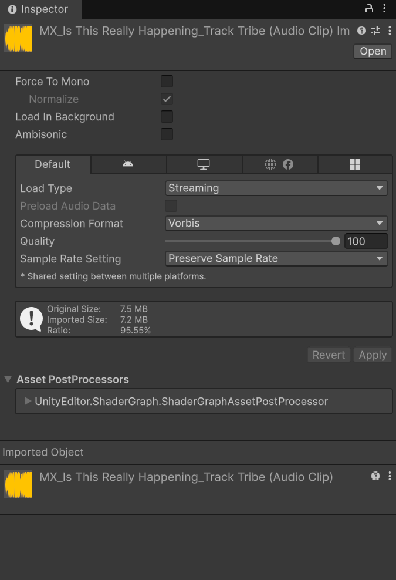
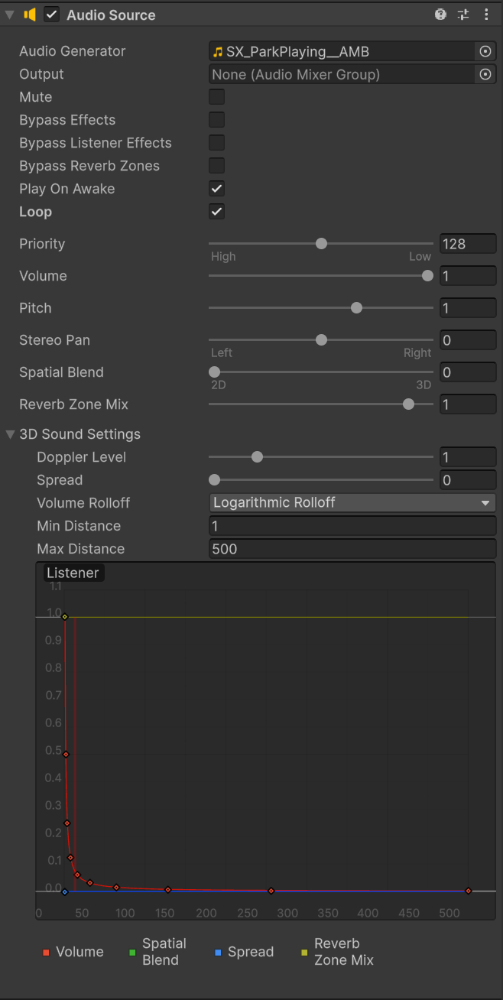

# 📜 Unity Audio
> By: Akram Taghavi-Burris | © 2026

Sound plays a critical role in creating immersive and believable game environments. While visuals establish the world, audio brings it to life, adding atmosphere, depth, emotion, and player feedback. From subtle ambient background noise to directional sound effects that respond to player movement, audio enhances realism and strengthens player engagement.

Unity provides a flexible audio system that allows you to implement different types of sound depending on your project’s needs.

## Supported Audio File Types in Unity
Before adding sound to your project, it’s important to understand which audio file formats Unity supports. Unity can import several common audio file types, allowing flexibility depending on your project needs.

### Commonly Used Formats

-   **.WAV** : Uncompressed audio format.
    -   High quality
    -   Larger file size
    -   Ideal for short, high-impact sound effects (like clicks, footsteps, or impacts).
        
-   **.MP3** :  Compressed audio format.
    -   Smaller file size
    -   Slight quality loss due to compression
    -   Good for longer background music or ambient loops to reduce file size.
        
-   **.OGG (Ogg Vorbis)** :  Compressed format commonly used in games.
    -   Better compression than MP3        
    -   Good balance between quality and file size
    -   Often recommended for longer background music or ambient loops to reduce file size.
        
-   **.AIFF**:  Uncompressed format similar to WAV.
    -   High quality
    -   Larger file size
    -   More common on macOS systems  

Unity also allows you to adjust compression and import settings inside the **Inspector**, giving you additional control over performance and audio quality.

---

## Audio Import Settings

When you import an audio file into Unity, the **Audio Clip Import Settings** determine how that sound is stored in memory, compressed, and played at runtime.

These settings directly affect:
-   **Memory usage**
-   **CPU performance**
-   **Load times**
-   **Audio quality**
    
Choosing the correct settings depends on **how the sound will be used** in your game.

### Inspector Properties (General Settings)

When you select an audio file in the Project window, Unity displays its import settings in the Inspector.

- **Force To Mono**: converts a multi-channel (stereo) audio clip into a single-channel (mono) clip before packaging.
  -   Reduces file size.
  -   Useful for 3D positional sound effects (footsteps, impacts).
  -   Not recommended for music that relies on stereo width.
    
- **Normalize**: If Force To Mono is enabled, Normalize adjusts the volume so the mixed-down audio maintains consistent loudness.

- **Load In Background**: Loads the audio clip asynchronously instead of blocking the main thread when the scene starts.
  -   Prevents frame hitches during scene load. 
  -   Useful for large audio files.
  -   Unity delays playback requests until loading is complete.
    
- **Ambisonic**: Used only for Ambisonic-encoded audio, which represents a 360° sound field.
  -   Designed for XR / VR / 360 video experiences.
  -   Not needed for standard games.
    
#### Platform-Specific Settings
Unity allows you to configure audio differently for PC, Mobile, WebGL, etc. These settings are critical for performance optimization.

- **Load Type**: Load Type determines **when and how** audio is decompressed and loaded into memory.
    -  _Decompress On Load_: Audio is fully decompressed into memory when loaded. Best used for short sound clips such as UI clicks, short impacts, and pickup sounds.
    -  _ Compressed In Memory_: Audio stays compressed in RAM and is decompressed during playback. Best for ambient loops, longer sound effects.
    -  _Streaming_: Audio is streamed from disk and decoded in small chunks during playback. Best to set background music and long ambient tracks.

- **Compression Format**: This determines how the audio is stored at runtime. Options include: 
    - _PCM_ - is uncompressed sound and is best used for short sound effects, and for higher quality audio at the expense of larger file sizes.
    - _ADPCM_ - is a compressed format (~3.5x smaller than PCM) and best used in sounds that have a lot of noise and play in large quantities, such as footsteps, impacts, and weapons.
    - _Vorbis_ - is the highest compression, creating a smaller file size, but it could affect the quality of audio. The quality can be adjusted to a specific compression/quality ratio. best used for medium-length sound effects and music.

- **Sample Rate Setting**: Controls how many audio samples per second are stored.
  -  _Preserve Sample Rate_ - Keeps the original sample rate.
  -  _Optimize Sample Rate_ - Unity analyzes the clip and reduces the sample rate automatically if possible.
  -  _Override Sample Rate_ - Manually lowers the sample rate to reduce file size (may reduce quality).
 
> [!TIP]
> In most cases, **Optimize Sample Rate** is selected, unless quality loss is aparent.
>

> [!IMPORTANT]
> Once you have imported your audio and set its import setting you will want to apply these settings before leaving the inspector
>

---
## Audio Listener and Audio Source Component Overview
In order for audio to play in a Unity project, two components are required:
-   A single **Audio Listener** component on a GameObject in the scene
-   A GameObject with an **Audio Source** component
    
By default, the **Main Camera** includes an **Audio Listener** component. While the Audio Listener does not have to be attached to the Main Camera, there should only ever be **one Audio Listener** active in a scene at a time. Having multiple Audio Listeners can cause audio conflicts and unexpected behavior.

The **Audio Source** component controls how an audio clip behaves in your scene. It allows you to assign an audio file to a GameObject and configure how that sound plays, including volume, looping, spatial behavior, and environmental effects.

### Audio Source Settings
To access the Audio Source settings, select any **GameObject** that contains an **Audio Source** component in the **Hierarchy** window. The properties will appear in the **Inspector**, where you can adjust playback and spatial settings.

- **Audio Generator** is the object that generates the audio. This can be: 
    -   An **Audio Clip**
    -   An **Audio Random Container**
    -   Can be left undefined if the audio is generated dynamically
    
- **Output** determines where the audio is routed.  
   - Leaving this value empty will default to sound playback through the **Audio Listener**
   - For advanced control, this can be set to a specific track on an **Audio Mixer**

- **Mute** Silences the audio without stopping playback.
- **Bypass Options** allow for toggling certain audio processing on or off.
    -    **Bypass Effects** – Ignores filters on the Audio Source
    -   **Bypass Listener Effects** – Ignores effects applied to the Audio Listener
    -   **Bypass Reverb Zones** – Ignores environmental reverb areas
    
- **Play On Awake** plays the audio automatically when the scene starts.  
    - If disabled, audio must be triggered through scripting using `Play()`.

- **Loop** Repeats the audio clip continuously after it finishes playing.
- **Priority** Controls which audio plays first if too many sounds are active.
    -   **0** = Highest priority
    -   **256** = Lowest priority      

- **Volume** controls how loud the audio is when the listener is 1 meter away.
- **Pitch** adjusts playback speed and tone.
    -   **1** = Normal speed
    -   Higher values = Faster & higher pitch
    -   Lower values = Slower & deeper pitch
- **Stereo Pan**
    - Controls left/right positioning for 2D sounds.

- **Spatial Blend** determines whether the sound behaves as:
    -   **2D** sound plays at the same level from any distance
    -   **3D** sound volume is determined by how far away the audio (game object) is.   
    
- ** Reverb Zone Mix** controls how much of the sound is affected by reverb zones in the environment.
  
- **3D Sound Settings** these properties affect how audio behaves in 3D space and are influenced by the **Spatial Blend** setting.
    - **Doppler Level** controls how strongly the Doppler effect is applied.
        - Set to **0** to disable it.
    - **Spread** adjusts how widely a 3D stereo or multi-channel sound is distributed in speaker space.
    - **Min Distance**: the minimum distance, the sound plays at full volume.
        - Increasing this value makes the sound feel louder in the environment.
    - **Max Distance**: the farthest distance the sound can be heard (depending on rolloff mode).
    - **Volume Rolloff** determines how sound fades over distance.
        -   **Logarithmic Rolloff** more realistic. Sound drops quickly at first, then gradually fades.
        -   **Linear Rolloff** sound decreases evenly over distance.
        -   **Custom Rolloff** allows you to manually define how sound fades using a curve.
    
    -  **Distance-Based Audio Curves** are editable curves that control how certain properties change based on distance from the Audio Listener, such as:
        - **Volume**
        - **Spatial Blend**
        - **Spread**
        - **Reverb Zone Mix**
        - Any attached filters
--- 

--- 
# ⚒️ Tutorial: Adding Audio

<strong><em>Tutorial Details</em></strong>

|📝 Topic          | 🕑 Estimated Time | 🧰 Requirements   |
| :---------------: | :---------------: | :---------------: |
| Audio    | 30 minutes       |   GitHub Desktop, Unity, Media Asset Package |

> [!NOTE]
> Before starting this tutorial, ensure you have :
>  - Completed **[Animation Tutorial](Animation.md)**
>  - That you are on the **Audio** branch in GitHub Desktop.
>

### Step 1 — Prepare the Gate GameObject
1.  Open the **ParkGame-Unity** project
2.  Open the **Level_01** scene.
3.  In the **Hierarchy** window, right-click and choose **Create Hierarchy Folder** 
    - Name the folder **Audio**
4. Right-click on **Audio** folder in the **Hierarchy** window, and choose  **Create Empty**.
    - Name the new GameObject to **BackgroundAudio**        
5. With **BackgroundAudio** selected, ensure its **Transform Position** is set to **0, 0, 0**

# 

### Step 2 — Add the Ambient Sound Effect
1.  Select **BackgroundAudio** in the **Hierarchy**.
2.  In the **Inspector**, click:
    -   **Add Component > Audio Source**
3.  In the **Project** window, navigate to the  **Media / SoundFX** folder
4.  Locate the **SX_ParkPlaying_AMB** clip
5.  Drag the clip onto the **Audio Generator** field in the Audio Source component.

> [!NOTE]
> In the **Scene View**, you will notice a small **speaker gizmo** on GameObjects that contain Audio Sources.
>

#

### Step 3 — Configure the Ambient Audio Settings
1. With **BackgroundAudio** still selected set the following **Audio Source** settings:
    - **Play On Awake** → Checked
    - **Loop** → Checked
    - **Spatial Blend** set fully to **2D**
    
> [!NOTE]  
> Setting Spatial Blend to **2D** ensures the audio plays at the same volume everywhere in the scene, creating an omnipresent background ambiance.

2. Press **Play** and adjust the **Volume** slider as needed.

> [!IMPORTANT]
> You can adjust the volume while in Play Mode, but any changes made during Play Mode are not saved when you exit.
> Be sure to note the adjusted value, then reapply it manually after exiting Play Mode to make the change permanent.
> 

#

### Step 4 — Create a Prefab
1. Drag **BackgroundAudio** from the **Hierarchy** into the **Prefabs** folder in the **Project** window.
2.  Save the scene.

> [!TIP]  
> Turning audio objects into prefabs allows reuse across multiple scenes.
>

# 

### Step 5 — Add the Radio to the Scene
1.  In the **Project** window **Assets/Prefabs** folder,
   - Locate the **Radio**
2. Drag the **Radio** prefab into the scene.
3. Place it in a far corner of **Area One**, opposite the gate.
4. Save the scene.

#

### Step 6 — Add 3D Music to the Radio
1.  Select **Radio** in the **Hierarchy**.
2.  In the **Inspector**, click:
    -   **Add Component > Audio Source**
3.  In the **Project** window, navigate to the  **Media / Music** folder
4.  Locate the **MX_IsThisReallyHappening_TrackTribe** clip
5.  Drag the clip onto the **Audio Generator** field in the Audio Source component.
    
#

### Step 7 — Configure the Radio Audio Settings
1. With **Radio** still selected set the following **Audio Source** settings:
    - **Play On Awake** → Checked
    - **Loop** → Checked
    - **Spatial Blend** set fully to **3D**
    - **Volume Rolloff** set to **Logarithmic**
    -   Under **3D Settings**:
        -  Set **Min Distance** = 1
        -  Set **Max Distance** = 500
        
> [!NOTE]  
> 3D Spatial Blend allows the sound to get louder as the player approaches and quieter as they move away.
>

#
### Step 8 — Test the 3D Audio
1.  Press **Play**.
2.  You should initially hear only the ambient park sound.
3.  Move your character toward the radio.
4.  The music should:
    -   Gradually increase in volume as you get closer.
    -   Fade out as you walk away.
5. Exit **Play** mode and save the scene.

#

### Step 9 — Add a Radio Filter Effect
We will add an audio filter to simulate the music playing through a real radio speaker.
1.  Select **Radio** in the **Hierarchy**.
2.  In the **Inspector**, click:
    -   **Add Component > Audio Low Pass Filter**
3. Congigure the **Audio Low Pass Filter** settings:
    -   **Cutoff Frequency** = **3000** 
    -   **Lowpass Resonance Q** = **2**
  
4. Press **Play** to hear the difference.

> [!NOTE]  
> The lower the Cutoff Frequency, the more “tinny” and muffled the sound becomes.
> 
> The Resonance Q controls how sharp the cutoff feels.
>

> [!TIP]
> Audio effects can be layered for richer sound design.
> 
> You may optionally add:
> -   **Audio High Pass Filter** → to remove bass and simulate tiny speakers
> -   **Audio Distortion Filter** → to add subtle analog grit
> -   
> All of these can be combined with the Low Pass Filter.

> Remember that **small adjustments** go a long way. Subtle effects feel realistic, heavy effects feel artificial.
> 

#

### Step 10 — Create a Prefab Variant
Since our **Radio** prefab now contains audio, we will want to create a prefab variant. 
1.  Drag the modified **Radio** from the **Hierarchy** into the **Prefabs** folder.  
2.  When prompted, choose:
    -   **Create Prefab Variant**
        
3.  Rename the variant to:
    -   **Radio_Audio_3D_Retro**
> [!TIP]  
> Prefab Variants inherit the original prefab’s structure but allow unique components like audio sources or filters.  
> This lets you reuse the same Radio model while customizing its behavior.
>

#

### Step 12 — Save Your Work
1.  Save the scene: **File → Save** or **Ctrl + S**
2.  Close Unity.
3.  In **GitHub Desktop**:
    -   Stage your changes
    -   Commit with message:
        -   `feat: added ambient audio and 3D radio sound.`
4.  Push to the appropriate branch.
