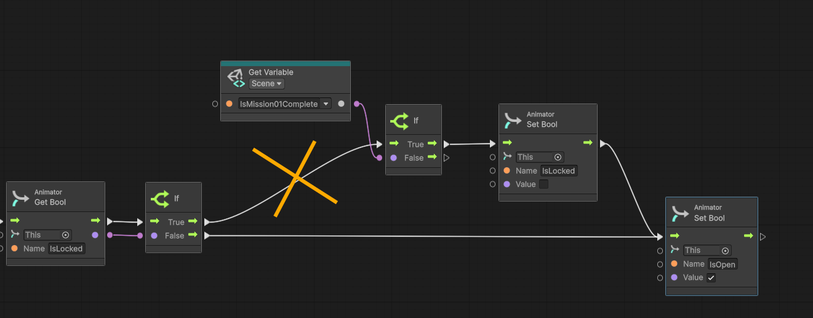
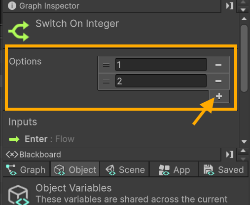
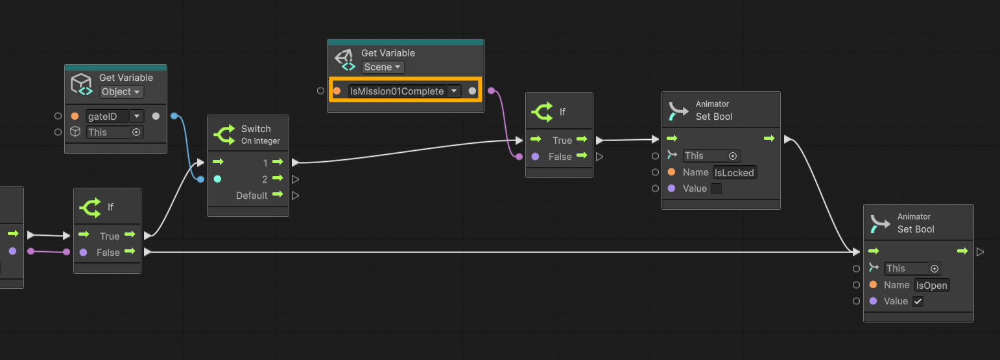
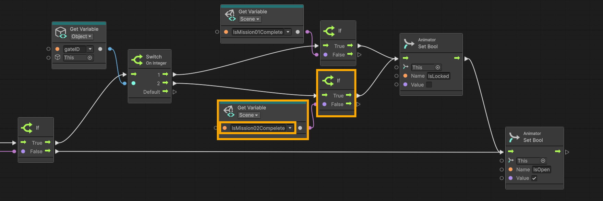

# ⚒️ Tutorial: Extending Interactions

<strong><em>Tutorial Details</em></strong>

|📝 Topic          | 🕑 Estimated Time | 🧰 Requirements   |
| :---------------: | :---------------: | :---------------: |
| Visual Scripting   | 45 minutes       |   GitHub Desktop, Unity, Trash Package |

> [!NOTE]
> Before starting this tutorial, ensure you have :
>  - Completed **[Gate Interactions Tutorial](GateInteractions.md)**
>  - That you are on the **Interactions** branch in GitHub Desktop.
>
--- 

## Tutorial Overview
Our current system works, but it is **hardcoded for a single mission**. Once completed, every gate in the level responds the same way.

While this is fine for a simple prototype, it limits how we design our game. Most games require:

-   Multiple objectives
-   Staged progression
-   Different areas unlock under different conditions

In this tutorial, we will extend our Level Manager to support **multiple missions**, each with its own completion state. We will also update our gate system so that each gate checks for a **specific mission**, rather than relying on a single global condition.

This change makes our system more **flexible and scalable**, allowing us to build more complex and engaging level designs without rewriting our core logic.

---

## Updating the Level Manager 

###  Step 1 — Update the Level Manager
1. Select **Level Manager** from the **Hierarchy** window
2. In the **Inspector** window choose **Edit Graph**.

#

### Step 2 — Rename Existing Mission Variables
1.  In the **Graph Editor**, in the **Inspector** window on the left
2.  Rename the **Scene Variable** `IsMissionComplete`
    -   **`IsMission01Complete`**

#

### Step 3 — Update the Event
1.  In the **LevelManager Script Graph**, find the **Custom Event** `CheckMissionStatus`
2.  Rename it to **`CheckMission01Status`**
3.  Update any set and get nodes that reference `IsMissionComplete`
    -   Update to **`IsMission01Complete`**

> [!TIP]
> This naming convention allows us to scale cleanly as we add more missions.
>

# 

### Step 4 — Add a Second Mission Variable
1.  In the **Graph Inspector**, create a new **Scene Variable**:
    -   **Name**: `IsMission02Complete`
    -   **Type**: Boolean
    -   **Default Value**: `False`

#

### Step 5 - Add a Second Mission Check 
Just as we have a custom event for `CheckMission01Status`, we will need to create a custom event for `CheckMission02Status`.

This is intentional—missions can have **completely different conditions**, and there is no single “correct” way to define completion. Each mission should reflect the specific gameplay goal it represents.

For example, a mission could be completed by:

-   Collecting a certain number of items (like our trash system)
-   Reaching a specific location in the level
-   Interacting with an object (e.g., activating a switch)
-   Defeating an enemy or completing a challenge

By designing each mission check separately, you gain more control over player progression and can create more varied gameplay experiences.

> [!IMPORTANT]
> You will create the second mission check on your own, with the criteria of your choosing. 
> 

>[!NOTE]  
> You can continue with the tutorial and update the **Gate** script even if you have not yet created your second mission check. Just make sure the corresponding variable (e.g., `IsMission02Complete`) exists so the logic can be connected later.
>

---
## Updating the Trash Bin 
Because the Level Manager event name has been re-named we need to update the Trash bin that triggers that event. 

###  Step 1 — Update the TrashBin
1. Select any one of the **TrashBin** from the **Hierarchy** window
2. In the **Inspector** window choose **Edit Graph**.

### Step 2 — Update Custom Trigger 
1.  In the **Graph Editor**, locate the end of the `OnTriggerEnter`
2.  Update the name of the **Custom event Trigger**  node at the end
    - `CheckMission01Status`
---

## Updating the Gate Script
Right now, all gates check the **same condition**. Ideally, each gate should respond to the **specific mission it is associated with**—for example, Gate 1 opens when Mission 01 is complete, Gate 2 opens when Mission 02 is complete.

We don’t want to create a **separate custom script for each gate**, as that would be repetitive and hard to maintain. Instead, we can use a **flexible, scalable approach**:
-   **Object Variable** – each gate can have its own ID or instance-specific value
-   **Switch on Integer** – the gate checks the ID and executes the corresponding mission check

This allows all gates to share the **same script**, while still behaving differently depending on the mission they are tied to.

#

###  Step 1 — Update the Gate Script
1. Select the first **Gate** from the **Hierarchy** window
   - This should be the gate that unlocks the second area of the level
2. In the **Inspector** window choose **Edit Graph**.

#

## Step 2 — Add a Gate ID (Object Variable)
1.  Create an **Object Variable**:
    -   **Name**: `gateID`
    -   **Type**: Integer
    -   **Default Value**: `1`

> [!NOTE]  
> Object Variables are **instance-based**, meaning each gate can have its own value.
> These values can only be set on the instance in the scene.
>

# 

## Step 3 — Add Switch Logic to OnTriggerEnter

1.  Locate your existing **OnTriggerEnter flow**
2.  After:
    -   `Animator Get Bool (IsLocked)`
    -   The following **If branch**
3. Break the flow to the following **If branch**

4.  Add **Switch on Integer** node
5.  Connect the **True output** from the previous **If** → **Switch**
6.  Add a **Get Variable (Object)**:
    -   Set to `gateID`
7.   Connect it into the **Switch input**
8.  With the **Switch on Integer** node selected
     - In the Graph Inspector, click the `+` in the **Options**
     - Add two options: 
         - 1
         - 2 

>[!NOTE]
> The options act as case statements in a traditional switch. These are the possible values of the variable we are comparing against.
>

#

## Step 4 — Handle Mission 01

1.  Locate your existing:
    -   `Get Variable (Scene) → IsMissionComplete`
2.  Update it to:
    -   `IsMission01Complete`
3.  Connect:
    -   **Switch Case 1** → Mission 01 **If branch**

## Step 5 — Add Mission 02 Logic

1.  Copy:
    -   `Get Variable (Scene) → IsMission01Complete`
    -   Its **If branch**
2.  Update the copied variable:
    -   `IsMission02Complete`
3.  Connect:
    -   **Switch Case 2** → Second **If branch**

#

## Step 6 — Playtest

1.  Enter **Play Mode**
2.  Complete **Mission 01**
    -   Gate 1 should open just as before. 

# 

## Step 7 — Configure Multiple Gates
1. Select the second **Gate** from the **Hierarchy** window
   - The gate that opens the final area of the game
2. Set its `gateID = 2`

# 

## Step 8 — Playtest

1.  Enter **Play Mode**
2.  Complete **Mission 01**
    -   Gate 1 should open just as before.
3. Trigger the second area gate.
   - This gate should not open until the second mission is completed.
  
# 

## Step 09 — Save Your Work

1.  Save the scene (**Ctrl + S**)
2.  Close Unity
3.  In **GitHub Desktop**:
    -   Stage changes
    -   Commit:
        
        `feat: Extend game for multiple missions.`
        
4.  Push to your branch

