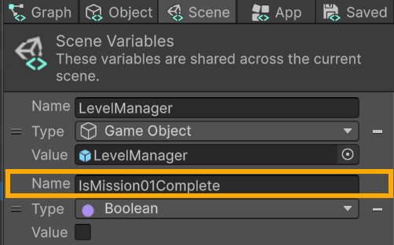
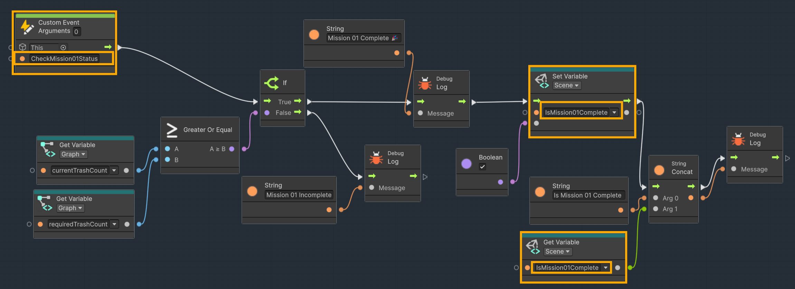
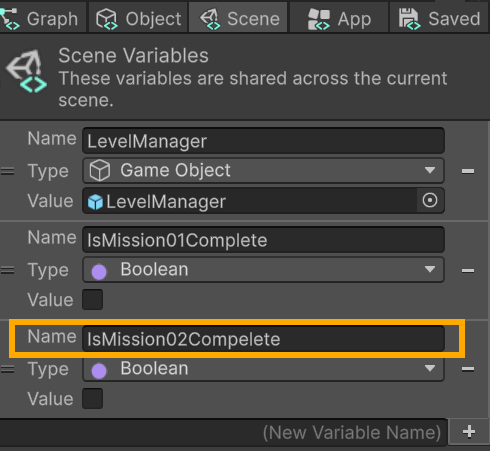

# ⚒️ Tutorial: Extending Interactions

<strong><em>Tutorial Details</em></strong>

|📝 Topic          | 🕑 Estimated Time | 🧰 Requirements   |
| :---------------: | :---------------: | :---------------: |
| Visual Scripting   | 45 minutes       |   GitHub Desktop, Unity, Trash Package |

> [!NOTE]
> Before starting this tutorial, ensure you have :
>  - Completed **[Gate Interactions Tutorial](GateInteractions.md)**
>  - That you are on the **Interactions** branch in GitHub Desktop.
>
--- 

## Tutorial Overview
Our current system works, but it is **hardcoded for a single mission**. Once completed, every gate in the level responds the same way.

While this is fine for a simple prototype, it limits how we design our game. Most games require:

-   Multiple objectives
-   Staged progression
-   Different areas unlock under different conditions

In this tutorial, we will extend our Level Manager to support **multiple missions**, each with its own completion state. We will also update our gate system so that each gate checks for a **specific mission**, rather than relying on a single global condition.

This change makes our system more **flexible and scalable**, allowing us to build more complex and engaging level designs without rewriting our core logic.

---

## Updating the Level Manager 

###  Step 1 — Update the Level Manager
1. Select **Level Manager** from the **Hierarchy** window
2. In the **Inspector** window choose **Edit Graph**.

#

### Step 2 — Rename Existing Mission Variables
1.  In the **Graph Editor**, in the **Inspector** window on the left
2.  Rename the **Scene Variable** `IsMissionComplete`
    -   **`IsMission01Complete`**

#

### Step 3 — Update the Event
1.  In the **LevelManager Script Graph**, find the **Custom Event** `CheckMissionStatus`
2.  Rename it to **`CheckMission01Status`**
3.  Update any set and get nodes that reference `IsMissionComplete`
    -   Update to **`IsMission01Complete`**

> [!TIP]
> This naming convention allows us to scale cleanly as we add more missions.
>

# 

### Step 4 — Add a Second Mission Variable
1.  In the **Graph Inspector**, create a new **Scene Variable**:
    -   **Name**: `IsMission02Complete`
    -   **Type**: Boolean
    -   **Default Value**: `False`

#

### Step 5 - Add a Second Mission Check 
Just as we have a custom event for `CheckMission01Status`, we will need to create a custom event for `CheckMission02Status`.

This is intentional—missions can have **completely different conditions**, and there is no single “correct” way to define completion. Each mission should reflect the specific gameplay goal it represents.

For example, a mission could be completed by:

-   Collecting a certain number of items (like our trash system)
-   Reaching a specific location in the level
-   Interacting with an object (e.g., activating a switch)
-   Defeating an enemy or completing a challenge

By designing each mission check separately, you gain more control over player progression and can create more varied gameplay experiences.

> [!IMPORTANT]
> You will create the second mission check on your own, with the criteria of your choosing. 
> 

---

