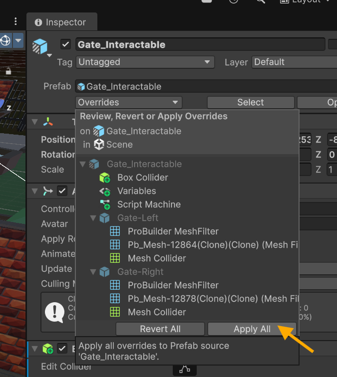
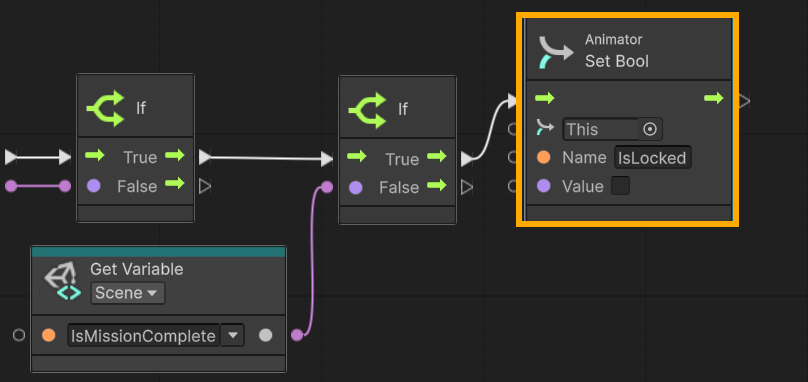

# ⚒️ Tutorial: Gate Interactions

<strong><em>Tutorial Details</em></strong>

|📝 Topic          | 🕑 Estimated Time | 🧰 Requirements   |
| :---------------: | :---------------: | :---------------: |
| Visual Scripting   | 45 minutes       |   GitHub Desktop, Unity, Trash Package |

> [!NOTE]
> Before starting this tutorial, ensure you have :
>  - Completed **[Trash Bin Tutorial](TrashBin.md)**
>  - That you are on the **Interactions** branch in GitHub Desktop.
>

---
> [!IMPORTANT]
>  In this tutorial, we want to set up the interactions that will trigger our gate animations, which we completed in the **[Animation Tutorial](Animations.md)**. You will need to have completed that tutorial before proceeding.
> 
--- 

###  Step 1 — Add a Trigger Collider
1. In the **Hierarchy**, select the **Gate Interactable** prefab.
2.  The **Inspector** add a **Box Collider**.
     - Enable **Is Trigger**.
5.  Adjust the **Box Collider size** so the player can easily enter the interaction area.

> \[!TIP\]  
> The trigger should be slightly larger than the trash bag mesh to make interaction feel responsive.
>

### Step 2 — Add a Gate Script
1.  In the **Hierarchy**, select the **gate** prefab.
3.  Click **Add Component** search for **Script Machine**.
2.  Click **New** to create a new Script Graph.
3.  Name the graph: **Gate**
4.  Save it inside your **Scripts** folder.

### Step 3 - Apply the Prefab Changes
1. Select the **Gate** preab in the **Hierarchy** window.
2. In the **Inspectory** window click on the **Overrides** drop down
    - Choose **Apply All**
This will apply all the changes we made to the Gate Interactable to all prefab instances.

### Step 3 - Create the Trigger Logic
1.  In the **Hierarchy**, select your Trash Bag prefab.
2. In the **Inspector**, locate the Script Machine.
   -   Click **Edit Graph**.
     
3.  Remove Default Nodes in the **Graph Editor area** (blackboard),  
-   Delete **On Start**
-   Delete **On Update**

They are not needed for this interaction.

4. Add **OnTriggerEnter** node
5. Add a **Collider Get GameObject** node
6. Add a **Game Object Compare Tag** node
   - Set the **Tag** value to `Player`
7. Connect it:
    -   Click and drag from the **Collider output port** on `OnTriggerEnter`
    -   Connect it to the **Collider input port** on `Get GameObject`
8. Add an **If (Branch)** node.
9. Connect the **Compare Tag** result into the condition.
  
> [!NOTE]
> This `Player` tag comparison is the same on the **TrashBag** and **TrashBin** scripts. Therefore, we could have easily copied them from one of those scripts and pasted them here. Skipping over steps 4-9 above.
>

### Step 4 - Check IsMissionComplete
1. Add a second **if** node
2. Connect the `True` output of the first **If** node into the second **If** node
3. Add a **Get Variable** node:
    -   Set to **Scene → IsMissionComplete**
4.  Connect the nodes:
    - **Get Variable** `IsMissionComplete` → **If** value

> [!TIP]
> This would be a good place to add a `Debug.Log` message to check for logic errors.
> Remember that `Debug.Log` messages are not necessary and are for debugging purposes. As such, we will skip doing this and proceed.
>

### Step 5 - Set Animator Parameter
1. Add an **Animator Set Bool** node
    - Set the name to `IsLocked`
    - Set the value to `True`
> [!WARNING]
> `IsLocked` is one of the **Animator Paramaters** we created in the Animation tutorial. This parameter must be spelled exactly how you have it in the animator.
>

1. Add an **Animator Set Bool** node
    - Set the value to `True`

