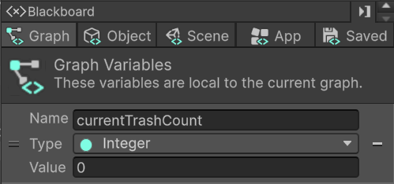
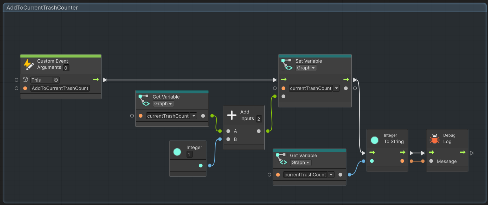
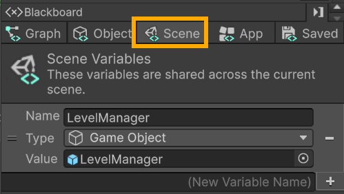
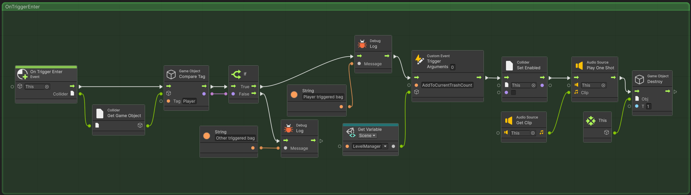

# ⚒️ Tutorial: Level Manager Setup

<strong><em>Tutorial Details</em></strong>

|📝 Topic          | 🕑 Estimated Time | 🧰 Requirements   |
| :---------------: | :---------------: | :---------------: |
| Visual Scripting   | 45 minutes       |   GitHub Desktop, Unity, Trash Package |

> [!NOTE]
> Before starting this tutorial, ensure you have :
>  - Completed **[Trash Interaction Tutorial](TrashInteractions.md)**
>  - That you are on the **Interactions** branch in GitHub Desktop.
>

### Step 1 — Scene Setup 
1.  In the **Hierarchy** window right-click and choose **Create Hierarchy Folder**
    - Name this folder **Managers**
2. Inside the folder right-click and choose **Create Empty**
3. In the **Inspector** window
   - Rename this object to **LevelManager**
   - Add a **Script Machine** component
  
4. Make the **LevelManager** a prefab by dragging it from the **Hierarchy** window the **Projects** window
   - Into the **Assets/Prefabs** folder
  
6. Back in the **Hierarchy** window select the **LevelManager** prefab
7. In the **Inspector** window click on **Edit Graph** 

# 

## Step 2 — Create a Custom Event on the Level Manager

The **LevelManager** will keep track of how many trash bags the player collects. 
First, we need a custom event to increment a counter.

1.  In the **LevelManager Script Graph**, **right-click** on an empty area.
2.  Search for **Custom Event** and add it.
3.  Set up the node:
    -   **Target**: `This` (refers to the LevelManager object)
    -   **Name**: `AddToCurrentTrashCounter`
        

> \[!NOTE\]  
> Custom Events act like functions you can trigger from other objects.
> 
> Here, `AddToCurrentTrashCounter` will increase the trash count whenever a trash bag is collected.
> 

#

## Step 3 — Create a Private Counter Variable
We need a variable to store the current number of trash bags collected. 
Only the Level Manager needs access to this variable; as such, we will set it to be a _graph_ which can be thought of as _private_ variables in standard C#. 

1.  In the **Graph Editor**, in the **Inspector** window on the left
2.  Create a **Graph Variable**:
    -   **Name**: `currentTrashCounter`
    -   **Type**: Integer
    -   **Default Value**: `0`
  

> [!NOTE]
> **Graph Variables** in visual scripting is similar to **private** variables in standard C#. They are only accessible by the object they are attached to.
>

        
3.  In the graph, add these nodes:
    -   **Get Variable** → set to `currentTrashCounter` (reads the current count)
    -   **Add Node** → 2 inputs
    -   **Integer Literal** → set value to `1`
    -   **Set Variable** → set to `currentTrashCounter` (writes the updated count)
        
4.  Connect the nodes in this order:
    -   `Get Variable → Add Node`
    -   `Integer Literal → Add Node`
    -   `Add Node → Set Variable`
    -   `Custom Event → Set Variable` (so the flow runs when the event triggers)
        
5.  Add a **Debug Log** node after the Set Variable node to print the new counter value.
    -   Set the message to something like `"Current Trash Count: "` + `currentTrashCounter`
        
6.  Save the graph.
 
> \[!TIP\]  
> This ensures you can visually confirm in the Console that the counter increments correctly when triggered.
>

The final `AddToCurrentTrashCounter` event on the **LevelManager** should look like below: 

#

## Communicating with Objects 
The **LevelManager**'s `AddToCurrentTrashCount` needs to be triggered when the player hits the **trashBag** object. To set this up properlly we will need to revise the behaviors for our **trashBag**.

## Step 4 — Create a Scene Variable for LevelManager
1.  In the scene **Hierarchy** window, locate the **trashBag** object.
2.  In the **Inspector** window, click **Edit Graph** to edit the visual script graph on the Trash bag.

To trigger the event on the **LevelManager**, the **trashBag** object needs to hold a reference to the **LevelManager' Game Object**. To do this we will create a **scene** variable. 

1.  In the **Graph Editor**, in the **Inspector** window on the left
    
2.  Create a **Scene Variable**:
    -   **Name**: `LevelManager`
    -   **Type**: GameObject
  

        
3.  Drag the **LevelManager object** from the **Hierarchy** into the variable field.
    

> \[!NOTE\]  
> Scene Variables allow multiple objects (Trash Bags, Gates, Bins) to reference a single object in the scene without hardcoding it.
>

# 

## Step 5 — Trigger the LevelManager Event from the Trash Bag
Now we’ll make each Trash Bag trigger the LevelManager event when the player collects it.

1.  In the **TrashBag Script Graph**, **right-click** → search for **Trigger Custom Event** → add it.
2.  Configure the node:
    -   **Event Name**: `AddToCurrentTrashCounter`
        
3.  Add a **Get Variable** node:
    -   Set to **Scene → LevelManager**
        
4.  Connect the nodes:
    -   `Get Variable (LevelManager) → Target input` of **Trigger Custom Event**
        
5.  Update the flow of your **OnTriggerEnter group** so it looks like this:

6.  Save all graphs.

The final **TrashBag** script graph should look like the following: 

   
> \[!TIP\]  
> This ensures the LevelManager counter updates **before** the sound plays and the trash bag is destroyed.
>

  #

  ### Step 6 — Save Your Work
1.  Save the scene: **File → Save** or **Ctrl + S**
2.  Close Unity.
3.  In **GitHub Desktop**:
    -   Stage your changes
    -   Commit with message:
        -   `feat: TrashBag Interaction.`
4.  Push to the appropriate branch.

> \[!NOTE\]  
> At this point, you should see the counter increase in the Console when the player enters the Trash Bag trigger. This confirms the system is working end-to-end.
> 
