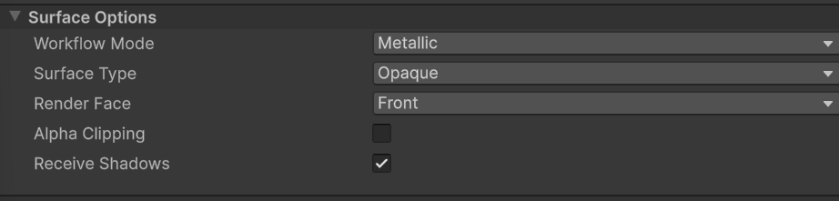
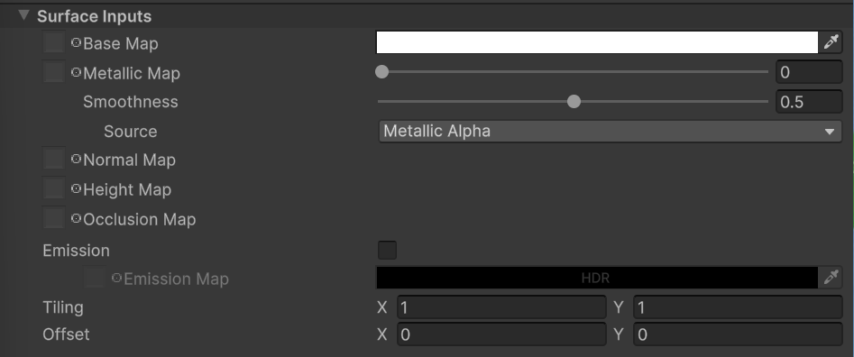
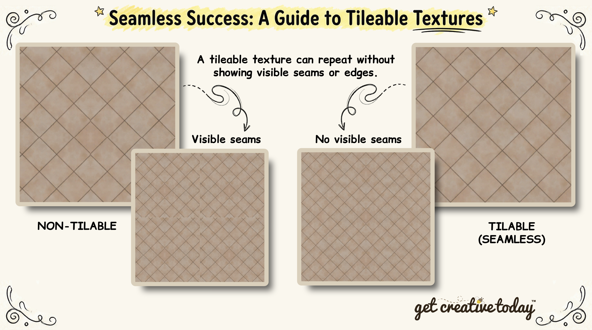
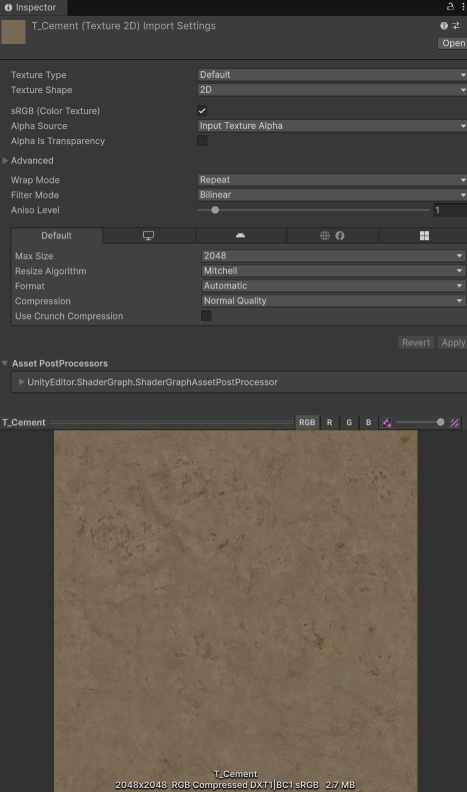
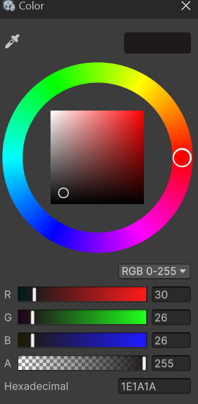
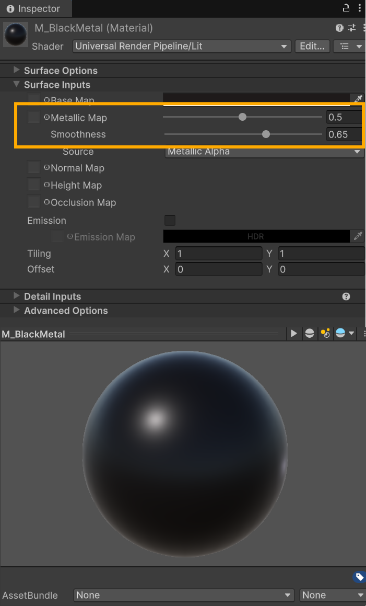
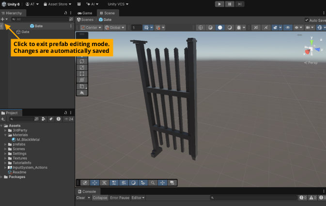
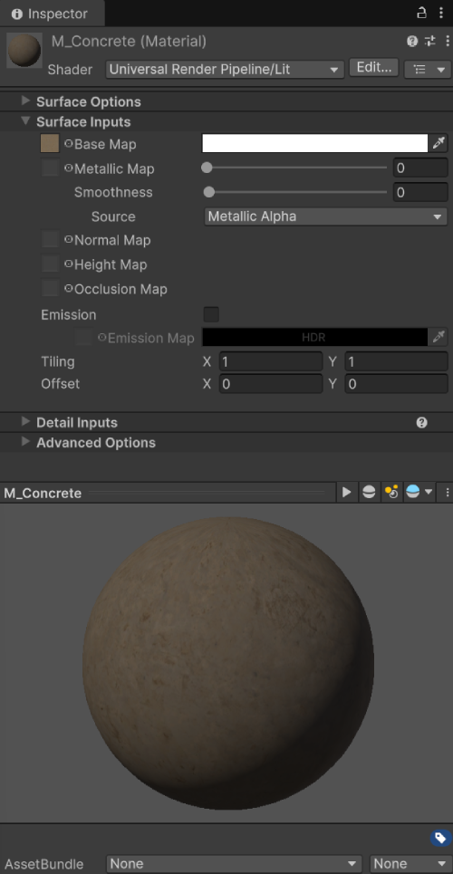
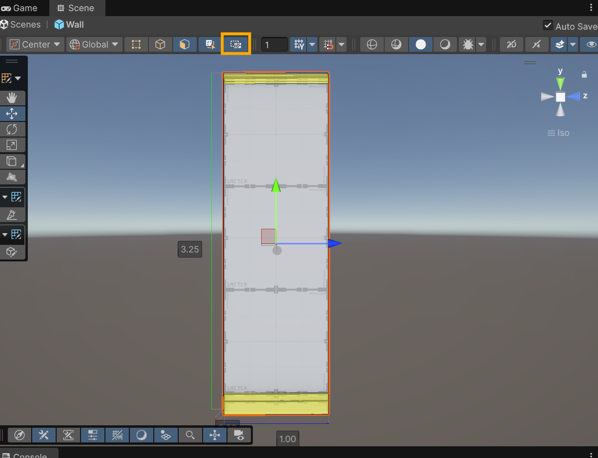

# 📜 Unity Materials
> By: Akram Taghavi-Burris | © 2026

Materials are one of the core building blocks for giving objects their visual appearance in Unity. A **material** defines how the surface of a 3D object interacts with light and color. In Unity, materials are powered by **shaders**, which are programs that calculate how pixels are rendered on the screen.

> [!TIP]
> Shaders are tied to the render pipeline. In this course, we use the **Universal Render Pipeline (URP)**, which is optimized for a wide range of devices. For most cases, we’ll use the **Lit Shader**, which supports realistic lighting, shadows, and reflections.

## Creating Materials

Materials are assets that can be created in Unity by right-clicking in the **Project** window and choosing **Create > Material**. Once created, you will need to name your material.

If you need to rename the material, unlike most other assets, the name **cannot** be changed in the **Inspector**. Instead, it must be changed by right-clicking the asset in the Project window and choosing **Rename**.

> [!IMPORTANT]  
> All materials should follow the proper naming scheme, beginning with the prefix **`M_`** followed by a descriptive name, such as:  
> - `M_WoodOak`
> - `M_RustyMetal`
> - `M_GoldMetal`

Once the material is created, you can adjust its properties. These properties can vary depending on which **shader** is selected.

In this course, we use the **Universal Render Pipeline (URP)**, and for most cases, we will use the **URP/Lit Shader**, which is the default shader used for realistic materials. Because of that, your material will include the following core properties.

# 

### Surface Options

- **Workflow Mode**
  -   **Metallic Workflow:** Uses a metallic value to simulate metal vs non-metal surfaces. Best for realistic metals like gold, iron, or aluminum.
  -   **Specular Workflow:** Uses a specular map to define the reflectivity and color of the reflection. Gives more control for non-metal surfaces like plastics or painted surfaces.
    
>[!TIP]
> Use metallic workflow for most standard objects. Use the specular workflow if you need fine control over non-metal reflections.

- **Surface Type**
  -   **Opaque:** Blocks light fully; most solid objects.
  -   **Transparent:** Allows light and background to show through; used for glass, water, or semi-transparent materials.
    
- **Rendering Face**
  -   **Front:** Only the front side of a mesh renders.
  -   **Back:** Only the backside renders.
  -   **Both:** Renders both sides. Useful for thin objects like paper, leaves, or cloth.
    
- **Shadows**
  -   **Receive Shadows:** Determines whether the object shows shadows cast on it from other objects.
  -   Turning off shadow reception can improve performance for background objects or distant scenery.

 #
 
### Surface Inputs

- **Base Map (Albedo)**
  -   The base color or texture of the material.
  -   Can be a **flat color** or a **texture image**.
  -   Think of this as the "skin" of your object.
  -   If a texture and base color are set, the color will tint the texture image.
    
- **Metallic Map / Value**
  -   Controls how metallic the surface looks.
      -  0 = non-metal (plastic, wood)
      -   1 = metal (steel, copper)
    
-  **Smoothness**
  -   Determines how shiny or rough the surface is.
  -   Can be set as a **value** or **texture**.
    
- **Normal Map**
  -   Simulates small surface details (bumps, grooves) without adding geometry.
  -   **Strength:** Adjusts the intensity of the effect.
  
> [!WARNING]
> The Texture type of the texture image must be set as **Normal Map** in Unity for it to be correctly applied
>

- **Tiling and Offset**
  -   **Tiling:** Repeats the texture across the surface.
  -   **Offset:** Moves the texture along the surface.
  -   Useful for patterns like bricks, tiles, or wood planks.

---
## Textures
Above, we stated that the **Base Map** property of a material can be set to an albedo (color) or a texture. 
A **texture** is a 2D image that gets mapped onto the surface of a 3D object. Textures are most commonly used to add detail that would be too expensive (or time-consuming) to model directly into the mesh.

For example, instead of modeling every wood grain, crack, or scratch into a wall, we can apply a texture that creates the illusion of that detail.

## How Textures Are Used in Materials
Materials can use several different texture inputs, and each one controls a different part of how the surface looks.
The most important texture is the **Base Map (Albedo)**. This is the texture that defines the object’s main color and overall appearance (wood grain, bricks, painted metal, etc.).

> [!TIP]  
> If your material has a Base Map texture, the **Base Color** should usually be left as **white**. 
> Otherwise, the **Base Color** acts like a **tint**.
> For example, if you apply a wood texture and set the Base Color to green, the wood will appear green, like it was painted or weathered.
> 

Once the Base Map is set, additional texture inputs can be used to control lighting and surface behavior:
-   **Normal Map:** Adds surface detail by affecting how light hits the object (bumps, grooves, cracks).
-   **Metallic Map:** Controls which parts of the surface behave like metal.
-   **Smoothness:** Controls how shiny or rough the surface looks.
    
Many of these maps are not full-color images. Instead, they are **converted from real-world surface data into numeric values** that the shader can interpret.

For example:
-   A **metallic map** is typically a grayscale image where white represents metal (1) and black represents non-metal (0).
-   A **smoothness map** stores how shiny or rough each pixel is, usually in grayscale.
-   A **normal map** stores surface direction for lighting calculations using the RGB channels: red = X (left/right), green = Y (up/down), blue = Z (outward).
  
> [!TIP]  
> Because these maps encode data instead of color, they often look strange to the eye (e.g., grayscale or purple), but the shader uses the information to produce realistic lighting and surface detail.
> 

## Creating Textures 
Textures can be created in a number of ways. They can be:
-   **Photographs** of real-world surfaces (wood, stone, metal, etc.)
-   **Digitally painted** in software like Photoshop or Krita
-   **Procedurally generated** using tools like Substance Designer or Blender
-   **Vector-based**, created in programs like Illustrator or Inkscape

They **do not need to be** realistic. Textures can also be stylized or cartoony, **depending on the visual style of your game**.

> [!TIP]  
> If you plan to create additional texture maps, like **normal maps**, **metallic maps**, or **roughness maps**, these often need to be generated from the base texture.  
> This can be done in image-editing software or with online converters such as the free [NormalMap Online Generator](https://cpetry.github.io/NormalMap-Online/).
> 

When creating or importing textures into Unity, there are a few best practices you should follow to ensure they perform well and look correct:

#

### Power of 2
Most textures should be saved at a resolution that is a **power of 2**, such as:
-   128 × 128  
-   256 × 256    
-   512 × 512    
-   1024 × 1024    
-   2048 × 2048
    
This allows Unity to generate mipmaps efficiently and compress textures properly for real-time rendering.

>[!IMPORTANT]
> **A texture only needs to be as large as the object will appear on screen**.
>
>For example, if a game object is only ever 200 × 200 pixels on screen, it does **not** need a 4K texture. You can start with a high-resolution image for detail, but before using it in the game, it’s better to create a lower-resolution version that matches the maximum size the object will need.
>
>In Unity, the **Max Size** setting for a texture ensures the engine only uses the resolution required for the object. This helps save memory, improve load times, and maintain performance on lower-end devices.
>

#

### Tileable Textures

If a texture will repeat across a surface (like brick, grass, or wood planks), it should be **tileable** (also called **seamless**).

A tileable texture can repeat without showing visible seams or edges. This is important because repeated patterns that don’t match at the edges create obvious lines or breaks, breaking the illusion of a continuous surface.

Using tileable textures can improve **performance**, because a single texture can cover large surfaces. They also provide **flexibility for variation**, since textures can be stretched, rotated, or offset to create unique patterns without needing additional images.

Textures can be made tileable by using **image-editing software** or specialized **pattern-generation tools**. Techniques often include offsetting the image and blending edges to remove visible seams.

> [!NOTE]  
> Not every texture needs to be tileable. **Only make a texture seamless if it will be repeated** across a large surface.
>
> For unique objects or decals, non-tileable textures are fine.
> 

#

### Compression
Textures are one of the largest sources of memory usage in most games. Unity can compress textures automatically, but the compression settings affect several important aspects:
-   **Visual quality:** High compression can introduce artifacts or blur fine details.
-   **File size:** Compressed textures take up less disk and memory space.
-   **Performance:** Smaller textures are faster to load and render, improving framerate, especially on lower-end devices.
    
Some ways you can optimize texture memory and performance include:
-   **Reduce resolution:** Lower the Max Size in the texture import settings to match the actual screen size the object will occupy.
-   **Choose the right Compression format:** Compression formats (such as DXT, ASTC, or ETC) determine how the image is stored in memory. Each have their trade-offs.
-   **Reuse textures:** Tileable textures and shared materials allow multiple objects to use the same image rather than duplicating textures.
    
> [!TIP]  
> Balancing texture size, compression, and quality is key. Always test on target hardware to make sure textures look good without causing unnecessary memory or performance issues.
> 

---

## Texture Import Settings (Inspector)
When you click a texture in the Project window, Unity shows its **import settings** in the Inspector. 
These settings determine how Unity processes and compresses the texture.

- **Texture Type**: Sets how the texture is meant to be used in Unity.
   -  Common types include:
      -   **Default** (most color textures)
      -   **Normal Map** (used for surface detail)
      -   **Sprite (2D and UI)** (used for 2D assets)
    
> [!IMPORTANT]  
> A normal map will not work correctly unless its Texture Type is set to **Normal Map**.
> 
#
- **Texture Shape**: Controls how Unity interprets the texture.
    - Most textures should remain set to:**2D**
    - Other shapes (like Cube) are used for special cases such as skyboxes and reflection probes.

- **sRGB (Color Texture)**: Determines whether the texture should be treated as a color image.
    -   Turn ON for **Base Map / Albedo** textures
    -   Turn OFF for **data textures** like:    
        -   Metallic maps
        -   Roughness / Smoothness maps
        -   Height maps
        -   Mask maps
        
> [!TIP]  
> If a metallic map looks “wrong,” the first thing to check is whether sRGB is incorrectly enabled.
> 
#
-   **Alpha is Transparency** property, determines how Unity uses the alpha channel of a texture.
    -   Many textures include an **alpha channel**, which stores transparency information for the image.
    -   The most common option is **Input Texture Alpha**, which tells Unity to use the alpha channel embedded in the texture itself.
    -   A texture having alpha does not automatically make the material transparent.
        -   Transparency is controlled by the **material’s Surface Type**.

> [!TIP]  
> If a texture does not have an alpha channel, this setting has no effect. For transparency, make sure the texture includes alpha and that the **Surface Type** of the material is set to **Transparent**.
>

> [!NOTE]
> If the texture contains alpha data, Unity can use it for:
> -   Transparent surfaces
> -   Cutout shapes (like leaves, fences, decals, etc.)
>

### Compression Settings 
Inside the Texture properties, you can also set how the textures are to be resized and compressed for the game build. 
These settings are divided into tabs based on the build platform. The **Default** tab will have the baseline settings that apply to all. These settings include: 
 - **Max Size**: limits the maximum resolution Unity will use.
   - For example a 2048×2048 texture can be forced down to 1024×1024 or 512×512.
   - This is one of the easiest ways to reduce file size.

- **Resize Algorithm**: determines how Unity resizes textures when Max Size is smaller than the original.
  - For most cases, Unity’s default is fine.

- **Format**: determines how the texture is stored on the GPU.
  - Different formats can affect:
    -   Visual quality
    -   Transparency support
    -   Compression efficiency
    -   Platform compatibility
    
- **Compression**: reduces file size and improves performance, but may lower quality.
  - Common options:
    -   **None** (highest quality, largest size)
    -   **Low / Normal / High Quality** (recommended)
    
- **Crunch Compression**: an additional compression option that can reduce file size further.

> [!TIP]  
> Crunch compression is useful for reducing build size, but it increases texture load/decompression time.  
> It is best used for textures that do not need to load instantly.
>

--- 

# ⚒️ Tutorial: Create Wall & Gate Materials

<strong><em>Tutorial Details</em></strong>

|📝 Topic          | 🕑 Estimated Time | 🧰 Requirements   |
| :---------------: | :---------------: | :---------------: |
| Scene Building     | 15 minutes       |   GitHub Desktop, Unity, Texture.unitpackage     |

> [!NOTE]
> Before starting this tutorial:
> - Ensure you have completed **[ProBuilder](ProBuilder.md)** tutorial
> - Your project is synced with the **SceneBuilding** in GitHub Desktop
> - You have imported the required resource files (see Harvey)
>

> [!WARNING]
> If you have made any changes to your project from a different pc (i.e., classroom pc) and have pushed them to GitHub, you will need to **Fetch** the updates to your project in **GitHub Desktop** before starting this tutorial.
>

> [!IMPORTANT]
>Make sure you have imported any required packages for this tutorial before beginning.
> In the **Project** window, right-click and choose **Import Package > Custom Package**, then select the downloaded package from Harvey.

## Gate Material 
The first material we will create is for our **gate prefab**. Our goal is to make a material that gives the illusion of **black metal**. To achieve this, we’ll use the standard **URP Lit Shader**, set the **Albedo** to a dark grey color, and adjust the **Metallic** and **Smoothness** values to create the appearance of a shiny, reflective surface.

### Step 1 — Gate Material

1.  Open the **ParkGame-Unity** project
2.  In the **Project** window, open:
    - `Assets/Scenes/Level_01`

3.  In **Project** window in the **Assets** folder create a new folder:
    - Name the folder: **Materials**

4. Inside the **Materials** folder, right-click and select **Create > Material**
   - Name the new material **`M_BlackMetal`**
5. With the **`M_BlackMetal`** material selectd in the **Project** window access it's properties in the **Inspector** window.
6. Ensure that material'**Shader** is set to **Universal Render Pipline/Lit** 
7. Set the **Base Map (Albedo)** color to a dark grey. 

7.  Set the **Metallic Map** and **Smoothness** as shown:

### Step 2- Applying the Gate Material
1. Inside the **Project** window locate the **`Asset / Prefabs`** folder
2. Double-click on the **Gate** prefab
   - This will open the preab in isolation
3. From the **Project** window drag and drop the **M_BlackMetal** material on to the Gate object
4. Exit the prefab mode to save the changes

5. Return to the park scene (**`Level_0`**)
6. Verify that all instances of the gate now use the **`M_BlackMetal`** material.

> [!NOTE]
> The **power of prefabs** is that **all instances** in the scene **automatically update** when the original (parent) prefab is modified.
>

# 
## Wall Material — Cement (Base & Cap)
Next, we will create a material for our **wall prefab**. This wall will use **two different materials**:
-   **Cement** — for the base and top caps
-   **Brick** — for the main wall
    

We’ll start by creating the **cement material**. This material will use a **texture for the Base Map** and a **Normal Map** to give the surface subtle bumps and details.

> [!NOTE]
> By default, Unity applies a material to an entire object. However, because our wall is a **ProBuilder mesh**, we can assign materials to specific **faces**, giving us the flexibility to use multiple materials on a single object.
>

### Step 1 — Prepare the Textures

1.  In the **Project** window, navigate to the **Textures** folder.
2.  Locate the following textures:
    -   **`T_Cement`** (albedo / color map)
    -   **`T_Cement_N`** (normal map)
3.  Select **`T_Cement`**,  in the **Inspector** window
    -   Default import settings should be left as is.
4.  Select **`T_Cement_N`**, in the **Inspector** window
     -   Set **Texture Type** to **Normal Map**

> [!TIP]  
> Normal maps must be set to **Normal Map** type, or Unity will not interpret the surface details correctly.
> 

### Step 2 — Create the Cement Material
1.  Inside the **Materials** folder, right-click and select **Create > Material**.
2.  Name the new material **`M_Cement`**.
3.  With **`M_Cement`** selected, confirm the **Shader** is **Universal Render Pipeline / Lit**.
4.  Set up the material inputs:
    -   **Base Map (Albedo):** Assign **`T_Cement`**
        - Ensure the **Albedo** color is set to white to preserve the texture’s color.
        - _Changing the color will add a tint to the texture_
    -   **Normal Map:** Assign **`T_Cement_N`**
    -   **Metallic:** 0 (cement is non-metallic)
    -   **Smoothness:** 0 (to give a rough concrete look)

        

### Step 3 — Apply Cement Material to Wall Caps
Because the wall uses **multiple materials**, we need to apply the cement material **only to the base and top faces** using **ProBuilder Edit Mode**.
1.  In the **Hierarchy**, select the **Wall** prefab 
2. With the object select enter **ProBuilder Edit Mode**:
   
    
        
3.  Switch to **Face Selection Mode**.
4.  To select the base and top caps:
    -   Transition into a **Front View** of the wall.
    -   Make sure **Window Select Mode** is active.
    -   Click and drag a selection box around the faces you want to assign the cement material.
        -   **Important:** Drag the window **left to right** to select only the faces fully inside the box.
     
    
            
4.  With the faces selected, drag and drop the **M_BlackMetal** material (from the **Project** window) onto the Wall faces. 
    
> [!WARNING\]  
> Materials are applied only to the faces you select.  
> Faces not selected will keep their current material (or receive the brick material later).
> 
> **Rotate around your wall** to **check** that all base and top cap faces have the cement material.
> If any faces are missing it, simply select them and drag the material onto them.
> 
> Accidentally applied the cement material to the main wall? Don’t worry, you can fix it by assigning the brick material to those faces in the next step.
>

### Step 4 — Save and Verify
1.  Exit **Prefab Mode** to save the changes.
2.  Return to the park scene (**`Level_01`**) and verify that the base and top caps of the walls display the **cement material** correctly.

# 

## Wall Material — Brick (Main Wall)
Next, we’ll create the material for the **main wall** using a **brick texture**. This material will use a **Base Map** and a **Normal Map**, similar to the cement material, but with additional adjustments for tiling and normal strength to match the wall’s scale.

> [!NOTE]  
> Since the wall is a **ProBuilder mesh**, we will assign this material only to the **main wall faces**, leaving the base and caps with the cement material.
> 

### Step 1 — Prepare the Textures
1.  In the **Project** window, navigate to the **Textures** folder.
2.  Locate the following textures:
    -   **`T_Brick`** (albedo / color map)
    -   **`T_Brick_N`** (normal map)
        
3.  Select **`T_Brick`**, in the **Inspector** window
    -   Default import settings should be left as is.
  
4.  Select **`T_Brick_N`**, in the **Inspector** window
    -   Set **Texture Type** to **Normal Map**

### Step 2 — Create the Brick Material
1.  Inside the **Materials** folder, right-click and select **Create > Material**.
2.  Name the new material **`M_Brick`**.
3.  With **`M_Brick`** selected, confirm the **Shader** is **Universal Render Pipeline / Lit**.
4.  Set up the material inputs:
    -   **Base Map (Albedo):** Assign **`T_Brick`**
        -   Ensure the **Albedo** color is set to white to preserve the texture’s color.
    -   **Normal Map:** Assign **`T_Brick_N`** 
    -   **Metallic:** 0 (bricks are non-metallic)
    -   **Smoothness:** 0 (to keep the brick rough)

### Step 3 — Apply Brick Material to Wall Faces
1.  In the **Hierarchy**, select the **Wall** prefab.
2.  Enter **ProBuilder Edit Mode**.
3.  Switch to **Face Selection Mode**
4.  Select the main wall faces (excluding base and top caps):
    -   Transition to a **Front View** of the wall.
    -   Ensure **Window Select Mode** is active.
    -   Click and drag a selection box around the faces.
        -   **Important:** Drag **left to right** to select only faces fully inside the selection.
5.  With the faces selected, drag and drop the **`M_Brick`** material from the **Project** window onto the selected faces.

### Step 4 — Adjust Tiling, Normal Strength, and Offset
Now that the **brick material** is applied to the wall, take a moment to look at how it appears:
-   The bricks look **tightly packed**. This is because the texture’s scale is currently 1:1 on the wall, so each brick is smaller than we might want.
-   The **normal map** is at full strength (1), which can make the surface bumps feel exaggerated compared to the wall’s size.
-   The **bottom row of bricks** starts with a **half brick**, which looks unnatural for the base of the wall.
    
These observations show that we will need to adjust the **normal map strength**, **tiling**, and **offset** to improve the appearance of the wall.

 1. With **`M_Brick`** selected, in the **Inspector** window, set the following:
    -   **Normal Map Strength:** 0.5
         -   Reduces the intensity of surface bumps so the texture better matches the wall’s scale.
         
    -   **Tiling:** X = 0.5, Y = 0.5
        -   Scales the bricks to be slightly larger on the wall, spacing them more naturally.  
        
    -   **Offset:** Y = 0.25
       -   Moves the texture vertically so the bottom row of bricks starts with a whole brick.
        
By making these adjustments **after applying the material**, we can immediately see how changes affect the wall’s appearance. This helps us match the texture’s scale, realism, and placement without editing the texture file itself.

### Step 5 — Save and Verify
1.  Exit **Prefab Mode** to save the changes.
2.  Return to the park scene (**`Level_01`**) and verify that:
    -   The **base and top caps** show the **cement material**.
    -   The **main wall faces** display the **brick material** with proper tiling, normal strength, and offset.

# 

### Step 10 — Save & Commit
1.  Save your scene: **File > Save** or **Ctrl + S**.
2.  Close Unity.
3.  Switch to **GitHub Desktop** → stage your changes.
4.  Commit with the message:
    -   `feat: created wall & gate materials.`
5.  Push your changes to the remote branch: `SceneBuilding`.

