# 📜 Unity ProBuilder
> By: Akram Taghavi-Burris | © 2026

---

## Best Practices for ProBuilder Wall Creation

This tutorial will guide you through **creating and editing walls** using ProBuilder while maintaining best practices:

-   **Use Precise Dimensions** – Set pivot points and sizes for consistency.
    
-   **Work in Edit Mode Carefully** – Ensure the correct faces are selected before extrusion.
    
-   **Hierarchy Organization** – Parent multiple objects to keep the scene tidy.
    
-   **Prefab Usage** – Convert complex or reusable objects into prefabs to speed up scene building.

---

# ⚒️ Tutorial: Create the Park Wall with ProBuilder

<strong><em>Tutorial Details</em></strong>

|📝 Topic          | 🕑 Estimated Time | 🧰 Requirements   |
| :---------------: | :---------------: | :---------------: |
| Scene Building     | 30 minutes       |   GitHub Desktop, Unity     |

> [!NOTE]
> Before starting this tutorial, ensure you have completed **[Scene Building](SCeneBuilding.md)** and that your project is synced with the **SceneBuilding** in GitHub Desktop.
>

> [!WARNING]
> If you have made any changes to your project from a different pc (i.e., classroom pc) and have pushed them to GitHub, you will need to **Fetch** the updates to your project in **GitHub Desktop** before starting this tutorial.
> 

## Step 1 — Install ProBuilder Using Package Manager

1.  Open the **ParkGame-Unity** project
2.  In the Unity Editor, open the **Package Manager**: 
    -   **Window > Package Manager**
        
3.  In the top-left dropdown, change the package source to:
    -   **Unity Registry**
        
4.  In the search bar, type:
    -   `ProBuilder`
        
5.  Select **ProBuilder** from the list.
    
6.  Click **Install**.
    

> [!TIP]  
> If ProBuilder is already installed, the button will say **Remove** instead of Install.
> 

# 
## Step 2 — Open the Default Sample Scene (Empty Workspace)

1.  In the **Project** window, open:
    
    -   `Assets/Scenes/SampleScene`
        
2.  Make sure the scene is mostly empty (just a camera and light are fine).
    

> [!NOTE]  
> We will build the ProBuilder wall inside the **SampleScene** so we don’t accidentally modify **Level-01**. This keeps your main level clean and lets you focus on building the wall prefab without distractions from the environment.
> 

#

### Step 3 — Create a Basic Cube
1.  Click and **hold on the CC Icon** in the main toolbar of the scene view.
2.  In the pop-up dialog, select **Create Cube**.
3.  Click and drag in the scene view to create a cube. **Do not worry about exact dimensions yet.**

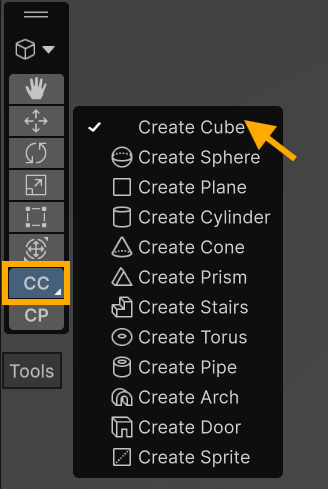
    

> [!NOTE]  
> You can adjust the size later, so initial placement is just for convenience.
> 

#

### Step 4 — Set Cube Shape Settings
1.  With the cube in **creation mode**, open the **Shape Settings** window in the scene view.
2.  Set the following settings:
    -   **Pivot:** Center
    -   **Size:** X = 0.125, Y = 0.125, Z = 1
3.  Press **Q** to exit creation mode and return to pan mode.

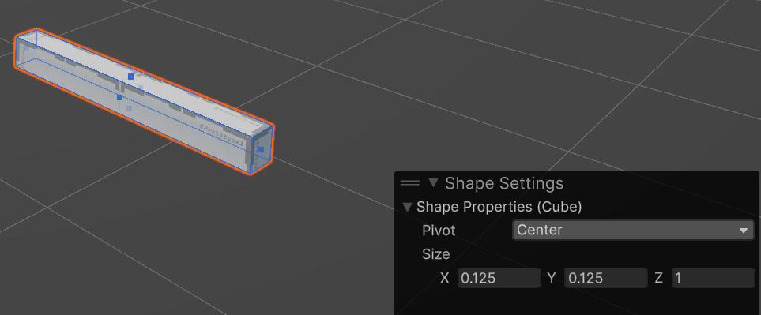
   
> [!TIP]  
> If you accidentally clicked away or mistyped settings, select the cube in the **Hierarchy** → in the **Inspector**, click **Edit Shape** under the ProBuilder Shape component.
> 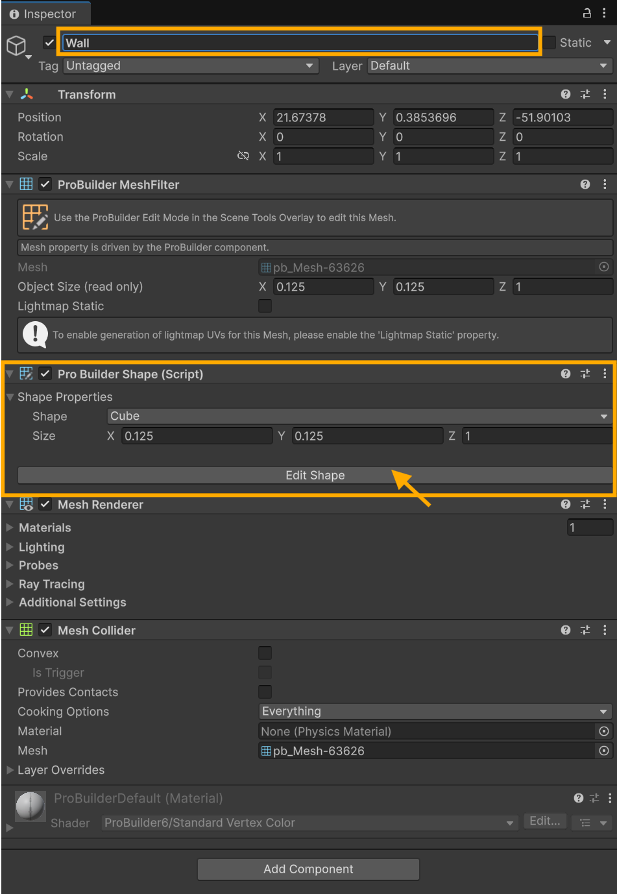

#

### Step 5 — Wall Properties
1.  With the Probuilder cube selected in the **Inspector** window
2.  Rename the cube to **Wall**
3.  Move the cube's **position** to X = 0, Y = 0, Z = 0

> [!IMPORTANT]  
> Keeping the wall at `(0,0,0)` helps avoid pivot and placement issues when converting it into a prefab.
>
    
#

### Step 6 — Enter ProBuilder Edit Mode
1. In the **Scene** window, click and **hold on the object icon** in the toolbar 
   - Select **ProBuilder** from the pop-up.

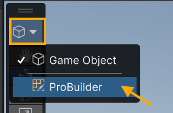
  
2.  The **ProBuilder Modify Toolbar** appears at the top of the scene window.
3.  Choose **Face Selection Mode** for this tutorial.

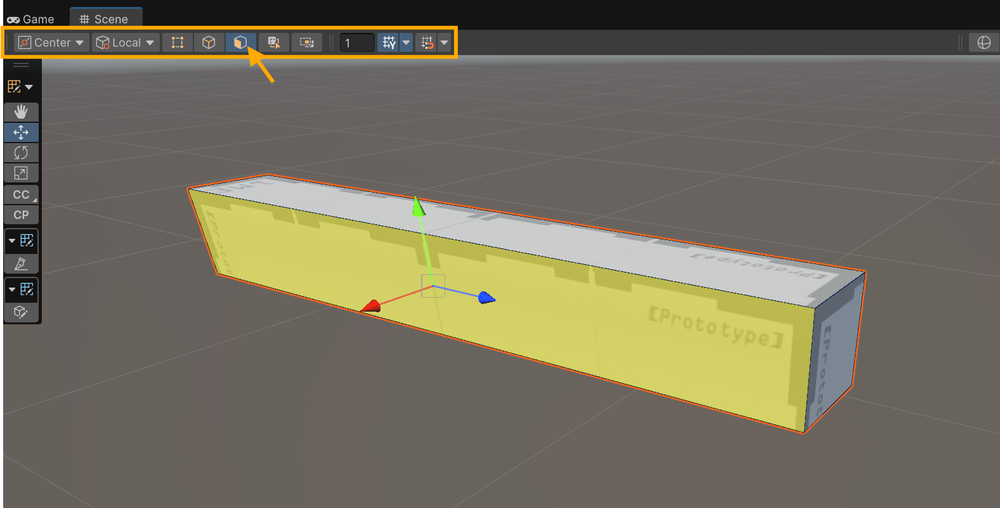
    
#

### Step 4 — Extrude the Wall Faces
1.  Select the **long face of the wall**.
2.  Hold **Shift** and select the back side of the same long edge.
3.  Right-click in the scene view → **Extrude Faces**.
4.  In the Extrude Settings dialog, set the distance: **0.625** and press confirm.

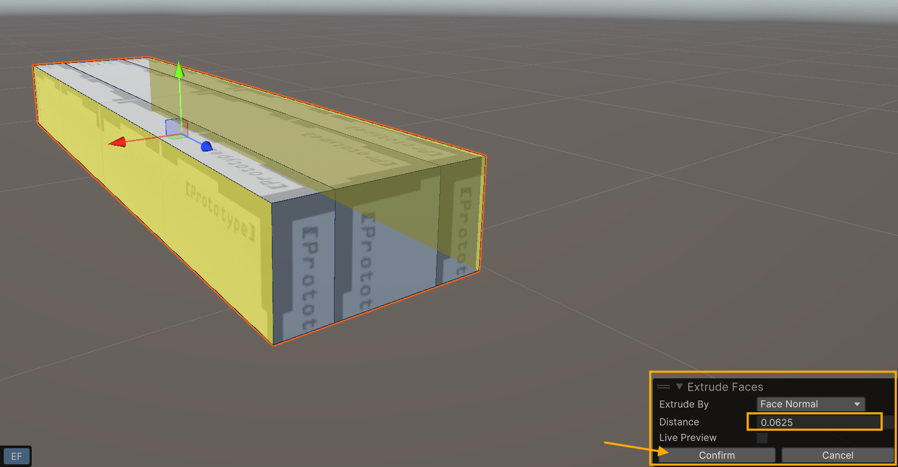
   
6.  Repeat the extrusion for both sides → distance **0.625** and press confirm.
7. Check **X position in Inspector** to verify the overall wall width; it should now be **0.375**.
   
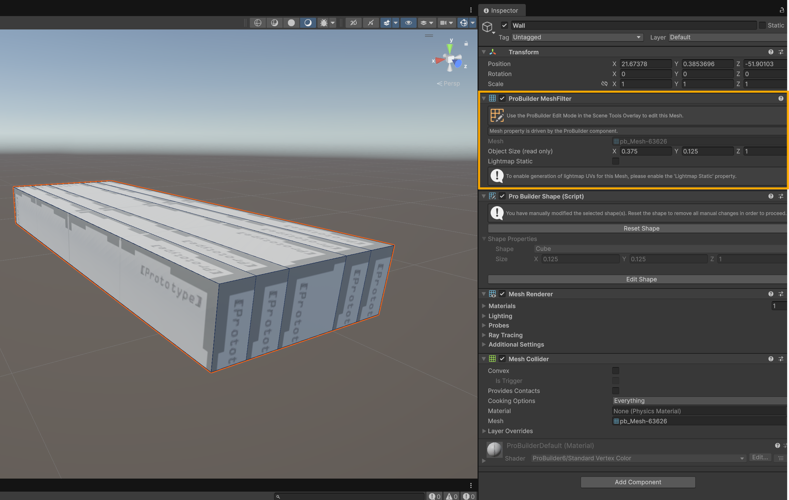

#

### Step 5 — Edit the Wall Top Faces
1.  Select the **3 inner top faces** → right-click → **Extrude Faces**.
    -   Distance: **0.0625** → confirm.
  
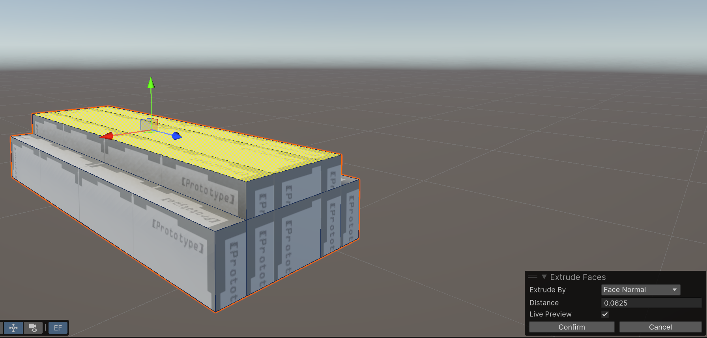

2.  Select the **innermost top face** → right-click → **Extrude Faces**.
    -   Distance: **3** → confirm.
  
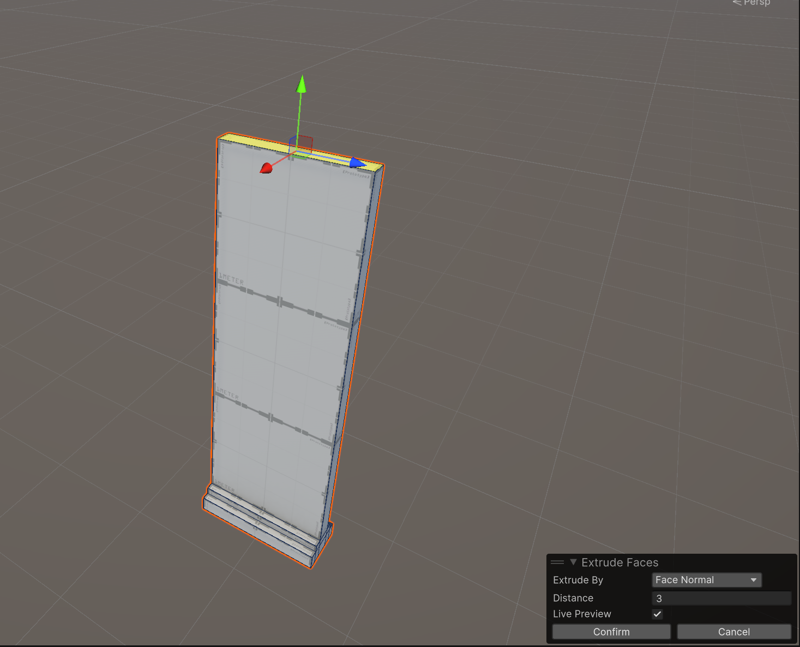
  
3.  With the top face still selected → extrude **0.03125** → confirm.
4.  Repeat another extrusion → **0.3125** → confirm.

> [!NOTE]  
> The wall’s **Y position should now be 3.25** in the Inspector.
> 

#

### Step 6 — Extrude Front Faces for Detail
1.  Select the **front faces of the top two sections** on both sides → right-click → extrude → distance: **0.0625** → confirm.

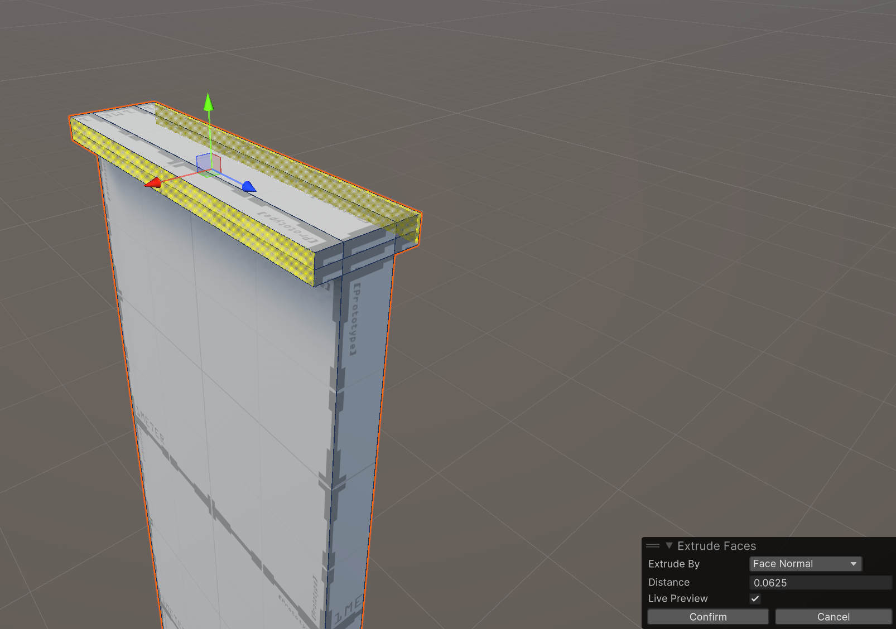

2.  Select the **front face of the topmost face** on both sides → extrude → distance: **0.625** → confirm.

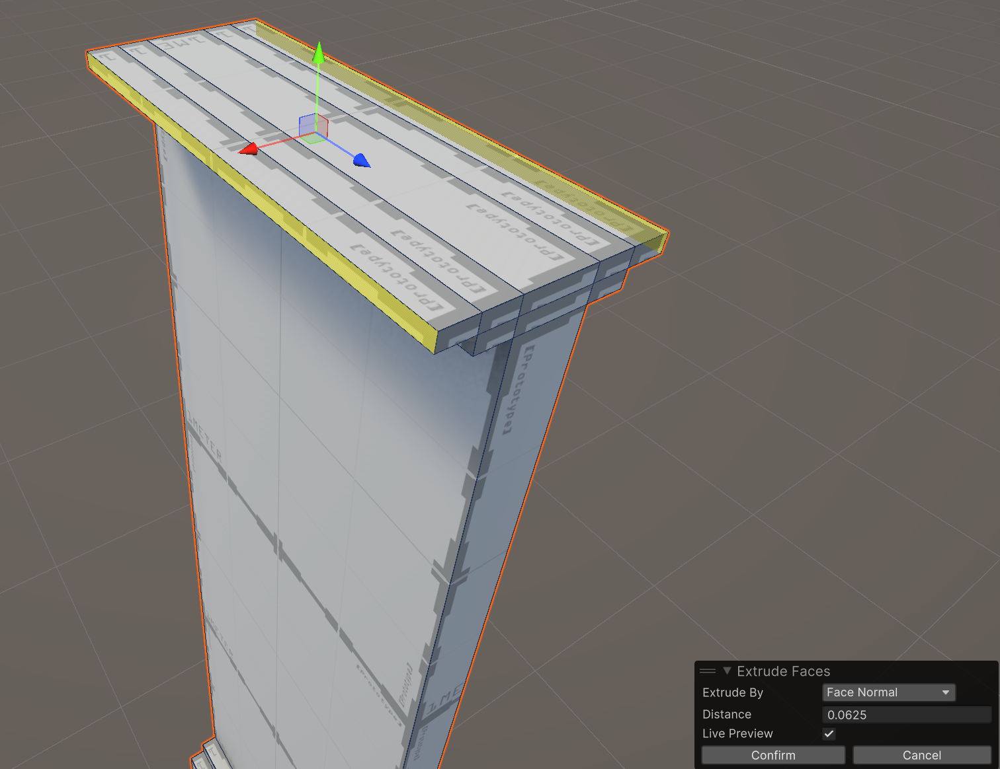

3. Exit **ProBuilder Edit Mode**.

#

### Step 7 — Create Wall Prefab

1. Drag and drop your **Wall** from the **Hierarchy** → into the **Prefabs** folder in the **Project** window.

2. In the **Hierarchy**, right-click → **Create Empty**
   - Name it **WallX3**
   - Set its position to `(0,0,0)`.

3. Drag the **Wall** object into **WallX3** so it becomes a child.

4. Duplicate the wall **two times** (so you have 3 total walls).

5. Move the duplicated walls so that:
   - One wall is placed to the **left** of the original wall
   - One wall is placed to the **right** of the original wall  
   - The **original Wall stays centered at (0,0,0)**

> [!IMPORTANT]  
> Do **not** move the original wall. Keeping the center wall at `(0,0,0)` ensures the prefab’s pivot stays centered, which makes placement easier later.
> 

6. In the **Hierarchy** window, rename the walls:
   - `Wall-01` (Left)
   - `Wall-02` (Center)
   - `Wall-03` (Right)

7. Drag and drop the **WallX3** object into the **Prefabs** folder to create a multi-wall prefab.

> [!NOTE]  
> You now have two wall prefab options:
> - **Wall** = a 1-meter wall segment  
> - **WallX3** = a 3-meter wall segment  
>
> You *could* also create variations like **WallX2** or **WallX4**, but when designing prefabs, it’s best to only create the variations you are most likely to use. Too many prefab versions can quickly clutter your project.
> 

#

### Step 9 — Place Walls in the Park (Organized Prefab-Friendly)

1.  Exit the **SampleScene** and return to **Level\_01**.
    
    -   No need to save the SampleScene — we only made the prefab, which is saved automatically.
        
2.  In the **Hierarchy**, inside your **Environment** folder:
    
    -   Create a new empty GameObject → name it **ParkWall**
        
    -   Set its **position** to `(0,0,0)`
        
    -   This will serve as the **parent container** for all wall segments and can later be turned into a prefab.
        
3.  Place your **WallX3 prefabs** inside **ParkWall**.
    
    -   When duplicating single-wall segments, choose a **corner of the park as Wall-01** and number subsequent walls sequentially.
        
4.  Use the **WallX3 prefab** to create the main boundaries of the park.
    
    -   For small gaps, use the **single Wall prefab** to fill in.
        
5.  Add wall segments to divide the park into at least **two sections**.
    
6.  Leave a **3-meter opening** between the sections.
    
    -   We will add a gate here in the next tutorial.
        

> [!TIP]  
> Using an empty **ParkWall** object as a parent keeps your hierarchy organized and allows you to **convert the entire wall layout into a prefab** if needed. Numbering walls helps track placement and makes future edits easier.
> 

#

### Step 10 — Save & Commit
1.  Save your scene: **File > Save** or **Ctrl + S**.
2.  Close Unity.
3.  Switch to **GitHub Desktop** → stage your changes.
4.  Commit with the message:
    -   `feat: created Wall Prefab.`
5.  Push your changes to the remote branch: `SceneBuilding`.

---

# ⚒️ Tutorial: Create the Park Gate with ProBuilder

<strong><em>Tutorial Details</em></strong>

|📝 Topic          | 🕑 Estimated Time | 🧰 Requirements   |
| :---------------: | :---------------: | :---------------: |
| Scene Building     | 30 minutes       |   GitHub Desktop, Unity     |

> [!NOTE]
> Before starting this tutorial, ensure you have completed **[Create the Park Wall with ProBuilder]()**
 and that your project is synced with the SceneBuilding branch in GitHub Desktop.

