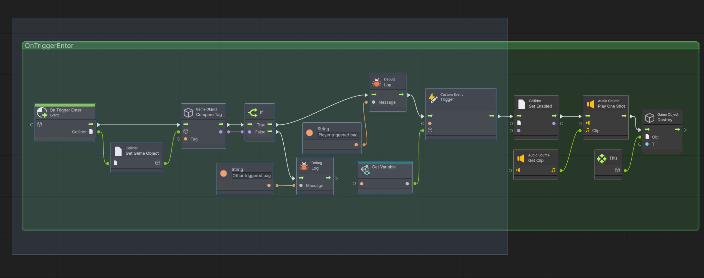

# ⚒️ Tutorial: Trash Bin Interactions

<strong><em>Tutorial Details</em></strong>

|📝 Topic          | 🕑 Estimated Time | 🧰 Requirements   |
| :---------------: | :---------------: | :---------------: |
| Visual Scripting   | 45 minutes       |   GitHub Desktop, Unity, Trash Package |

> [!NOTE]
> Before starting this tutorial, ensure you have :
>  - Completed **[Level Maanger Tutorial](LevelManager.md)**
>  - That you are on the **Interactions** branch in GitHub Desktop.
>

### Step 1 — TrahBin Variant
1.  In the **Herarchy** window select one of the **SM_Trash** prefabs

#

###  Step 2 — Add a Trigger Collider
This object already has a box collider on it, which means in our scene it will behave as a solid object. 
However, we need to check when the player interacts with the object, without worrying about physics. To solve this, we can add a second box collider and set it to trigger.

1.  With the trash bin selected, go to the **Inspector**.
2.  Click **Add Component** → search for **Box Collider**.
3.  Enable **Is Trigger**.
4.  Adjust the **Box Collider size** so the player can easily enter the interaction area.

> \[!TIP\]  
> The trigger should be slightly larger than the trash bin mesh to make interaction feel responsive.
>

#

###  Step 3 — Add a Script Machine
1. With the trash bin still selected in the **Inspector** window...
2. Click **Add Component** search for **Script Machine**.
3.  Click **New** to create a new Script Graph.
4.  Name the graph: **TrashBin**
5.  Save it inside your **Scripts** folder.

# 

## Step 4 — Create a Prefab Variant
1.  In the **Hierarchy**, select your Trash Bag prefab.
2.  Drag it into the **Prefabs folder** in the **Project window**.
3.  When prompted, choose **Create Prefab Variant**
4.  Rename the new variant: `TrashBin_Interactable`
    
> \[!TIP\]  
> Using a Prefab Variant allows you to reuse the original Trash Bag mesh while applying the new interaction logic consistently across the scene.
>

#

## Step 5 — Update Scene Prefabs
We need to now update all the trash bins in our scene to use the interactable prefab. 
1.  In the **Hierarchy**, select all **SM_Trash** prefabs
2.  In the **Project** window select the `TrashBin_Interactable` prefab
3.  Drag the prefab into the **Prefab** property of the **Inspector** window.
4.  All Trash Bins are now linked to the new prefabs

#

###  Step 6 — Create the Trigger Logic
The trigger logic for the trash bin and the trash bag is very similar. To avoid having to create the OnTriggerEnter from scratch, we can simply copy and paste one to the other. 

1.  In the **Hierarchy**, select your **Trash Bag** prefab.
2. In the **Inspector**, locate the Script Machine.
   -   Click **Edit Graph**.
3.  Drag a window around the **OnTriggerEnter** group all the way to the **Custom Event Trigger** nodes.

4. Press **CTRL+C** to copy the nodes
5. Return to the **Hierarchy**, select your **Trash Bin** prefab.
6. In the **Inspector**, locate the Script Machine.
   -   Click **Edit Graph**.
    
7.  Remove Default Nodes in the **Graph Editor area** (blackboard),  
    -   Delete **On Start**
    -   Delete **On Update**

8. Press **CTRL+V** to paste the copied **OnTriggerEnter** event 

 
 #
 
###  Step 7 — Update Custom Event Trigger
When the player interacted with the **trash bag**, it triggered the `AddToCurrentTrashCount` event on the **LevelManager**. As for the **trash bin**, it should trigger a different event, the `CheckMissionStatus` event. 

1. Select the **Custom Event Trigger** in the event graph 
  - Change the name of the event to `CheckMissionStatus`

> [!NOTE]
> While we setup the **trash bin** to trigger the `CheckMissionStatus` on the **LevelManager**, that event has not yet been setup. We will do that next. 

  # 
  
### Step 8 — Save Your Work
1.  Save the scene: **File → Save** or **Ctrl + S**
2.  Close Unity.
3.  In **GitHub Desktop**:
    -   Stage your changes
    -   Commit with message:
        -   `feat: TrashBag Interaction.`
4.  Push to the appropriate branch.

---

## Updating the Level Manager 

Now that we have our **trash bin** logic setup, we need to create the `CheckMissionStatus` on the **Level Manager** 

