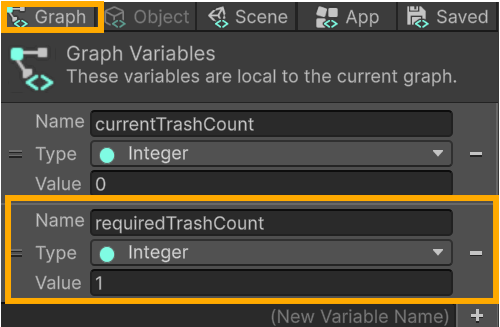
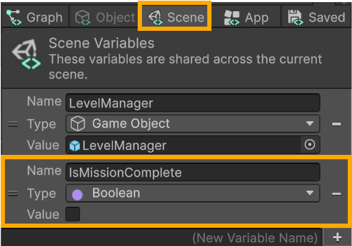
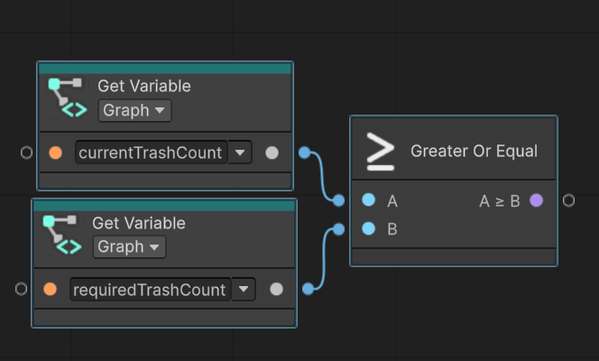
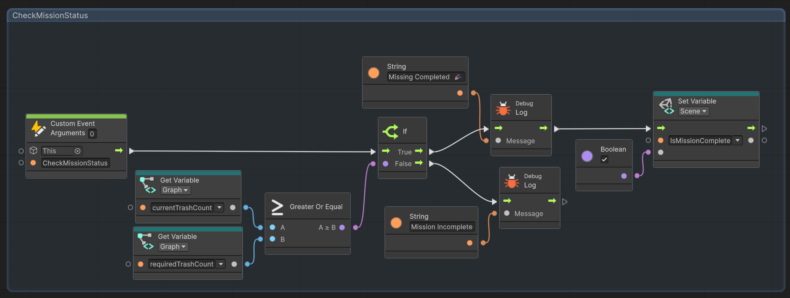

# ⚒️ Tutorial: Trash Bin Interactions

<strong><em>Tutorial Details</em></strong>

|📝 Topic          | 🕑 Estimated Time | 🧰 Requirements   |
| :---------------: | :---------------: | :---------------: |
| Visual Scripting   | 45 minutes       |   GitHub Desktop, Unity, Trash Package |

> [!NOTE]
> Before starting this tutorial, ensure you have :
>  - Completed **[Level Maanger Tutorial](LevelManager.md)**
>  - That you are on the **Interactions** branch in GitHub Desktop.
>

### Step 1 — TrahBin Variant
1.  In the **Herarchy** window select one of the **SM_Trash** prefabs

#

###  Step 2 — Add a Trigger Collider
This object already has a box collider on it, which means in our scene it will behave as a solid object. 
However, we need to check when the player interacts with the object, without worrying about physics. To solve this, we can add a second box collider and set it to trigger.

1.  With the trash bin selected, go to the **Inspector**.
2.  Click **Add Component** → search for **Box Collider**.
3.  Enable **Is Trigger**.
4.  Adjust the **Box Collider size** so the player can easily enter the interaction area.

> \[!TIP\]  
> The trigger should be slightly larger than the trash bin mesh to make interaction feel responsive.
>

#

###  Step 3 — Add a Script Machine
1. With the trash bin still selected in the **Inspector** window...
2. Click **Add Component** search for **Script Machine**.
3.  Click **New** to create a new Script Graph.
4.  Name the graph: **TrashBin**
5.  Save it inside your **Scripts** folder.

# 

## Step 4 — Create a Prefab Variant
1.  In the **Hierarchy**, select your Trash Bag prefab.
2.  Drag it into the **Prefabs folder** in the **Project window**.
3.  When prompted, choose **Create Prefab Variant**
4.  Rename the new variant: `TrashBin_Interactable`
    
> \[!TIP\]  
> Using a Prefab Variant allows you to reuse the original Trash Bag mesh while applying the new interaction logic consistently across the scene.
>

#

## Step 5 — Update Scene Prefabs
We need to now update all the trash bins in our scene to use the interactable prefab. 
1.  In the **Hierarchy**, select all **SM_Trash** prefabs
2.  In the **Project** window select the `TrashBin_Interactable` prefab
3.  Drag the prefab into the **Prefab** property of the **Inspector** window.
4.  All Trash Bins are now linked to the new prefabs

#

###  Step 6 — Create the Trigger Logic
The trigger logic for the trash bin and the trash bag is very similar. To avoid having to create the OnTriggerEnter from scratch, we can simply copy and paste one to the other. 

1.  In the **Hierarchy**, select your **Trash Bag** prefab.
2. In the **Inspector**, locate the Script Machine.
   -   Click **Edit Graph**.
3.  Drag a window around the **OnTriggerEnter** group all the way to the **Custom Event Trigger** nodes.

4. Press **CTRL+C** to copy the nodes
5. Return to the **Hierarchy**, select your **Trash Bin** prefab.
6. In the **Inspector**, locate the Script Machine.
   -   Click **Edit Graph**.
    
7.  Remove Default Nodes in the **Graph Editor area** (blackboard),  
    -   Delete **On Start**
    -   Delete **On Update**

8. Press **CTRL+V** to paste the copied **OnTriggerEnter** event 

 
 #
 
###  Step 7 — Update Custom Event Trigger
When the player interacted with the **trash bag**, it triggered the `AddToCurrentTrashCount` event on the **LevelManager**. As for the **trash bin**, it should trigger a different event, the `CheckMissionStatus` event. 

1. Select the **Custom Event Trigger** in the event graph 
  - Change the name of the event to `CheckMissionStatus`

> [!NOTE]
> While we setup the **trash bin** to trigger the `CheckMissionStatus` on the **LevelManager**, that event has not yet been setup. We will do that next. 

  # 
  
### Step 8 — Save Your Work
1.  Save the scene: **File → Save** or **Ctrl + S**
2.  Close Unity.
3.  In **GitHub Desktop**:
    -   Stage your changes
    -   Commit with message:
        -   `feat: TrashBag Interaction.`
4.  Push to the appropriate branch.

---

## Updating the Level Manager 

Now that we have our **trash bin** logic setup, we need to create the `CheckMissionStatus` on the **Level Manager** 

###  Step 1 — Update the Level Manager
1. Select **Level Manager** from the **Hierarchy** window
2. In the **Inspector** window choose **Edit Graph**.

### Step 2 — Create a Private Required Variable
We need a variable to store the number of required bags of trash to complete the level. 
Only the Level Manager needs access to this variable; as such, we will set it to be a _graph_ which can be thought of as _private_ variables in standard C#. 

1.  In the **Graph Editor**, in the **Inspector** window on the left
2.  Create a **Graph Variable**:
    -   **Name**: `requiredTrashCount`
    -   **Type**: Integer
    -   **Default Value**: `1`

  
> [!NOTE]
> We are setting our required amount to 1 for testing purposes. Once everything is working, we can come back and increase the amount.
>

### Step 3 — Create a Scene Variable
We need a variable to check if the mission (level) has been completed. This variable will be used by the gates to allow access to the next area. In order for the gate to see this variable, we will make it a _scene_ variable. 

1.  In the **Graph Editor**, in the **Inspector** window on the left
2.  Create a **Scene Variable**:
    -   **Name**: `IsMissionComplete`
    -   **Type**: Boolean
    -   **Default Value**: `False` (_unchecked_)

> [!Tip]
> Since variables act as public variables, and should be written in _PascalCase_, while private variables are written in _camelCase_.
>      
 
### Step 4 — Create a Custom Event on the Level Manager

The **LevelManager** will keep track of how many trash bags the player collects. 
First, we need a custom event to increment a counter.

1.  In the **LevelManager Script Graph**, **right-click** on an empty area.
2.  Search for **Custom Event** and add it.
3.  Set up the node:
    -   **Target**: `This` (refers to the LevelManager object)
    -   **Name**: `CheckMissionStatus`
4. In the graph, add these nodes:
    -   **Get Variable** → set to `currentTrashCount` (reads the current count)
    -    **Get Variable** → set to `requiredTrashCount` (reads the required amount)
    -   **Greater or Equal** 
5. Set the **Greater or Equal** node folow 
   - A → set to `currentTrashCount`
   - B → set to `requiredTrashCount`

6. In the graph editor, add an **If** node
    - Set the flow `CheckMissionStatus` →  **if** 
    - Set the flow of **Greater or Equal**  → **if**

### Step 5 — Test With Debug Logs

Before building full functionality, we will confirm that our functions are working as intended.
1. Add two **Debug Log** nodes 
2. Add two **String** (literal) nodes with the following message
   - _"Mission Incomplete"_
   - _"Mission Completed 🎉"_
3.  Connect it
     - Connect the **String** nodes one to each **Debug Log** node.
     - Connect the **Debug Log** node with the _Completed_ message to the **TRUE** output of the `if` branch
    - Connect the **Debug Log** node with the _Incomplete_ message to the **FALSE** output of the `if` branch
4.  Save the graph.
5.  Enter **Play Mode**.
6.  Move to the **trash bin**
    - The _Incompelte_ message should appear.
7.  Collect the trash and deposit it in the trash bin.
     - The _Completed_ message should appear.
8. Verify correct messages appear in the **Console**.

### Step 6 - Set Mission Status
1. In the graph editor on the **LevelManager** add a **Set Vaariable** node
    - Ensure it is a **scene* variable
    - Set its name to `IsMissionComplete`
2. Add a **Boolean** node
    - Set its value to `True` (checked)
3. Set the flow of the **Boolean** value into the value of **Set Vairable**
4. Set the flow of the **true** branch **Debug Log** into the **Set Variable** node.

### Step 7 —  Group and Organize the Nodes

1.  Click and drag a window around all nodes in the **OnTriggerEnter** _flow path_ 
2. With the mouse still held down, press **Ctrl** to group them.
3.  Click on the **Group** text at the top of the group box to rename it
    - Name the group: `CheckMissionStatus`
5.  Change the group’s **color** if desired for readability.
7.  Save the graph.

The graph should look like the following: 

  ### Step 6 — Save Your Work
1.  Save the scene: **File → Save** or **Ctrl + S**
2.  Close Unity.
3.  In **GitHub Desktop**:
    -   Stage your changes
    -   Commit with message:
        -   `feat: Level Manager Mission Check.`
4.  Push to the appropriate branch.

