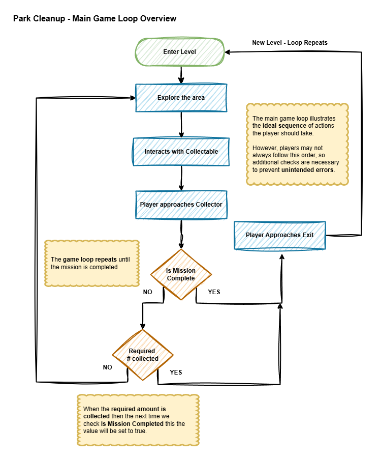
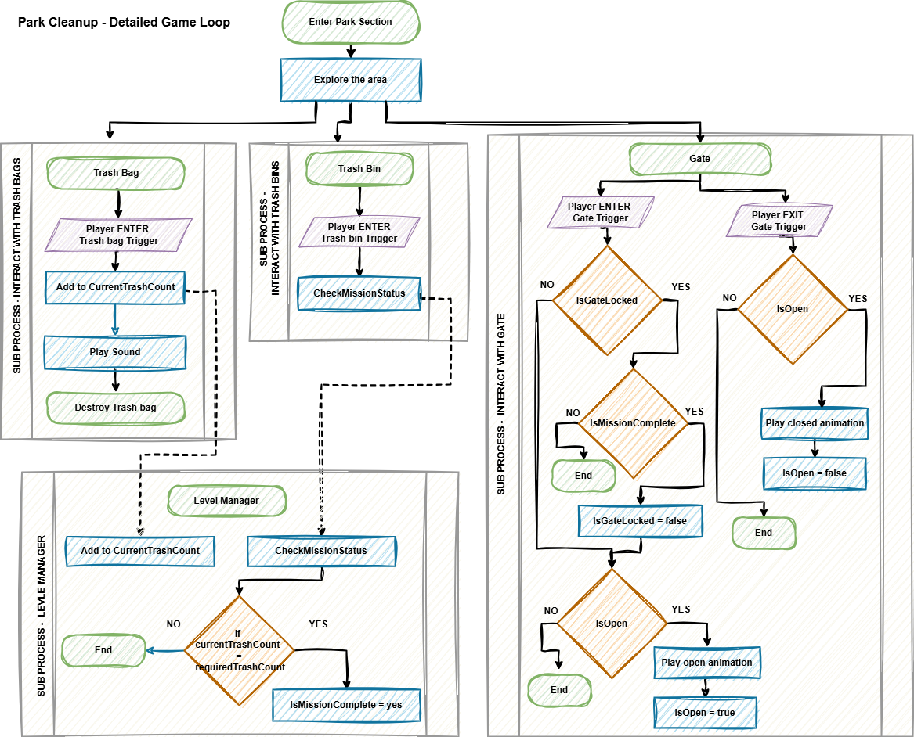

# 📜 Visualizing Loops
 By: Akram Taghavi-Burris | © 2026

Game loops are the heartbeat of gameplay, driving player actions, game reactions, and feedback in a continuous cycle. While we can describe loops in words, **visualizing them helps designers and developers understand the flow of gameplay, identify potential issues, and plan interactions clearly**.

## Using Flowcharts to Represent Loops

Flowcharts are a practical way to map both **main gameplay loops** and **object-specific interaction loops**. They use standardized symbols to represent actions, decisions, inputs, outputs, and repeated processes, making complex interactions easy to follow.

| Symbol                 | Meaning                             |
| ---------------------- | ----------------------------------- |
| Oval                   | Start or End of a process           |
| Rectangle              | Action or process step              |
| Parallelogram          | Player input or game feedback       |
| Diamond                | Decision point (Yes/No, True/False) |
| Trapezoid Top / Bottom | Start / End of a loop               |
| Arrow                  | Flow direction                      |

By translating loops into flowcharts, we can **see how core mechanics, player decisions, and game feedback interconnect**, providing a clear blueprint for both documentation and implementation.

---
## Game Brief
In our **Game Design Concept Document**, we introduced the basic idea of our game loops, outlining how players move through the park, collect trash, and progress. However, those descriptions were high-level and conceptual. The **true visualization and documentation of these loops** happens in the **Game Brief**, where we expand on the concept and map out the details of gameplay, player interactions, and objects/entities.

A **Game Brief** is a comprehensive project-level document that covers every aspect of the game, including:

-   **Overview:** The overall vision, theme, and pitch for the project.
-   **Core Gameplay:** Objectives, core mechanics, player controls, and game loops.
-   **Game Objects / Entities:** List of primary objects or characters and how they behave.
-   **Levels / Progression:** Level structure, challenges, and milestones.
-   **UI / UX:** HUD elements, menu flows, and interaction guidelines.
-   **Art Brief:** Style, mood, color palette, key assets, and animation requirements.
-   **Audio Brief:** Music, sound effects, and voice-over considerations.
-   **Technical Brief:** Engine, platform constraints, coding standards, and dependencies.
-   **Team-Wide Standards:** Version control workflow, asset naming conventions, and project organization.
-   **Deliverables / Scope:** Minimum viable product, stretch goals, and out-of-scope features.
-   **Timeline / Schedule:** Detailed project timeline with milestones and task assignments.
    
For this lesson, we will focus specifically on the **Core Gameplay Brief**, a subset of the full Game Brief that documents the **heart of the game**. This section details the **core mechanics, game loops, player actions, and object interactions**, providing a structured view of gameplay that can guide prototyping and implementation in Unity. By examining the gameplay brief for our Park Cleanup prototype, we can see how high-level concepts translate into **concrete loops and player interactions**.

# 
> #### 📗Textbook Project - Gameplay Brief
>
 ### 📄 Overview
 - **Title:** Park Clean-Up
 - **Genre / Style:** Casual Puzzle / Exploration
 - **Platform(s):** Tablet, Chromebook, PC
 - **Target Audience:** Ages 8–9 (3rd grade), motivated by creativity, achievement, and immersive exploration.

 #### ⚙️ Core Gameplay
 **Game Objective:**  

 Players explore a park to collect trash and recyclables, deposit them in the correct bins, and unlock gates to progress to new areas. The goal is to clean all areas of the park while learning about environmental stewardship.

 **Core Mechanics:**
 -   **Walking/Movement:** Navigate the park using keyboard and mouse.
 -   **Picking Up Trash:** Approach trash items to collect them.
 -   **Depositing Trash:** Place collected items into the trash bin.
 -   **Mission Complete:** Mission completed when the required amount of trash has been collected at the trash bin.
 -   **Unlocking Gates:** Gate will unlock on mission complete. 

 **Player Controls:**

 -   **Keyboard/Mouse:** WASD / Arrow Keys to move, Space to jump

 ### Gameplay Loop (High-Level)
1.  **Decision:** Player chooses where to go and what trash to collect.
2.  **Action:** Player picks up trash or interacts with a gate/bin.
3.  **Game Reaction:** Game updates the current collected count, deposited amount, and/or triggers animation/sound feedback.
4.  **Feedback:** Player sees progress updates, audio cues, or visual indicators.
5.  **Repeat:** Player continues until all areas are cleaned and all gates unlocked.

#### Main Gameplay Loop

| Object    | Attributes                          | Behaviors / Interactions                                |
| --------- | ----------------------------------- | ------------------------------------------------------- |
| Player    | Position, inventory capacity        | Moves, collects trash, deposits items, triggers gates   |
| Trash     | Type (regular/recyclable), position | Can be collected, removed from scene                    |
| Trash Bin | Position, type (recycle/regular)    | Receives trash, updates count, triggers feedback        |
| Gate      | Position, locked/unlocked           | Opens when area objectives complete, triggers animation |

#### Detailed Gameplay Loop

#### Levels / Progression
-   **Areas:** Park is divided into zones with increasing trash quantity and complexity.
-   **Progression:** Clean one zone to unlock the next gate.
-   **Challenge Curve:** Early zones are small with fewer trash items; later zones introduce more objects, limited inventory capacity, and time-based challenges.
-   **Milestones:** Completing a zone triggers visual feedback, sounds, and opens new areas.

# 
---

## 🔎 Examining Our Game Loop 

In the game brief above, the main gameplay loop provides a high-level breakdown of the expected player actions and interactions. The detailed gameplay loop breaks this down further by defining all possible actions and interactions, such as what happens if the player heads to the gate before collecting any trash? 

The detailed gameplay loop also separates the loops into individual objects. One common pitfall of beginner game developers is to have the Player game object keep track of everything. While it might sound like a good idea to keep everything centralized, it is a recipe for disaster. Instead, we need to think logically about the actions and interactions we want and what they are actually controlling. Each game object should be responsible for its own life cycle and behaviors. 

For example if we want the trash bags to be destroyed when we collect them, then the functionality of destroying the game object should be on the trash bag not the player, the same for the sound, if the sound is for the bag collection, it needs to be on the bag. The same goes for the gate; if the gate needs to play its animation, these conditions should be on the gate itself. 

But what do we do about keeping track of things that are not related to any one object. For example, we need to keep track of the trash we collected, this will eventuall need to be checked against the required amount of trash to clear the level, which will ultimatly determine if the leve or mission is comlpleted. These varaiables are tied to any object but more so the level/mission. While they could be tied to the player, again this is not always the best solution, because the player may reset at certain points, or the missions change or update on different levels meaning the player which moves between levels may have elements that it no longer needs always attached to itself. 

A better solution and one outlined in the detailed gameplay loop above is to implment a level manager. This is an invisible (empty object) that is created soley as a container to keep track of inforamtion for that specific level. In larger games this could even be expanded out into say a quest manager. 

In development there is a design pattern known as the Single Responsiblity Pattern, this states that any object or function should be responsible for only one thing. meaning that the playe rneeds to be repsonisble for player input and anything related to the player, in other games this may be player health or player stats. So information about the level itself makes sense to be placed on the level manager. 

When desigining our level manager we need to consider what exactly it needs to do. I needs to store information about the progress of our game such as how much trash we have collected, the required amount of trash needed to complete the level/mission and the when the mission is actually complete. To do this we can use a variable. Varaibles are containers taht store information that can vary over time. Variables can be anything from integers (whole numbers), floats (decimle values), booleans (true or false values), strings (text) and several other types. 

For the purpse of our game we know that the current trash collected will the required amount should be whole numbers so an integer, while the check if the mission is complete can be a simple boolean. 

When naming these vairables we want to use names that expclitly define what the vairable is without any abmiguity. 
For this purpouse we will use the following variable names: 

currentTrashCount 
requiredTrashCount
IsMissionComplete 

The term count at the end of the CurrentTrashCount and RequiredTrashCount explcitly identifies these as numeric values. Booleans vairables should be named as a question that whoes value is ture or false. IN this instance IsMissionComplete does just that. 

You might also notice that the currentTrashCount and requiredTrashCount vairables are camleCase and the IsMissionComplete is written in Parsle case, this is intential. The first two vairables are private meaning that only the level manager knows they exsist the trash bag and trash bin simply call methods on the level manager to check these values, they do not know the vairables exist at all. The IsMissionComplete viariable on the other hand needs to be checked by the Gate in order for it to open, since this needs to be accesible, this is a public vairable. it is beset practice and industry standard to use camel case for private variable and parsle case for public variables. 

